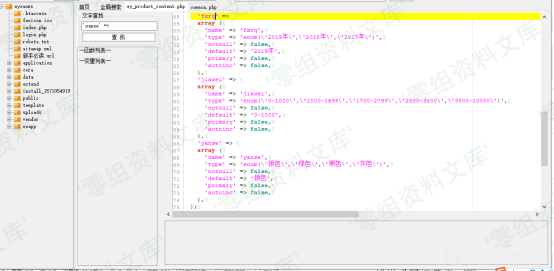

Eyoucms 1.3.9 前台sql注入
=========================

一、漏洞简介
------------

二、漏洞影响
------------

三、复现过程
------------

    http://0-sec.org:8081/eyoucms/?m=home&c=View&a=index&aid=89

然后开启burp抓包，构建如下的包

需要改两方面的参数一是referer，改成我们访问的页面

然后将get的url构造为如下

然后放进sqlmap一把梭就行啦

### 代码分析

\'url\_screen\_var\'这个值=\>\'ZXLjbXM\'，这里它cms也注释说明了这个参数代表了文章状态，在前台使用的。

ZXljbXM

这里使用这个参数是需要注册一个用户权限，正好是可以在前台使用

所以上图的refer就代表我们是从用户权限的那里过来的

根据它 ZXLjbXM 所需求的构造如下url。

    GET /eyoucms/?ZXljbXM=1&a=index&c=Lists&m=home&tid=3&yanse=1

看最后的参数yanse 是它这个的cms的产品评论里的参数。本来是系统自带的

但是这个参数也是属于用户发表的文章里面的构造，所以结合ZXLjbXM
即可构造可以存在注入的url链接

它这里请求的参数没有做防护

其实它这个文件的三个参数都是可以注入但是构造的请求url不相同。通过更改最后的参数即可

如果安装者是经过调整此点，或者仅用来展示网站的，那利用点可能微乎其微了

这个注入点比较鸡肋。其实没有多少高深的东西，只是笔者运气好，恰好看见这个参数。要不真的发现不了。

因为这个文件属于它cms自带的一处产品编辑的文件，实在不容易被注意到。

四、参考链接
------------

> https://xz.aliyun.com/t/6983
