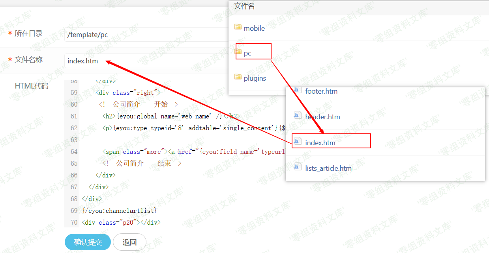
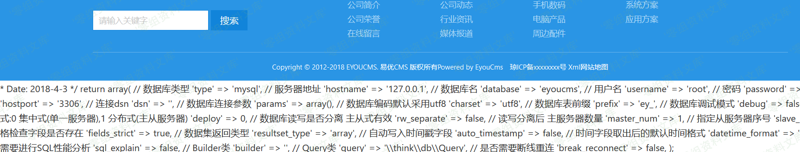

Eyoucms 1.4.3 后台代码执行漏洞
==============================

一、漏洞简介
------------

Eyoucms v1.4.3 版本后台修改模板文件可代码执行

二、漏洞影响
------------

Eyoucms 1.4.3

三、复现过程
------------

从官网下载最新版反复确认v1.4.3暂未修复。利用也很简单直接在高级选项 -\>
模板管理 -\> 修改pc模板。修改index.htm为例。

回到index页面刷新

