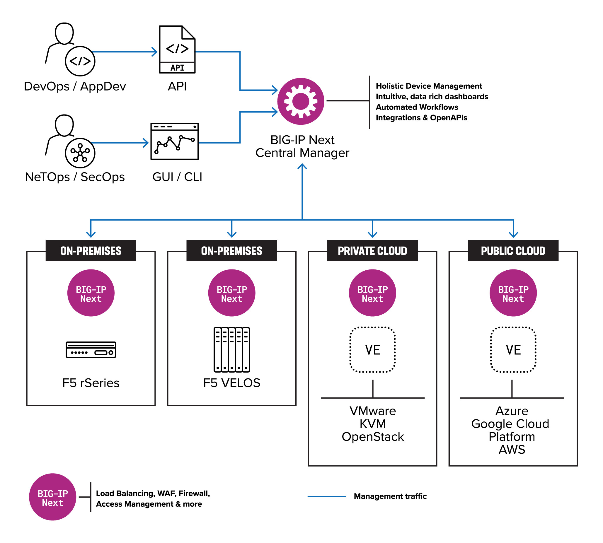

（CVE-2024-21793）F5 BIG-IP Next Central Manager OData注入漏洞
========================================================

一、漏洞简介
------------

2024 年 5 月 8 日，F5 发布安全公告，披露 BIG-IP Next Central Manager
API 存在 OData 注入漏洞 CVE-2024-21793。供应链安全公司 Eclypsium 的研究
人员 Vladyslav Babkin 发现该漏洞并同步发布了公开 PoC。未认证的远程攻击
者可通过向 Next Central Manager API 端点发送特制的 OData 查询请求，执行
恶意 SQL 语句，进而泄露管理员密码 hash 等敏感信息，最终接管设备。

Eclypsium 原文指出："The first vulnerability appears in Central Manager's
way to handle OData queries, and will allow the attacker to inject into an
OData query filter parameter. From there, the attacker has enough leverage
to leak sensitive information, like admin password hash for further
increasing his privileges. This specific vulnerability will only appear if
LDAP is enabled."

CVSS 3.1 7.5（HIGH）。影响 Next Central Manager 20.0.1 至 20.1.0，修复于
20.2.0。

二、漏洞影响
------------

-   产品：F5 BIG-IP Next Central Manager（集中管理 BIG-IP Next 实例的控
    制台）
-   版本：**20.0.1 – 20.1.0**（修复版：20.2.0）
-   组件/攻击向量：Central Manager API（URI）`/api/login`，OData 查询过
    滤参数注入
-   前提条件：无（未认证远程利用）；仅在目标启用 LDAP 认证时出现



*上图：Eclypsium 公布的攻击路径示意图（来源：Eclypsium 官方博客，已本地
化保存）。*

三、复现过程
------------

### 漏洞分析

Central Manager 处理 OData 查询的方式存在缺陷，攻击者可向 OData 查询的
filter 参数中注入恶意内容。`/api/login` 接口在 `provider_type` 为 LDAP
时，将 `username` 参数拼入 OData 过滤表达式且未做净化，导致注入的
OData 表达式被后端转为 SQL 执行。利用布尔盲注（`startswith('password',
'…')` 逐字符判断，猜对时返回 HTTP 500）可逐字节拖出管理员密码 hash。
Eclypsium 还发现配合未公开文档的 SSRF API，攻击者可在被管 BIG-IP Next
资产上创建隐藏的流氓管理员账户实现持久化（即使重置密码、打补丁后访问
仍可能残留）。

### PoC（来源：https://github.com/FeatherStark/CVE-2024-21793，仅限授权测试）

该仓库 `poc.py`（已验证为真实可运行的利用脚本）核心逻辑如下，用法：

```bash
python3 poc.py <target> [target_user]   # 默认拖取 admin 的密码 hash
```

关键注入点（`POST /api/login` JSON body）：

```json
{
  "username": "fakeuser' or 'username' eq 'admin' and startswith('password','<逐字符猜解>') or 'username' eq '1",
  "password": "password",
  "provider_type": "LDAP",
  "provider_name": "LDAP"
}
```

脚本对 `password` 字段做布尔盲注：每次猜一个字符（字符集为数字+大小
写字母+`/.$`），当响应 `status` 为 500 即表示猜中，逐字符还原出完整
hash。Eclypsium 指出管理员密码 hash 的 bcrypt cost 仅为 6，资金充足的攻
击者可达"每秒数百万次"爆破速度。

四、修复建议
------------

-   升级到 BIG-IP Next Central Manager 20.2.0 及以上版本。
-   若无法立即 patch，按 F5 建议将 Central Manager 管理访问限制在可信
    用户和设备、通过安全网络访问。
-   检查是否存在异常管理员账户（注意 Eclypsium 指出的隐藏账户可能不显
    示在 Central Manager 界面中）。

附录/参考链接
------------

-   F5 官方公告：https://my.f5.com/manage/s/article/K000138732
-   Eclypsium 原始分析（含 PoC）：https://eclypsium.com/blog/big-vulnerabilities-in-next-gen-big-ip/
-   PoC 仓库：https://github.com/FeatherStark/CVE-2024-21793
-   NVD：https://nvd.nist.gov/vuln/detail/CVE-2024-21793
