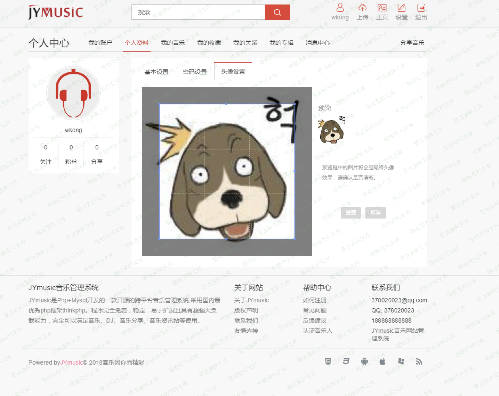

JYmusic 1.x 版本 前台getshell
=============================

一、漏洞简介
------------

二、漏洞影响
------------

1.x版本

三、复现过程
------------

访问前台，注册一个用

注册成功后点击右上角设置，个人资料，头像设置

抓包，修改文件后缀为.php

上传成功后访问个人中心，这里头像已经换了，审查元素查看头像的文件路径

访问<http://0-sec.org/Uploads/Avatars/uid_2/128.php>

成功解析，通过这种办法上传一个phpinfo

访问文件

四、参考链接
------------
