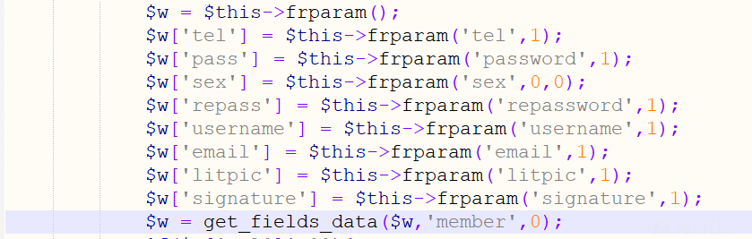
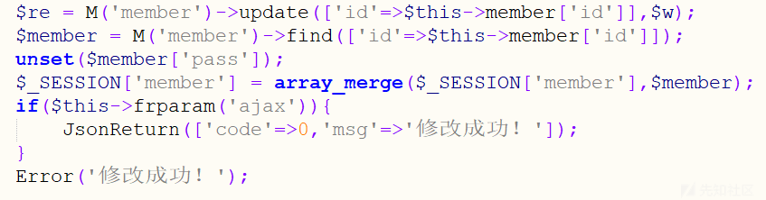
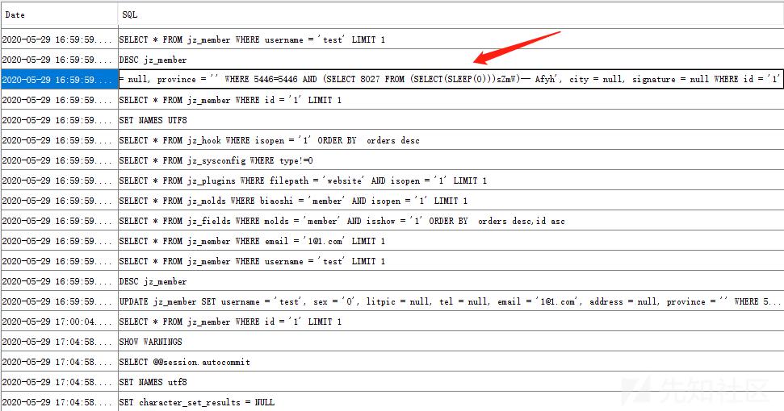

Jizhicms 1.7.1 ./user/userinfo.html sql注入漏洞
===============================================

一、漏洞简介
------------

二、漏洞影响
------------

Jizhicms 1.7.1

三、复现过程
------------

在更改个人资料处

    POST /user/userinfo.html HTTP/1.1
    Host: 127.0.0.1:8091
    User-Agent: Mozilla/5.0 (Windows NT 10.0; Win64; x64; rv:69.0) Gecko/20100101 Firefox/69.0
    Accept: text/html,application/xhtml+xml,application/xml;q=0.9,image/webp,*/*;q=0.8
    Accept-Language: zh-CN,zh;q=0.8,zh-TW;q=0.7,zh-HK;q=0.5,en-US;q=0.3,en;q=0.2
    Accept-Encoding: gzip, deflate
    Content-Type: application/x-www-form-urlencoded
    Content-Length: 138
    Origin: http://127.0.0.1:8091
    Connection: close
    Referer: http://127.0.0.1:8091/user/userinfo.html
    Cookie: PHPSESSID=84mcpgsvrgnfag0fnl3ngjm2eo
    Upgrade-Insecure-Requests: 1

    litpic=&file=&username=test&tel=&email=1%401.com&sex=0&province=&city=&address=&password=&repassword=&signature=&submit=%E6%8F%90%E4%BA%A4

在userinfo函数中可以看到只对tel ,pass sex
repass等参数进行了过滤，并不涉及province city
address等地址，意味着可以随意拼接sql语句触发 sql注入漏洞通过mysql监控工具可以看到已经带入查询，触发了sql注入漏洞通过sqlmap跑一下

参考链接
--------

> https://xz.aliyun.com/t/7861\#toc-2
