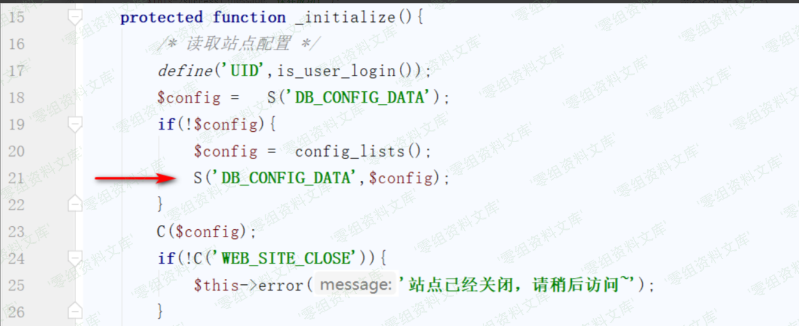
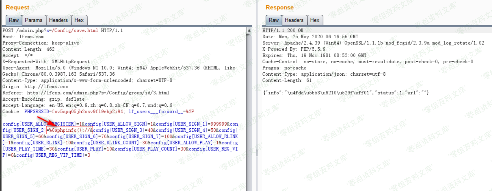
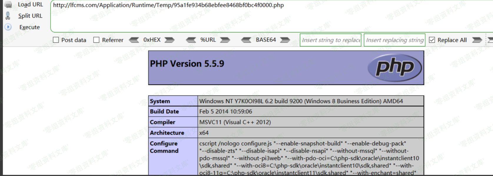

LFCMS 后台getshell
==================

一、漏洞简介
------------

二、漏洞影响
------------

三、复现过程
------------

该漏洞可以利用的原因一是在于后台对于站点配置数据没有做好过滤，二是利用了tp3.2版本下本身存在的缓存漏洞，漏洞起始利用点位于`/Application/Admin/Controller/ConfigController.class.php`中的`save`方法，代码如下

该处将后台设置的配置项直接存储在数据库中，接着当用户访问站点前台页面时，会调用`/Application/Home/Controller/HomeController.class.php`中的`_initialize`方法，部分代码如图

当第一次访问时，会调用第二十一行的缓存函数写缓存文件，在这里如果在设置配置数据的时候写入恶意的`PHP`代码，就可以在缓存文件中写入我们想要执行的代码，进而`getshell`，首先我们来到后台用户配置设置处

提交数据抓取数据包，在其中一个设置项中填入`php`代码，由于缓存文件对于配置项进行了注释，为了逃逸注释我们需要另起一行写入`PHP`代码并将后面的无用数据注释掉，如图

然后访问前台页面生成缓存文件，缓存文件在`/Application/Runtime/Temp/`目录下，文件名为缓存数据名称的`MD5`值，在这里也就是`DB_CONFIG_DATA`的`MD5`值，我们直接访问缓存文件

    http://www.0-sec.org/Application/Runtime/Temp/95a1fe934b68ebfee8468bf0bc4f0000.php

成功的写入了`PHP`代码

参考链接
--------

> https://xz.aliyun.com/t/7844\#toc-4
