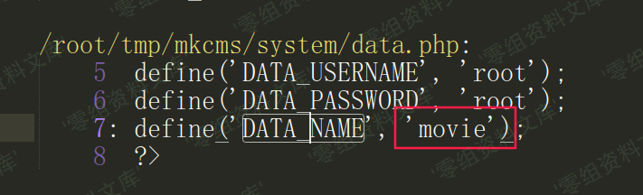

MKCMS v6.2 备份文件路径可猜解
=============================

一、漏洞简介
------------

二、漏洞影响
------------

MKCMS v6.2

三、复现过程
------------

/backupdata/movie.sql

    /admin/cms_backup.php
    <?php
    $filename="../backupdata/".DATA_NAME.".sql"; //存放路径，默认存放到项目最外层
    $fp = fopen($filename,'w');
    fputs($fp,$mysql);
    fclose($fp);
    alert_href('备份成功!','cms_data.php');
    ?>

全局搜`DATA_NAME`变量，是安装时候设置的数据库名

默认的`DATA_NAME`值是`movie`

参考链接
--------

> https://xz.aliyun.com/t/7580\#toc-4
