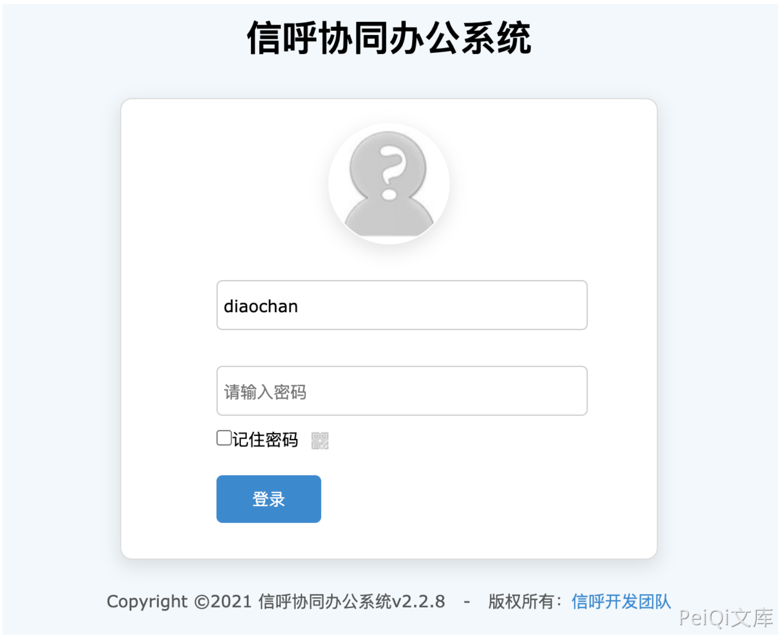
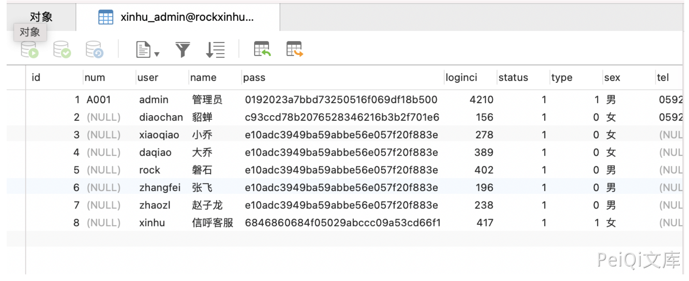
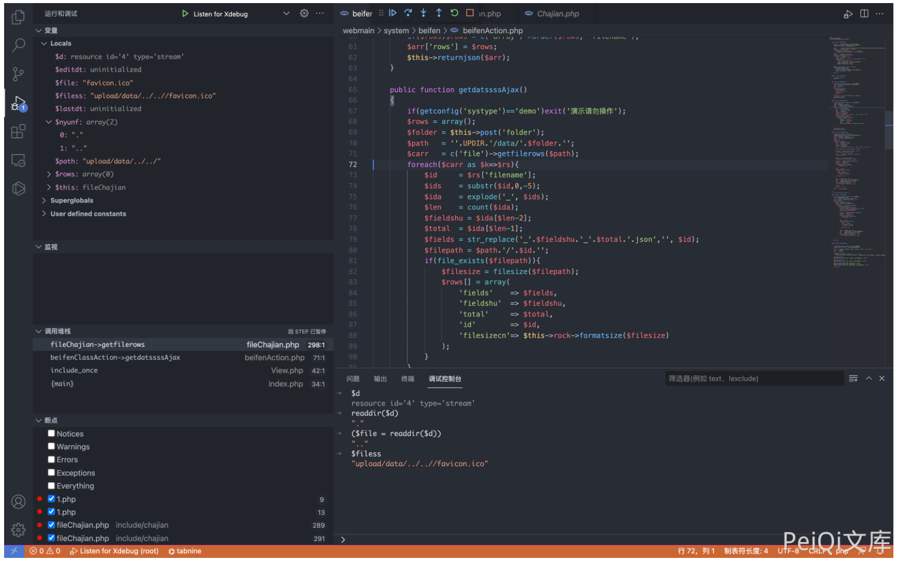
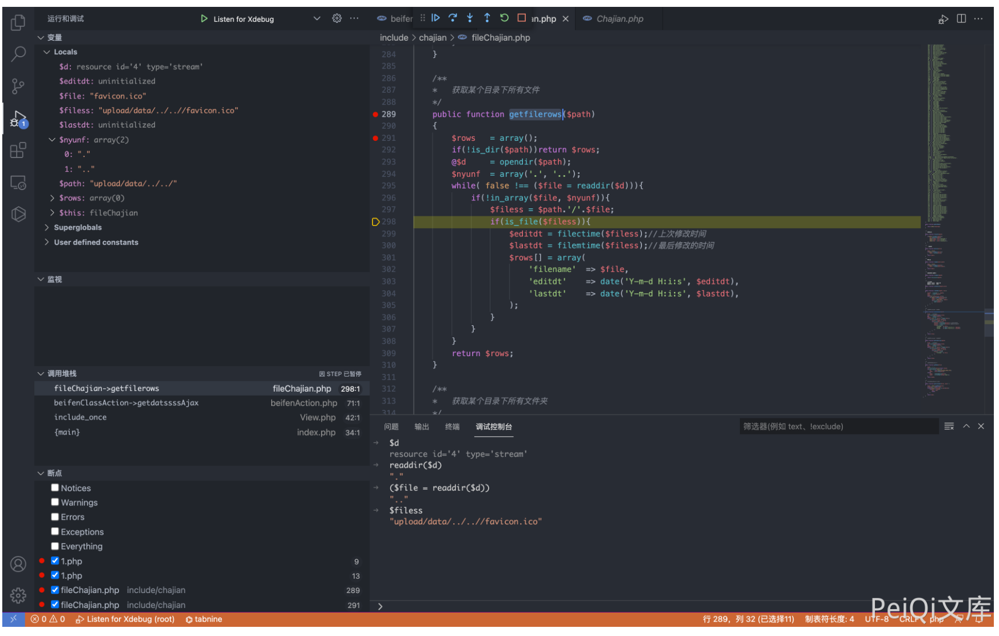
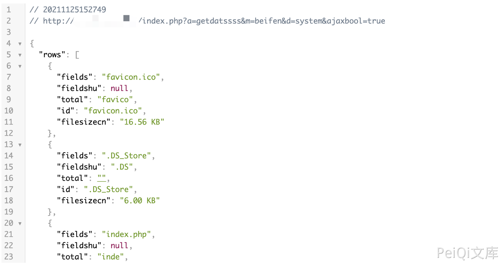

# 信呼OA beifenAction.php目录遍历/文件名列举

## 条目说明

- 对象与具体问题：信呼OA；beifenAction.php目录遍历/文件名列举
- 版本、配置及部署条件：<=2.3.2声称；folder可控
- 认证与权限前提：已登录；最低角色未列
- 核验边界：已完成原始 Markdown 的文本审阅；未执行 PoC、未访问目标、未视检截图。来源所述影响与复现结果不等于本库独立验证。

## 证据边界与更正

以下记录原始资料的证据边界。可以由原文确定的产品、编号及格式问题已在本条修订；没有原始证据的版本、响应和补丁信息仍待核实。

- 结果仅列目录文件名，不能规范为任意文件内容读取
- 核心getfilerows代码与结果均在未查看截图
- 弱口令条件独立于此漏洞，版本及修复待核

## 操作风险

现有材料未完整列明副作用；示例不保证只读或无状态变化。保留原示例供静态分析；仅可在明确授权的隔离测试环境验证，事先准备备份与回滚。

## 技术资料与来源记录

### 漏洞描述

信呼OA beifenAction.php文件中调用了 getfilerows方法，导致了目录遍历漏洞，攻击者通过漏洞可以获取服务器上的文件信息

### 漏洞影响

```
信呼OA <= 2.3.2
```

### 网络测绘

```
app="信呼协同办公系统"
```

### 漏洞复现

登录页面



其中默认存在几个用户存在弱口令 123456



存在漏洞的文件为 `webmain/system/beifen/beifenAction.php`



查看 `getfilerows()` 方法，在 `include/chajian/fileChajian.php`



该方法遍历目录下的文件名并输出，登录后，发送请求包

```
POST /index.php?a=getdatssss&m=beifen&d=system&ajaxbool=true

folder=../../
```



---

> 来源：Threekiii/Vulnerability-Wiki（https://github.com/Threekiii/Vulnerability-Wiki）
